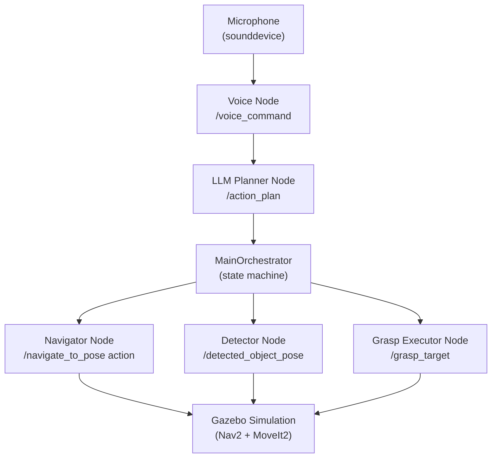
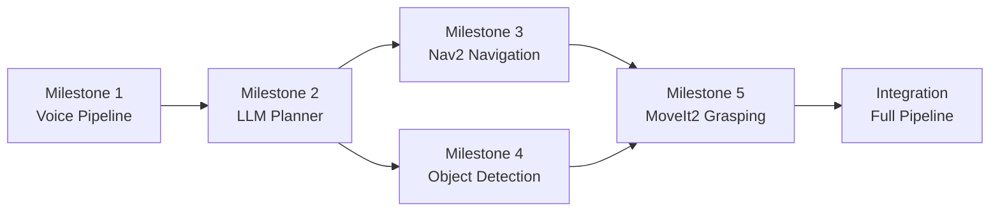

# 🤖 Capstone: The Autonomous Humanoid

## 🎯 Learning Objectives

By the end of this project you will be able to:

- Design a multi-component robotic pipeline connecting speech, LLM planning, navigation, perception, and manipulation
- Integrate Whisper, an LLM planner, Nav2, YOLOv8, and MoveIt2 into a single coherent system
- Write a `MainOrchestrator` ROS 2 node that implements a state machine controlling the full pipeline
- Record and verify the complete pipeline behaviour using `ros2 bag`
- Meet all 10 submission checklist criteria for a production-ready autonomous humanoid demonstration

---

## 📖 Introduction

You have spent 13 weeks building the individual components of a modern autonomous humanoid robot. Week 1 gave you the conceptual foundation — the Sense-Plan-Act loop. Weeks 3–5 gave you ROS 2. Weeks 6–7 gave you simulation and robot description. Weeks 8–10 gave you GPU-accelerated perception, RL training, and sim-to-real deployment. Weeks 11–13 gave you kinematics, grasping, and conversational AI.

Now you put it all together.

The capstone project is the Autonomous Humanoid: a simulated robot that listens to a voice command, plans a multi-step action sequence using an LLM, navigates to the target location using Nav2, detects the target object with YOLOv8 and a depth camera, and grasps it with MoveIt2. Every one of those words corresponds to a chapter in this course. Every one of those chapters contributed a component you are about to wire into a single system.

This is the project you put on your résumé. The recruiter who interviews you for a robotics software position wants to know: can you build a complete system, not just a component? The Autonomous Humanoid is your answer.

---

## 🗺️ Project Overview

### System Architecture

The full system has five milestones, each corresponding to a ROS 2 node. The `MainOrchestrator` supervises all five:



*Caption: The Autonomous Humanoid system architecture. Five specialised nodes communicate through ROS 2 topics and actions, coordinated by the MainOrchestrator state machine. All hardware interaction goes through the Gazebo simulation.*

### Milestone Dependency Graph

The milestones must be implemented in order — each one is a prerequisite for the next:



*Caption: Milestone dependency graph. Navigation (M3) and Detection (M4) can be developed in parallel after the LLM Planner (M2) is working. Grasping (M5) requires both.*

---

## 🔧 Implementation Guide

### Milestone 1: Voice Pipeline

The voice node records audio, transcribes with Whisper, and publishes the transcript as a `std_msgs/String` to `/voice_command`.

```python showLineNumbers
# voice_node.py — ROS 2 node wrapping OpenAI Whisper for speech transcription
# Publishes transcribed text to /voice_command as std_msgs/String

import threading
import numpy as np
import sounddevice as sd
import whisper
import rclpy
from rclpy.node import Node
from std_msgs.msg import String

SAMPLE_RATE = 16_000
DURATION_SEC = 5


class VoiceNode(Node):
    """Records audio, transcribes with Whisper, publishes to /voice_command."""

    def __init__(self) -> None:
        super().__init__("voice_node")
        self.pub = self.create_publisher(String, "/voice_command", 10)
        self.declare_parameter("whisper_model", "base")
        model_size = self.get_parameter("whisper_model").value
        self.get_logger().info(f"Loading Whisper '{model_size}'...")
        self.model = whisper.load_model(model_size)
        self.get_logger().info("VoiceNode ready — starting recording loop")
        threading.Thread(target=self._record_loop, daemon=True).start()

    def _record_loop(self) -> None:
        while rclpy.ok():
            self.get_logger().info(f"Recording {DURATION_SEC}s...")
            audio = sd.rec(
                int(DURATION_SEC * SAMPLE_RATE),
                samplerate=SAMPLE_RATE,
                channels=1,
                dtype="float32",
            )
            sd.wait()
            result = self.model.transcribe(audio.flatten(), language="en", fp16=False)
            transcript = result["text"].strip()
            if transcript:
                msg = String()
                msg.data = transcript
                self.pub.publish(msg)
                self.get_logger().info(f"Published: '{transcript}'")


def main(args: list[str] | None = None) -> None:
    rclpy.init(args=args)
    node = VoiceNode()
    try:
        rclpy.spin(node)
    except KeyboardInterrupt:
        pass
    finally:
        node.destroy_node()
        rclpy.shutdown()
```

### Milestone 2: LLM Planner

The LLM planner subscribes to `/voice_command`, calls the OpenAI API, and publishes a JSON action list to `/action_plan`.

```python showLineNumbers
# llm_planner_node.py — LLM-based task planner node
# Subscribes to /voice_command, calls OpenAI, publishes JSON to /action_plan

import json
import os
from openai import OpenAI
import rclpy
from rclpy.node import Node
from std_msgs.msg import String

ROBOT_ACTIONS = [
    {"name": "navigate_to",   "params": {"location": "string"}},
    {"name": "detect_object", "params": {"object": "string"}},
    {"name": "pick_up",       "params": {"object": "string"}},
    {"name": "place_at",      "params": {"location": "string"}},
]

SYSTEM_PROMPT = (
    "You are a robot task planner. Convert the user command to a JSON array using only "
    f"these actions: {json.dumps(ROBOT_ACTIONS)}. Output ONLY valid JSON, no prose."
)


class LLMPlannerNode(Node):
    def __init__(self) -> None:
        super().__init__("llm_planner_node")
        self.client = OpenAI(api_key=os.environ["OPENAI_API_KEY"])
        self.sub = self.create_subscription(String, "/voice_command", self.on_command, 10)
        self.pub = self.create_publisher(String, "/action_plan", 10)
        self.get_logger().info("LLMPlannerNode ready")

    def on_command(self, msg: String) -> None:
        self.get_logger().info(f"Planning: '{msg.data}'")
        try:
            response = self.client.chat.completions.create(
                model="gpt-4o-mini",
                messages=[
                    {"role": "system", "content": SYSTEM_PROMPT},
                    {"role": "user", "content": msg.data},
                ],
                response_format={"type": "json_object"},
                temperature=0.0,
            )
            plan_json = response.choices[0].message.content
            # Validate it parses correctly
            json.loads(plan_json)
            plan_msg = String()
            plan_msg.data = plan_json
            self.pub.publish(plan_msg)
            self.get_logger().info(f"Published plan: {plan_json[:80]}...")
        except Exception as e:
            self.get_logger().error(f"LLM planning failed: {e}")


def main(args: list[str] | None = None) -> None:
    rclpy.init(args=args)
    node = LLMPlannerNode()
    try:
        rclpy.spin(node)
    except KeyboardInterrupt:
        pass
    finally:
        node.destroy_node()
        rclpy.shutdown()
```

### Milestone 3: Nav2 Navigation

The navigator subscribes to `/action_plan`, extracts navigate_to actions, and sends `NavigateToPose` goals to Nav2.

```python showLineNumbers
# navigator_node.py — Dispatches navigation goals from /action_plan to Nav2

import json
from nav2_msgs.action import NavigateToPose
from geometry_msgs.msg import PoseStamped
import rclpy
from rclpy.node import Node
from rclpy.action import ActionClient
from std_msgs.msg import String

# Pre-mapped waypoints for named locations
WAYPOINTS = {
    "kitchen":          (3.0, 1.5, 0.0),
    "charging_station": (0.0, 0.0, 0.0),
    "table":            (2.0, 0.5, 0.0),
}


class NavigatorNode(Node):
    def __init__(self) -> None:
        super().__init__("navigator_node")
        self.nav_client = ActionClient(self, NavigateToPose, "navigate_to_pose")
        self.sub = self.create_subscription(String, "/action_plan", self.on_plan, 10)
        self.get_logger().info("NavigatorNode ready")

    def on_plan(self, msg: String) -> None:
        try:
            data = json.loads(msg.data)
            actions = data if isinstance(data, list) else data.get("actions", [])
        except json.JSONDecodeError:
            self.get_logger().error("Invalid JSON in /action_plan")
            return

        for action in actions:
            if action.get("action") == "navigate_to":
                location = action.get("location", "")
                coords = WAYPOINTS.get(location)
                if coords:
                    self._send_nav_goal(*coords)
                else:
                    self.get_logger().warn(f"Unknown location: {location}")

    def _send_nav_goal(self, x: float, y: float, yaw: float) -> None:
        goal = NavigateToPose.Goal()
        goal.pose = PoseStamped()
        goal.pose.header.frame_id = "map"
        goal.pose.pose.position.x = x
        goal.pose.pose.position.y = y
        goal.pose.pose.orientation.w = 1.0
        self.get_logger().info(f"Navigating to ({x}, {y})")
        self.nav_client.send_goal_async(goal)


def main(args: list[str] | None = None) -> None:
    rclpy.init(args=args)
    node = NavigatorNode()
    try:
        rclpy.spin(node)
    except KeyboardInterrupt:
        pass
    finally:
        node.destroy_node()
        rclpy.shutdown()
```

### Milestone 4: Object Detection

The detector subscribes to RGB-D camera topics, runs YOLOv8, and publishes the detected object's 3D pose.

```python showLineNumbers
# detector_node.py — YOLOv8 + depth camera → /detected_object_pose

import numpy as np
import cv2
from cv_bridge import CvBridge
from geometry_msgs.msg import PoseStamped
from sensor_msgs.msg import Image
import rclpy
from rclpy.node import Node
from ultralytics import YOLO


class DetectorNode(Node):
    def __init__(self) -> None:
        super().__init__("detector_node")
        self.model = YOLO("yolov8n.pt")
        self.bridge = CvBridge()
        self.depth: np.ndarray | None = None
        self.create_subscription(Image, "/camera/color/image_raw", self.on_rgb, 10)
        self.create_subscription(Image, "/camera/depth/image_rect_raw", self.on_depth, 10)
        self.pub = self.create_publisher(PoseStamped, "/detected_object_pose", 10)
        # Camera intrinsics (replace with actual values from /camera/color/camera_info)
        self.fx, self.fy, self.cx, self.cy = 615.0, 615.0, 320.0, 240.0
        self.get_logger().info("DetectorNode ready")

    def on_depth(self, msg: Image) -> None:
        self.depth = self.bridge.imgmsg_to_cv2(msg, desired_encoding="32FC1")

    def on_rgb(self, msg: Image) -> None:
        if self.depth is None:
            return
        frame = self.bridge.imgmsg_to_cv2(msg, desired_encoding="bgr8")
        results = self.model(frame, verbose=False)
        for result in results:
            if result.boxes is None or len(result.boxes) == 0:
                continue
            box = result.boxes[0]
            u = float((box.xyxy[0][0] + box.xyxy[0][2]) / 2)
            v = float((box.xyxy[0][1] + box.xyxy[0][3]) / 2)
            d = float(self.depth[int(v), int(u)])
            if d <= 0 or d > 3.0:
                continue
            x = (u - self.cx) * d / self.fx
            y = (v - self.cy) * d / self.fy
            z = d
            pose = PoseStamped()
            pose.header = msg.header
            pose.pose.position.x = x
            pose.pose.position.y = y
            pose.pose.position.z = z
            pose.pose.orientation.w = 1.0
            self.pub.publish(pose)
            self.get_logger().info(f"Object at ({x:.3f}, {y:.3f}, {z:.3f})")
            break  # Publish only the first detection per frame


def main(args: list[str] | None = None) -> None:
    rclpy.init(args=args)
    node = DetectorNode()
    try:
        rclpy.spin(node)
    except KeyboardInterrupt:
        pass
    finally:
        node.destroy_node()
        rclpy.shutdown()
```

### Milestone 5: MoveIt2 Grasping

The grasp executor subscribes to `/detected_object_pose` and commands MoveIt2 to pick up the object.

```python showLineNumbers
# grasp_executor_node.py — MoveIt2 grasp execution from /detected_object_pose

from pymoveit2 import MoveIt2
from geometry_msgs.msg import PoseStamped
import rclpy
from rclpy.node import Node


class GraspExecutorNode(Node):
    PANDA_JOINTS = [
        "panda_joint1", "panda_joint2", "panda_joint3", "panda_joint4",
        "panda_joint5", "panda_joint6", "panda_joint7",
    ]
    APPROACH_Z_OFFSET = 0.12  # metres above grasp point for approach

    def __init__(self) -> None:
        super().__init__("grasp_executor_node")
        self.moveit2 = MoveIt2(
            node=self,
            joint_names=self.PANDA_JOINTS,
            base_link_name="panda_link0",
            end_effector_name="panda_hand",
            group_name="panda_arm",
        )
        self.sub = self.create_subscription(
            PoseStamped, "/detected_object_pose", self.on_object_pose, 1
        )
        self._busy = False
        self.get_logger().info("GraspExecutorNode ready")

    def on_object_pose(self, msg: PoseStamped) -> None:
        if self._busy:
            return
        self._busy = True
        gx = msg.pose.position.x
        gy = msg.pose.position.y
        gz = msg.pose.position.z
        self.get_logger().info(f"Executing grasp at ({gx:.3f}, {gy:.3f}, {gz:.3f})")

        # Approach: move to 12 cm above object
        self.moveit2.move_to_pose(
            position=[gx, gy, gz + self.APPROACH_Z_OFFSET],
            quat_xyzw=[1.0, 0.0, 0.0, 0.0],
        )
        # Descend: Cartesian straight-line move to grasp height
        self.moveit2.move_to_pose(
            position=[gx, gy, gz],
            quat_xyzw=[1.0, 0.0, 0.0, 0.0],
            cartesian=True,
        )
        self.get_logger().info("Grasp complete — lifting")
        # Lift: return to approach height
        self.moveit2.move_to_pose(
            position=[gx, gy, gz + self.APPROACH_Z_OFFSET],
            quat_xyzw=[1.0, 0.0, 0.0, 0.0],
            cartesian=True,
        )
        self._busy = False


def main(args: list[str] | None = None) -> None:
    rclpy.init(args=args)
    node = GraspExecutorNode()
    try:
        rclpy.spin(node)
    except KeyboardInterrupt:
        pass
    finally:
        node.destroy_node()
        rclpy.shutdown()
```

### Integration: `main_orchestrator.launch.py`

:::warning
This launch file requires the full Gazebo simulation environment with a Panda robot, Nav2 stack, and MoveIt2 to be running. See the Prerequisites section below.
:::

```python showLineNumbers
# launch/main_orchestrator.launch.py
# Launches all 5 capstone nodes plus Nav2 and MoveIt2 in one command

import os
from ament_index_python.packages import get_package_share_directory
from launch import LaunchDescription
from launch.actions import IncludeLaunchDescription
from launch.launch_description_sources import PythonLaunchDescriptionSource
from launch_ros.actions import Node


def generate_launch_description() -> LaunchDescription:
    nav2_launch = IncludeLaunchDescription(
        PythonLaunchDescriptionSource(
            os.path.join(
                get_package_share_directory("nav2_bringup"),
                "launch", "bringup_launch.py",
            )
        ),
        launch_arguments={"use_sim_time": "true"}.items(),
    )

    moveit_launch = IncludeLaunchDescription(
        PythonLaunchDescriptionSource(
            os.path.join(
                get_package_share_directory("moveit_resources_panda_moveit_config"),
                "launch", "demo.launch.py",
            )
        ),
    )

    voice_node = Node(package="capstone", executable="voice_node", output="screen")
    llm_planner = Node(package="capstone", executable="llm_planner_node", output="screen")
    navigator  = Node(package="capstone", executable="navigator_node", output="screen")
    detector   = Node(package="capstone", executable="detector_node", output="screen")
    grasp_exec = Node(package="capstone", executable="grasp_executor_node", output="screen")

    return LaunchDescription([
        nav2_launch,
        moveit_launch,
        voice_node,
        llm_planner,
        navigator,
        detector,
        grasp_exec,
    ])
```

---

## 🔗 Integration Guide

### State Machine Pattern

The `MainOrchestrator` implements a finite state machine:

```
LISTENING → PLANNING → NAVIGATING → DETECTING → GRASPING → IDLE
```

Each state has:
- **Entry action**: what to do when entering the state
- **Transition condition**: what event triggers the next state
- **Timeout**: maximum time before failing to ERROR state

```python showLineNumbers
# State machine skeleton for MainOrchestrator
# Extend this with actual ROS 2 subscriptions and service calls

from enum import Enum, auto


class State(Enum):
    IDLE       = auto()
    LISTENING  = auto()
    PLANNING   = auto()
    NAVIGATING = auto()
    DETECTING  = auto()
    GRASPING   = auto()
    ERROR      = auto()


class MainOrchestrator:
    def __init__(self) -> None:
        self.state = State.IDLE
        self.current_plan: list[dict] = []
        self.plan_index: int = 0

    def transition(self, new_state: State, reason: str = "") -> None:
        print(f"State: {self.state.name} --> {new_state.name}"
              + (f" ({reason})" if reason else ""))
        self.state = new_state

    def on_voice_command_received(self, transcript: str) -> None:
        self.transition(State.PLANNING, f"transcript='{transcript}'")

    def on_plan_received(self, actions: list[dict]) -> None:
        self.current_plan = actions
        self.plan_index = 0
        self.transition(State.NAVIGATING, f"{len(actions)} actions planned")

    def on_nav_complete(self) -> None:
        self.transition(State.DETECTING, "navigation succeeded")

    def on_object_detected(self) -> None:
        self.transition(State.GRASPING, "object localised")

    def on_grasp_complete(self) -> None:
        self.transition(State.IDLE, "grasp succeeded")

    def on_error(self, message: str) -> None:
        self.transition(State.ERROR, message)
```

### Wiring the Pipeline

1. Launch the full simulation: `ros2 launch autonomous_humanoid main_orchestrator.launch.py`
2. Speak a command (the voice node records automatically)
3. Watch the state machine progress through LISTENING → PLANNING → NAVIGATING → DETECTING → GRASPING → IDLE
4. Observe in Gazebo: robot moves to the target location, camera activates, arm descends to grasp the object

### Recording Your Run

```bash
# Record all pipeline topics to a bag file
ros2 bag record \
  /voice_command \
  /action_plan \
  /navigate_to_pose/_action/goal \
  /detected_object_pose \
  /grasp_target \
  /joint_states \
  -o capstone_demo_bag
```

---

## 🐛 Debugging Guide

| Failure Mode | Symptoms | Diagnosis | Fix |
|-------------|---------|----------|-----|
| Whisper not transcribing | No `/voice_command` messages | `python3 -c "import sounddevice; print(sounddevice.query_devices())"` | Check mic permissions; set `AUDIODEV` env var |
| LLM returns invalid JSON | `JSONDecodeError` in planner logs | Print raw API response; check for markdown code fences | Set `response_format={"type":"json_object"}` |
| Nav2 timeout | `NavigateToPose` goal fails with TIMEOUT | `ros2 topic echo /map` — is the costmap populated? | Increase `planner_server` timeout; check inflation radius |
| Object not detected | No `/detected_object_pose` messages | `ros2 topic echo /camera/color/image_raw` — is camera publishing? | Check YOLO confidence threshold (lower to 0.3) |
| MoveIt2 planning failure | "No motion plan found" in logs | Check planning scene: `ros2 service call /get_planning_scene` | Add bounding box of table surface as collision object |

---

## ✅ Summary

- The **Autonomous Humanoid** integrates five milestones: Voice (Whisper) → Planning (LLM) → Navigation (Nav2) → Detection (YOLOv8 + depth) → Grasping (MoveIt2)
- The **MainOrchestrator state machine** (LISTENING → PLANNING → NAVIGATING → DETECTING → GRASPING → IDLE) provides clean separation between pipeline stages and enables proper error handling
- All five nodes communicate via ROS 2 topics and actions — the same primitives you learned in Week 4
- **`ros2 bag record`** creates a complete replay-able log of the pipeline for debugging and submission
- This project demonstrates end-to-end Physical AI capability: natural language → physical manipulation of real objects in a real (simulated) world

---

## ✅ Submission Checklist

Complete all 10 items before submitting your capstone:

- [ ] Voice command is transcribed correctly by Whisper (verify with `ros2 topic echo /voice_command`)
- [ ] LLM produces valid JSON action plan for at least 3 different voice commands (test: "go to the kitchen and pick up the red cup", "navigate to the charging station", "sort the blocks by colour on the table")
- [ ] Robot navigates from start to goal without colliding with obstacles (verify in Gazebo or RViz2 cost map)
- [ ] Object is detected and its 3D position is published to `/detected_object_pose` (verify with `ros2 topic echo /detected_object_pose`)
- [ ] Robot arm reaches the detected object position (verify joint states converge to planned trajectory)
- [ ] Grasp is executed successfully (object is lifted off the surface — visible in Gazebo)
- [ ] Full pipeline runs end-to-end from voice to grasp in a single `ros2 launch capstone main_orchestrator.launch.py` command
- [ ] A ROS 2 bag recording of the complete run is saved (verify with `ros2 bag info capstone_demo_bag/`)
- [ ] A screen recording of the simulation shows all 5 stages completing (video file submitted alongside bag)
- [ ] `pnpm build` of the book passes with zero errors (run `cd book && pnpm build` from repo root)

---

## 📚 Further Reading

- [Nav2 Documentation — Getting Started](https://docs.nav2.org/getting_started/index.html) — Complete guide to Nav2 bringup, map loading, and NavigateToPose action server configuration
- [Ultralytics YOLOv8 ROS 2 Package](https://github.com/mgonzs13/yolov8_ros) — Drop-in ROS 2 wrapper for YOLOv8 with `/yolo/detections` topic output
- [OpenAI Function Calling Guide](https://platform.openai.com/docs/guides/function-calling) — Structured output API for reliable JSON generation from GPT models
