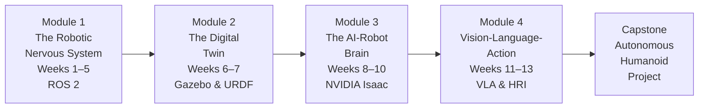

# Welcome to Physical AI & Humanoid Robotics

## What Is Physical AI?

We are living through one of the most consequential transitions in the history of technology. For decades, artificial intelligence lived entirely in software — processing language, recognizing images, recommending content — but always at a safe remove from the physical world. That era is ending. A new class of intelligent systems is emerging: machines that can *perceive, reason, and act* in the same physical space as humans. This is **Physical AI**: the convergence of machine learning, robotics, and sensor technology into systems that can reach, walk, grasp, and navigate alongside us.

The clearest expression of this shift is the humanoid robot. Boston Dynamics, Figure AI, Tesla, NVIDIA, and dozens of startups are racing to deploy human-shaped machines that can use tools designed for human hands, navigate environments built for human bodies, and collaborate with human workers on human terms. By 2025, humanoid robots have moved from laboratory curiosities to early commercial deployments in manufacturing and logistics. The question is no longer *whether* Physical AI will transform how we work and live — it is *when*, and *who will build it*.

This course is for builders. By the time you complete all 13 weeks and the capstone project, you will have hands-on experience with every layer of the Physical AI stack: from the fundamental middleware of robotics (ROS 2), through digital simulation environments (Gazebo, NVIDIA Isaac Sim), to the machine learning techniques that give robots intelligent behavior (reinforcement learning, computer vision), all the way to the natural language interfaces that allow humans and robots to collaborate through speech. You will not just understand Physical AI — you will have built a version of it yourself.

---

## Course Structure

This course is organized into four modules, each building on the last, culminating in a capstone project where you integrate everything into a single autonomous system.

*The learning journey across all four modules — each module delivers complete, runnable skills that feed directly into the next.*

### Module 1: The Robotic Nervous System (Weeks 1–5)

Everything starts here. Before a robot can think, it needs a nervous system — a way to sense the world, pass information between components, and send commands to actuators. ROS 2 (Robot Operating System 2) is that nervous system for the vast majority of modern robotics research and development. You will learn what Physical AI is, how sensors encode the world, how ROS 2 organizes computation into nodes and topics, and how to build complete Python packages with launch files. By the end of Week 5, you will be building real ROS 2 software from scratch.

### Module 2: The Digital Twin (Weeks 6–7)

Real robots are expensive. Mistakes are costly. Simulation solves both problems. In this module, you will learn to create and control virtual robot environments in Gazebo Harmonic, one of the most widely used robot simulators in the world. You will also learn URDF — the XML format used to describe robot geometry, kinematics, and inertia — and how to connect simulated sensors to your ROS 2 code. By the end of Week 7, you can test any robot behavior safely before touching hardware.

### Module 3: The AI-Robot Brain (Weeks 8–10)

NVIDIA Isaac is the GPU-accelerated platform that powers the next generation of Physical AI. In this module, you will learn how Isaac Sim provides photorealistic synthetic training data, how Isaac Lab trains reinforcement learning policies across thousands of parallel robot environments, and how to close the sim-to-real gap by exporting trained PyTorch policies to ONNX format for edge deployment on NVIDIA Jetson. This is where robots go from scripted to learned behavior.

### Module 4: Vision-Language-Action (Weeks 11–13)

The final module tackles the hardest problems in Physical AI: how do humanoid robots move with the full complexity of a human body (kinematics and locomotion), how do they grasp objects they have never seen before (manipulation and grasping), and how do they understand natural language instructions from the people around them (conversational robotics with Whisper and LLMs)? By Week 13, you will have built a voice-to-action pipeline that takes a spoken command and converts it into a structured sequence of ROS 2 actions.

### Capstone: The Autonomous Humanoid

The capstone project integrates all five components — voice command, LLM planning, ROS 2 navigation, object detection, and MoveIt2 grasping — into a single end-to-end pipeline. A student who completes the capstone can demonstrate a simulated humanoid robot that hears a voice command, understands it, navigates to the right location, identifies a target object, and grasps it. This is Physical AI in action.

---

## Prerequisites

This course assumes you are a programmer who is new to robotics. You do not need prior experience with ROS, simulation, or machine learning. You do need:

**Software prerequisites:**
- **Ubuntu 22.04 LTS** (or Windows 11 with WSL2 running Ubuntu 22.04) — ROS 2 Humble requires Ubuntu 22.04
- **Python 3.11+** — all code examples use Python with type hints
- **Node.js 20 LTS** — required to run this textbook's Docusaurus-based site locally
- **Git** — for managing your workspace

**Hardware prerequisites:**
- **Modules 1–2**: Any modern laptop or desktop with 8 GB RAM. Gazebo simulation benefits from a discrete GPU but runs on integrated graphics.
- **Module 3 (NVIDIA Isaac)**: Requires an **NVIDIA RTX GPU with at least 8 GB of VRAM**. If you do not have RTX hardware, you can follow the conceptual content and use Isaac Sim's cloud preview. Isaac Lab can run on NVIDIA A100/H100 cloud instances.
- **All modules**: **16 GB RAM** recommended; 8 GB minimum.

**Knowledge prerequisites:**
- Python programming (functions, classes, modules, type hints)
- Basic command line / terminal usage (navigating directories, running scripts)
- Familiarity with JSON and YAML formats
- Some exposure to machine learning concepts (not required, but helpful for Modules 3–4)

---

## How to Use This Textbook

Each weekly chapter follows the same eight-section structure so you always know what to expect:

1. **Learning Objectives** — specific, measurable skills you will acquire
2. **Introduction** — why this topic matters in the real world
3. **Core Concepts** — the main educational content with diagrams and explanations
4. **Code Examples** — working, runnable code that you can copy and execute
5. **Hands-On Exercise** — a practical task to apply what you just learned
6. **Summary** — a quick recap of the key points
7. **Quiz** — five multiple-choice questions to test your understanding
8. **Further Reading** — curated resources to go deeper

**Recommended pacing:** One chapter per week, with the hands-on exercise completed before reading the next chapter. Each chapter is designed to take 45–90 minutes to read and an additional 30–60 minutes to complete the exercise.

**Cross-references:** When a concept from a previous chapter is relevant, you will see a :::tip admonition pointing you to the earlier material.

**Code blocks:** All code blocks include line numbers and a top-line comment explaining the purpose of the snippet. Code is written for Python 3.11+ with full type hints.

---

## Getting Help

**ROS 2 community:** The ROS Discourse forum and the ROS 2 documentation at docs.ros.org are the authoritative sources for ROS 2 questions.

**NVIDIA Isaac:** The NVIDIA Isaac developer forums and the Isaac documentation provide support for all Isaac platform questions.

**Stack Overflow:** The `ros2`, `gazebo`, and `python-robotics` tags on Stack Overflow have active communities.

Ready to build? Turn to [Week 1: Introduction to Physical AI](/module-1-ros2/week-01-intro-physical-ai) and let us get started.
