# 🤖 Week 1: Introduction to Physical AI

## 🎯 Learning Objectives

By the end of this chapter you will be able to:

- Define Physical AI and explain how it differs from disembodied language models
- Contrast embodied intelligence with traditional software-only AI approaches
- Explain the Sense → Plan → Act loop and trace it through a concrete robot scenario
- Identify three or more real humanoid robots (Atlas, Figure 01, Tesla Optimus, Unitree G1) and describe their key characteristics
- Articulate why a human-shaped body is a strategic advantage for robots operating in human environments

---

## 📖 Introduction

Artificial intelligence made headlines for years through language, chess, and image recognition — tasks that happen entirely inside a computer. The new frontier is different: AI that *moves through the world*, picks things up, opens doors, and collaborates with people on factory floors and in homes. This is **Physical AI** — intelligence that is grounded in, and inseparable from, a physical body.

The years 2024 and 2025 represent an inflection point. A dozen well-funded companies shipped humanoid robots to real workplaces. Boston Dynamics' Atlas transitioned from a hydraulic research platform to an all-electric commercial product. Figure AI's Figure 01 signed a contract with BMW. Tesla's Optimus began assembling its own batteries. These are not science-fiction prototypes; they are production-intent machines, and the software stacks powering them are built on the same tools you will learn in this course.

Over the next 13 weeks you will build real software for real robots — starting with the conceptual foundations in this chapter and ending with a fully integrated autonomous humanoid that listens to voice commands, plans actions with an LLM, navigates with Nav2, detects objects with YOLO, and grasps them with MoveIt2. Every chapter is hands-on. Every week you will run code. By Week 13, you will have built something worth putting on a résumé.

---

## 🧠 Core Concepts

### What Is Physical AI?

Physical AI refers to artificial intelligence systems that perceive, reason about, and act upon the physical world through a body equipped with sensors and actuators. The key word is *embodied*: the intelligence is not separable from the hardware that hosts it.

Compare this to a large language model (LLM). An LLM like GPT-4 processes text and returns text. It has no eyes, no joints, no notion of gravity or friction. When you ask it "how do I pick up a glass?", it answers from statistical patterns in training data — it has never felt the weight of a glass or adjusted its grip when the surface was slippery. A Physical AI system *has*. It has a force/torque sensor on its wrist and a depth camera above its shoulder, and its controllers were trained in simulation through millions of attempted grasps.

This is not to say LLMs are irrelevant to robotics — Week 13 of this course uses an LLM as a high-level task planner. But the LLM is one component in a much larger stack. The foundation of that stack is the embodied loop.

### Embodied Intelligence

The philosopher James Gibson introduced the concept of *affordances* in 1979: the environment offers possibilities for action that are perceived directly by an agent with the right body. A chair affords sitting to a human but not to a snake. A door handle affords turning to a hand but not to a claw. Intelligence, in Gibson's view, cannot be understood in isolation from the body doing the perceiving.

Modern robotics vindicates this intuition. Research consistently shows that robots with richer sensorimotor experience — more diverse contacts, more varied terrains, more physical interactions — develop better internal world models than robots trained purely on video or text. The body is not just an output device for a brain; it is part of the cognitive system. Sensing shapes planning; planned actions reshape sensing. This tight coupling is called *sensorimotor integration*, and it is the reason Physical AI is architecturally different from everything that came before.

### The Sense → Plan → Act Loop

Every physical AI system — from a Roomba to a humanoid — executes the same fundamental cycle:

```mermaid
flowchart LR
    S["🔍 Sense\n(Perceive world)"] --> P["🧠 Plan\n(Decide action)"]
    P --> A["⚡ Act\n(Execute motion)"]
    A --> W["🌍 World\n(Changes state)"]
    W --> S
```



*Caption: The Sense-Plan-Act feedback loop — the fundamental cognitive cycle of every physical AI system. Each arrow represents a data flow: sensor readings feed the planner; planned commands drive actuators; actuator motion changes the world; the changed world is re-sensed.*

**Sense**: Cameras, LiDAR, IMUs, force/torque sensors, and microphones sample the state of the environment and the robot's own body. The output is raw data — point clouds, image tensors, acceleration vectors.

**Plan**: A reasoning layer — which may be a classical planner, a neural network, or an LLM — interprets the sensor data and decides what to do next. "The object is 0.4 m ahead and 0.1 m to the left. Move forward 0.3 m, rotate 15° left, then close the gripper."

**Act**: Motor controllers execute the plan by sending torque commands to joints, velocity commands to wheels, or pressure commands to pneumatic actuators.

The loop runs continuously — typically at 50–1000 Hz for low-level motor control, and 1–10 Hz for high-level task planning. The frequencies are layered: a fast inner loop keeps the robot balanced while a slow outer loop decides where to walk.

### The Humanoid Robot Landscape

Four platforms dominate the current humanoid robot landscape:

| Robot | Manufacturer | Locomotion | Notable Feature | Year |
|-------|-------------|------------|-----------------|------|
| Atlas | Boston Dynamics | Dynamic bipedal | Whole-body acrobatics; electric joints | 2013 (electric: 2024) |
| Figure 01 | Figure AI | Bipedal walking | BMW factory deployment | 2023 |
| Optimus Gen 2 | Tesla | Bipedal walking | Self-assembly in Tesla factory | 2024 |
| Unitree G1 | Unitree Robotics | Bipedal + manipulation | $16K price point; ROS 2 native | 2024 |

Each platform makes different tradeoffs. Atlas prioritizes agility and whole-body coordination — it can do backflips, but it costs roughly $150,000. Unitree G1 prioritizes accessibility — at $16,000, it is within reach of university labs and well-funded startups. Figure 01 and Optimus prioritize industrial reliability — they are designed to work an 8-hour shift on a factory floor without falling over.

### Why Humanoids?

The case for humanoid form factors rests on three arguments.

**Human-designed environments**: Our world is built for human bodies. Stairs, doorknobs, keyboards, car interiors, kitchen counters — every dimension and every interface was designed for a 5–6 foot bipedal agent with two hands. A wheeled robot cannot climb stairs. A quadruped cannot reach into a high cabinet. A humanoid can operate in any space a human can.

**Human tools**: Every tool humanity has ever built — hammers, screwdrivers, surgical instruments, keyboards — was designed for human hands. Training a humanoid to use existing human tools is far more economical than redesigning every tool for a robot end-effector.

**Human collaboration**: Humans evolved to read human body language, hand gestures, and gaze direction. A robot that moves like a human is more legible to human teammates — they can predict its intentions, step out of its way, and hand it objects naturally. This legibility is a safety feature as much as a usability feature.

---

## 💻 Code Examples

### Example 1: The SensePlanAct Robot

```python showLineNumbers
# Simulates the Sense-Plan-Act cognitive loop in pure Python
# No ROS 2 required — this is a conceptual model

import random
import time


class SensePlanActRobot:
    """A minimal robot that demonstrates the Sense → Plan → Act loop."""

    def sense(self) -> dict:
        """Simulate reading from distance and temperature sensors."""
        return {
            "distance_m": round(random.uniform(0.1, 3.0), 2),
            "temperature_c": round(random.uniform(18.0, 35.0), 1),
            "obstacle_detected": random.random() < 0.3,
        }

    def plan(self, sensor_data: dict) -> str:
        """Decide what to do based on sensor readings."""
        if sensor_data["obstacle_detected"]:
            return "STOP_AND_TURN"
        elif sensor_data["distance_m"] < 0.5:
            return "SLOW_APPROACH"
        elif sensor_data["temperature_c"] > 30.0:
            return "SEEK_COOL_ZONE"
        else:
            return "MOVE_FORWARD"

    def act(self, action: str) -> None:
        """Execute the planned action (simulated)."""
        actions = {
            "STOP_AND_TURN": "Stopping and rotating 90 degrees",
            "SLOW_APPROACH": "Slowing to 0.1 m/s for careful approach",
            "SEEK_COOL_ZONE": "Navigating toward lower temperature zone",
            "MOVE_FORWARD": "Moving forward at 0.5 m/s",
        }
        print(f"ACTION: {actions.get(action, 'UNKNOWN')}")
```

### Example 2: Running the Loop

```python showLineNumbers
# Run the Sense-Plan-Act loop for 5 iterations with mock sensor data

robot = SensePlanActRobot()

print("=== Sense-Plan-Act Demo: 5 Cycles ===\n")
for cycle in range(1, 6):
    print(f"--- Cycle {cycle} ---")
    sensor_data = robot.sense()
    print(f"  SENSE: distance={sensor_data['distance_m']}m, "
          f"temp={sensor_data['temperature_c']}C, "
          f"obstacle={sensor_data['obstacle_detected']}")
    action = robot.plan(sensor_data)
    print(f"  PLAN:  selected action = {action}")
    robot.act(action)
    print()
    time.sleep(0.1)

print("=== Demo complete ===")
```

**Expected output:**

```
=== Sense-Plan-Act Demo: 5 Cycles ===

--- Cycle 1 ---
  SENSE: distance=1.45m, temp=22.3C, obstacle=False
  PLAN:  selected action = MOVE_FORWARD
ACTION: Moving forward at 0.5 m/s
```

---

## 🛠️ Hands-On Exercise: Humanoid Robot Research Table

**Difficulty**: Beginner | **Time**: 20–30 minutes | **Prerequisites**: Python 3.11+

Build a Python script that creates a comparison table for three humanoid robots and prints it using f-strings.

```python showLineNumbers
# Research three humanoid robots and print a formatted comparison table

humanoid_robots = {
    "Atlas (Electric)": {
        "manufacturer": "Boston Dynamics",
        "locomotion_type": "Dynamic bipedal",
        "payload_kg": 11.3,
        "use_case": "Industrial inspection, research",
        "year_released": 2024,
    },
    "Figure 01": {
        "manufacturer": "Figure AI",
        "locomotion_type": "Bipedal walking",
        "payload_kg": 20.0,
        "use_case": "Automotive manufacturing (BMW)",
        "year_released": 2023,
    },
    "Unitree G1": {
        "manufacturer": "Unitree Robotics",
        "locomotion_type": "Bipedal + manipulation",
        "payload_kg": 3.0,
        "use_case": "Research, education, startups",
        "year_released": 2024,
    },
}

header = (f"{'Robot':<22} {'Manufacturer':<20} {'Locomotion':<24} "
          f"{'Payload':>9} {'Use Case':<34} {'Year'}")
separator = "-" * len(header)

print(separator)
print(header)
print(separator)

for name, info in humanoid_robots.items():
    print(
        f"{name:<22} {info['manufacturer']:<20} {info['locomotion_type']:<24} "
        f"{info['payload_kg']:>8.1f}kg {info['use_case']:<34} {info['year_released']}"
    )

print(separator)
print(f"\nTotal robots compared: {len(humanoid_robots)}")
```

**Expected Output:**

```
---------------------------------------------------------------------------------------------------
Robot                  Manufacturer         Locomotion               Payload  Use Case                            Year
---------------------------------------------------------------------------------------------------
Atlas (Electric)       Boston Dynamics      Dynamic bipedal           11.3kg  Industrial inspection, research      2024
Figure 01              Figure AI            Bipedal walking           20.0kg  Automotive manufacturing (BMW)       2023
Unitree G1             Unitree Robotics     Bipedal + manipulation     3.0kg  Research, education, startups        2024
---------------------------------------------------------------------------------------------------

Total robots compared: 3
```

**Stretch goal**: Add two more robots (Agility Robotics Digit, 1X Neo) and sort the table by `year_released`.

---

## 📋 Summary

- **Physical AI** is AI that perceives and acts in the physical world through a body; it is fundamentally different from text-only AI
- **Embodied intelligence** means the body is part of cognition — sensorimotor coupling shapes how the robot builds a world model
- **Sense → Plan → Act** is the universal loop: every robot executes it continuously at multiple frequencies
- **Four key humanoid platforms** (Atlas, Figure 01, Optimus, Unitree G1) represent different tradeoffs between performance, cost, and deployment context
- **Humanoid form** is strategically justified by human-designed environments, human tools, and legible human-robot collaboration

---

## 🧪 Quiz

**Question 1**: What is the primary distinction between Physical AI and a Large Language Model (LLM)?

- A) LLMs are faster than Physical AI systems
- B) Physical AI operates through a physical body with sensors and actuators; LLMs process only tokens ✅
- C) Physical AI only works outdoors
- D) LLMs cannot be used in robotics at all

**Question 2**: Which loop describes the fundamental cognitive cycle of every physical AI system?

- A) Input → Process → Output
- B) Train → Evaluate → Deploy
- C) Sense → Plan → Act ✅
- D) Perceive → Classify → Store

**Question 3**: In the Sense-Plan-Act loop, what is the role of the "Plan" step?

- A) Collecting raw sensor data from cameras and LiDAR
- B) Sending torque commands to motor controllers
- C) Interpreting sensor data and deciding the next action to execute ✅
- D) Storing long-term memories in a database

**Question 4**: Which of the following best explains why humanoid form factors are strategically important for commercial robotics?

- A) Humanoids are cheaper to manufacture than wheeled robots
- B) Human environments, tools, and collaboration patterns were designed for human-shaped bodies ✅
- C) Bipedal locomotion is always more energy-efficient than wheels
- D) Humanoids require less software complexity than other robot types

**Question 5**: A robot is navigating a warehouse. Its LiDAR detects an obstacle 0.3 m ahead. Which layer of the Sense-Plan-Act loop processes this to decide whether to stop or turn?

- A) The Sense layer — it processes and acts on raw LiDAR data directly
- B) The Act layer — motor controllers interpret distance values
- C) The Plan layer — it receives sensor data and decides the appropriate action ✅
- D) The World layer — the environment determines the response

---

## 📚 Further Reading

- [ROS 2 Documentation — Getting Started](https://docs.ros.org/en/humble/index.html) — Official ROS 2 Humble documentation; start here before Week 3
- [NVIDIA Isaac — Robotics Platform Overview](https://developer.nvidia.com/isaac) — NVIDIA full robotics AI platform including Isaac Sim, Isaac ROS, and Isaac Lab
- [Understanding Intelligence — Pfeifer and Scheier (MIT Press)](https://mitpress.mit.edu/9780262161541/understanding-intelligence/) — The foundational academic text on embodied cognition and its implications for AI and robotics
