# 🔬 Week 2: Embodied Intelligence & Sensor Systems

:::tip Related Chapter
This chapter expands on the **Sense** step from [Week 1's Sense-Plan-Act loop](/module-1-ros2/week-01-intro-physical-ai). Every sensor type covered here feeds data into that loop.
:::

## 🎯 Learning Objectives

By the end of this chapter you will be able to:

- Explain why embodied intelligence requires tight sensorimotor coupling between sensors and actions
- Describe the operating principles of LiDAR, RGB-D cameras, IMUs, and force/torque sensors
- Explain how sensor fusion combines multiple modalities to produce a reliable world model
- Implement Python dataclasses to represent LiDAR, IMU, and camera readings with correct types
- Generate and visualize a synthetic 3D point cloud using the `open3d` library

---

## 📖 Introduction

In Week 1 we established that the Sense → Plan → Act loop is the heartbeat of every physical AI system. But we left one question unanswered: *what does "Sense" actually mean in hardware?*

The answer is a collection of electromechanical devices — lasers that measure distance at the speed of light, cameras that capture structured infrared patterns to reconstruct depth, tiny crystal oscillators that feel every vibration of a robot's footstep, and strain gauges so sensitive they can detect the difference between grasping a grape and grasping a golf ball. Together, these sensors give a robot its *proprioception* (awareness of its own body state) and *exteroception* (awareness of its environment).

Understanding each sensor's physics, strengths, and failure modes is not optional knowledge. A motion planner that does not understand LiDAR noise characteristics will command the robot into walls. An HRI (Human-Robot Interaction) system that does not model IMU drift will misidentify a turning robot as a falling one. This chapter builds the intuition you need to make smart sensor choices and to interpret sensor data correctly in the chapters that follow.

---

## 🧠 Core Concepts

### What Makes Intelligence Embodied?

James Gibson's theory of affordances (1979) argues that perception is never purely passive — it is always oriented toward action. When you see a cup handle, you do not first abstractly perceive a curved protrusion and then separately decide it affords grasping. Grasping and perceiving are fused. The body constrains and shapes what the mind notices.

This principle has a concrete engineering consequence: robots with richer physical interaction histories develop better generalising world models than robots trained purely on synthetic data. A robot that has physically grasped 10,000 real objects — feeling unexpected slippage, correcting grip on the fly, sensing vibration during cutting — builds representations that no amount of video watching can match. This is **sensorimotor coupling**: the motor system modifies what the sensory system attends to, and the sensory system continuously updates the motor system's predictions.

For you as a developer, the implication is practical: never discard sensor data prematurely. The temptation to reduce a 360° LiDAR scan to a single distance value is understandable, but doing so discards information that might be critical. Design pipelines that preserve full sensor fidelity until the planning layer genuinely cannot use more detail.

### LiDAR

**LiDAR** (Light Detection and Ranging) measures distance by emitting short pulses of laser light and timing how long they take to return. The fundamental equation is:

```
distance = (speed_of_light x time_of_flight) / 2
```

A rotating LiDAR (like the Velodyne VLP-16) fires 16 laser beams simultaneously while spinning at 10–20 Hz, producing a **point cloud** — a set of (x, y, z) coordinates representing surfaces in 3D space. A single scan at 10 Hz delivers roughly 300,000 points per second.

LiDAR is the backbone of **SLAM** (Simultaneous Localization and Mapping): the robot uses point cloud matching (typically the ICP or NDT algorithm) to estimate its own position while building a map of its environment. LiDAR SLAM is reliable in environments with geometric structure (indoor corridors, parking garages) but degrades in open fields with few distinct surfaces.

**Key failure modes**: specular reflections from mirrors or windows return incorrect distances; rain and fog scatter the beam; very dark surfaces absorb the laser pulse and return no reading.

### Depth Cameras (RGB-D)

RGB-D cameras combine a standard colour image with a per-pixel depth measurement. The **Intel RealSense D435i** — one of the most common platforms in robotics research — uses **structured light**: it projects a known infrared dot pattern onto the scene and measures the deformation of that pattern with an infrared camera. Deformation is proportional to depth.

An alternative principle is **time-of-flight (ToF)**: the camera modulates an infrared light source and measures the phase shift of the reflected signal. ToF cameras (like the Microsoft Azure Kinect) work well at greater ranges but consume more power.

RGB-D cameras produce a depth image where each pixel encodes distance in millimetres. Combined with the colour image and the camera's intrinsic matrix, this allows per-pixel 3D reconstruction — the foundation of the perception pipeline in Week 9.

**Key failure modes**: structured light is disrupted by direct sunlight; transparent and highly reflective surfaces return invalid depth values; range is typically limited to 0.3–10 m.

### IMU (Inertial Measurement Unit)

An IMU fuses two sensors:

- **Accelerometer**: measures linear acceleration in 3 axes (including gravity). At rest, it reads approximately 9.81 m/s downward — useful for estimating tilt.
- **Gyroscope**: measures angular velocity in 3 axes (roll rate, pitch rate, yaw rate) using the Coriolis effect in vibrating crystal structures.

Integrating gyroscope readings gives orientation over time — but integration accumulates error (drift). Integrating accelerometer readings twice gives position — but double integration amplifies noise catastrophically. This is why IMUs are always fused with other sensors.

The standard fusion output is a **quaternion** (w, x, y, z) — a 4-component number encoding 3D rotation without gimbal-lock singularities. Most ROS 2 IMU drivers publish `sensor_msgs/msg/Imu` messages containing the quaternion, angular velocity, and linear acceleration.

**Role in humanoid balance**: the robot's IMU reads its torso tilt. When the balance controller detects the torso leaning forward beyond a threshold, it commands the ankle joints to compensate — this happens at around 1 kHz, far faster than any human-in-the-loop control could achieve.

### Force/Torque Sensors

A force/torque (F/T) sensor mounted at the wrist or ankle measures the 6-DOF wrench (3 forces and 3 torques) applied to the end-effector or foot. F/T data is critical for:

- **Grasp stability detection**: if the measured force drops suddenly, the object has slipped
- **Compliant manipulation**: impedance control uses F/T feedback to make the robot yield when it encounters unexpected resistance, preventing breakage
- **Contact detection**: detecting the moment a foot touches the ground, enabling proper gait transitions
- **Safe HRI**: ISO/TS 15066 mandates that collaborative robots stop when F/T readings exceed safe limits during human contact

### Monocular and Stereo Cameras

A **monocular camera** captures a single RGB image stream. By itself, it cannot measure depth without additional assumptions or a known object size. However, modern neural networks (like DepthAnything v2) can estimate metric depth from monocular video with surprising accuracy.

A **stereo camera** pairs two cameras with a known baseline distance. The disparity between corresponding points in the left and right images encodes depth — wider disparity means closer object. Stereo reconstruction is more reliable than monocular depth in novel environments but fails when scenes lack texture (white walls, overcast sky).

The image pipeline from capture to ROS 2 publication runs: raw Bayer mosaic → debayer (reconstruct RGB) → lens distortion correction → stereo rectification (for stereo pairs) → publish as `sensor_msgs/msg/Image`.

### Sensor Fusion

No single sensor is sufficient. LiDAR gives precise 3D geometry but cannot identify object classes. Cameras identify objects but struggle with depth. IMUs are fast but drift. Force/torque sensors are precise but have no spatial range.

**Sensor fusion** combines multiple modalities to produce estimates better than any single source. Two classical approaches:

- **Complementary filter**: combines high-frequency gyroscope data (which drifts slowly) with low-frequency accelerometer data (which is noisy but drift-free) to produce a stable orientation estimate
- **Extended Kalman Filter (EKF)**: a probabilistic state estimator that maintains a Gaussian belief over the robot state and updates it as sensor readings arrive, weighting each reading by its covariance

```mermaid
flowchart TD
    L["📡 LiDAR\n360 point cloud"] --> F["🔀 Sensor Fusion Node\nEKF"]
    C["📷 Depth Camera\nRGB-D frame"] --> F
    I["📐 IMU\nquaternion + accel"] --> F
    F --> W["🗺️ World Model\nposition + map"]
    W --> T["📨 ROS 2 Topic\n/world_state"]
```



*Caption: Multi-sensor fusion architecture. Each sensor contributes to the EKF state estimator at its native frequency. The fused world model is published to a single ROS 2 topic consumed by the planning layer.*

---

## 💻 Code Examples

### Example 1: Sensor Data Dataclasses

```python showLineNumbers
# Typed dataclasses for representing raw sensor readings in Python
# These structures mirror the data carried in ROS 2 sensor messages

from dataclasses import dataclass
import numpy as np


@dataclass
class LiDARReading:
    """A single 360-degree LiDAR scan as a flat array of distances."""
    distances: np.ndarray          # shape (360,), float32, in metres; 0.0 = no return
    timestamp: float               # seconds since epoch
    frame_id: str = "laser_frame"


@dataclass
class IMUReading:
    """6-DOF inertial measurement: orientation + angular velocity + linear acceleration."""
    quaternion: tuple[float, float, float, float]      # (w, x, y, z)
    angular_velocity: tuple[float, float, float]       # rad/s around (x, y, z)
    linear_acceleration: tuple[float, float, float]    # m/s^2 along (x, y, z)
    timestamp: float
    frame_id: str = "imu_link"


@dataclass
class CameraFrame:
    """Aligned RGB + depth frame from an RGB-D camera."""
    image: np.ndarray    # shape (H, W, 3), dtype=uint8,  BGR pixel values
    depth: np.ndarray    # shape (H, W),    dtype=float32, metres (0.0 = invalid)
    timestamp: float
    frame_id: str = "camera_color_optical_frame"


class SensorFusion:
    """Combines latest readings from all sensors into a unified world snapshot."""

    def __init__(self) -> None:
        self.lidar: LiDARReading | None = None
        self.imu: IMUReading | None = None
        self.camera: CameraFrame | None = None

    def update(
        self,
        lidar: LiDARReading,
        imu: IMUReading,
        camera: CameraFrame,
    ) -> dict:
        """Store latest readings and return a simple fused state dict."""
        self.lidar = lidar
        self.imu = imu
        self.camera = camera

        # Estimate robot tilt from IMU quaternion
        w, x, y, z = imu.quaternion
        roll = np.arctan2(2 * (w * x + y * z), 1 - 2 * (x**2 + y**2))
        pitch = np.arcsin(2 * (w * y - z * x))

        # Nearest obstacle from LiDAR (ignore zero returns)
        valid = lidar.distances[lidar.distances > 0.0]
        nearest_obstacle_m = float(np.min(valid)) if len(valid) > 0 else float("inf")

        return {
            "roll_deg": round(float(np.degrees(roll)), 2),
            "pitch_deg": round(float(np.degrees(pitch)), 2),
            "nearest_obstacle_m": round(nearest_obstacle_m, 3),
            "camera_resolution": f"{camera.image.shape[1]}x{camera.image.shape[0]}",
        }
```

### Example 2: Synthetic LiDAR Scan Generator

```python showLineNumbers
# Generate a simulated 360-degree LiDAR scan with Gaussian noise
# Useful for testing navigation and mapping algorithms offline

import numpy as np
import time


def generate_lidar_scan(
    n_rays: int = 360,
    base_range_m: float = 5.0,
    noise_std_m: float = 0.02,
    obstacle_angle_deg: float = 45.0,
    obstacle_range_m: float = 1.2,
) -> LiDARReading:
    """
    Generate a synthetic LiDAR scan with a single near obstacle.

    Args:
        n_rays:              Number of rays (angular resolution = 360 / n_rays degrees)
        base_range_m:        Background wall distance in metres
        noise_std_m:         Gaussian noise standard deviation in metres
        obstacle_angle_deg:  Angle of the simulated obstacle in degrees
        obstacle_range_m:    Distance to the simulated obstacle in metres

    Returns:
        LiDARReading with distances array and current timestamp
    """
    angles_deg = np.linspace(0, 360, n_rays, endpoint=False)

    # Background: open space at base_range_m with Gaussian noise
    distances = np.random.normal(
        loc=base_range_m, scale=noise_std_m, size=n_rays
    ).astype(np.float32)

    # Inject a simulated obstacle spanning +/- 5 degrees around obstacle_angle_deg
    mask = np.abs(angles_deg - obstacle_angle_deg) < 5.0
    distances[mask] = np.random.normal(
        loc=obstacle_range_m, scale=noise_std_m * 0.5, size=mask.sum()
    ).astype(np.float32)

    return LiDARReading(distances=distances, timestamp=time.time())


# --- Demo ---
scan = generate_lidar_scan()
valid = scan.distances[scan.distances > 0.0]
print(f"Scan generated: {len(scan.distances)} rays")
print(f"Mean range:     {valid.mean():.2f} m")
print(f"Nearest point:  {valid.min():.2f} m")
print(f"Farthest point: {valid.max():.2f} m")
```

**Expected output:**

```
Scan generated: 360 rays
Mean range:     4.81 m
Nearest point:  1.17 m
Farthest point: 5.09 m
```

---

## 🛠️ Hands-On Exercise: Visualize a 3D Point Cloud

**Difficulty**: Intermediate | **Time**: 30–45 minutes | **Prerequisites**: Python 3.11+

Generate a synthetic 3D point cloud and visualize it using the Open3D library.

**Step 1 — Install Open3D:**

```bash
pip install open3d
```

**Step 2 — Generate and visualize:**

```python showLineNumbers
# Generate a 10,000-point synthetic point cloud and visualize with Open3D
# Simulates a LiDAR scan of a room with floor and two walls

import numpy as np
import open3d as o3d


def generate_room_pointcloud(n_points: int = 10_000) -> np.ndarray:
    """Generate points sampled from three planes simulating a room interior."""
    third = n_points // 3
    remainder = n_points - 2 * third

    # Floor: z = 0
    floor = np.column_stack([
        np.random.uniform(-3, 3, third),
        np.random.uniform(-3, 3, third),
        np.random.normal(0.0, 0.01, third),
    ])

    # Front wall: y = 3
    front_wall = np.column_stack([
        np.random.uniform(-3, 3, third),
        np.random.normal(3.0, 0.01, third),
        np.random.uniform(0, 2.5, third),
    ])

    # Right wall: x = 3
    right_wall = np.column_stack([
        np.random.normal(3.0, 0.01, remainder),
        np.random.uniform(-3, 3, remainder),
        np.random.uniform(0, 2.5, remainder),
    ])

    return np.vstack([floor, front_wall, right_wall]).astype(np.float32)


points = generate_room_pointcloud(10_000)
print(f"Generated {len(points):,} points")

pcd = o3d.geometry.PointCloud()
pcd.points = o3d.utility.Vector3dVector(points)

# Colour by height for visual clarity
z_values = points[:, 2]
z_norm = (z_values - z_values.min()) / (z_values.max() - z_values.min() + 1e-6)
colours = np.column_stack([z_norm, 1.0 - z_norm, np.zeros_like(z_norm)])
pcd.colors = o3d.utility.Vector3dVector(colours)

print("Opening Open3D viewer — close the window to continue")
o3d.visualization.draw_geometries(
    [pcd],
    window_name="Synthetic Room Point Cloud",
    width=1024,
    height=768,
)
print("Visualization closed.")
```

**Expected output**: An Open3D window opens showing a coloured 3D point cloud — floor points are green; upper wall points are red.

---

## 📋 Summary

- **Embodied intelligence** requires sensorimotor coupling; robot skills learned through physical interaction generalise better than those learned from data alone
- **LiDAR** uses time-of-flight to produce precise point clouds; it powers SLAM but degrades in fog, rain, and featureless environments
- **Depth cameras (RGB-D)** combine colour and depth using structured light or ToF; excellent for close-range manipulation but fail on transparent surfaces
- **IMUs** measure acceleration and rotation at high frequency; they drift over time and must always be fused with other sensors
- **Force/torque sensors** enable compliant manipulation and safe human-robot interaction by detecting contact forces at the end-effector or foot
- **Sensor fusion** (complementary filter, EKF) combines multiple modalities to produce estimates better than any single source

---

## 🧪 Quiz

**Question 1**: Which sensor principle does a LiDAR use to measure distance?

- A) Structured infrared light pattern deformation
- B) Phase shift of a modulated infrared signal
- C) Time-of-flight of a pulsed laser beam ✅
- D) Stereo baseline disparity between two cameras

**Question 2**: Why must IMU data always be fused with additional sensor data?

- A) IMUs can only measure rotation, not translation
- B) IMU gyroscope readings accumulate drift error over time ✅
- C) IMUs only work in temperatures above 0°C
- D) IMU data rates are too slow for real-time control

**Question 3**: A robot's wrist-mounted force/torque sensor detects a sudden drop in measured grip force during a pick-and-place task. What does this most likely indicate?

- A) The robot's battery is running low
- B) The camera frame rate has dropped
- C) The grasped object has slipped from the gripper ✅
- D) The IMU quaternion has drifted

**Question 4**: What is the purpose of the Extended Kalman Filter (EKF) in a sensor fusion pipeline?

- A) It compresses point cloud data to reduce memory usage
- B) It converts IMU quaternions to Euler angles
- C) It maintains a probabilistic state estimate, weighting sensors by their covariance ✅
- D) It filters out LiDAR returns from rain and fog

**Question 5**: A robot operates outdoors on a bright sunny day with a structured-light depth camera. The depth image shows almost entirely invalid values. What is the most likely cause?

- A) The camera USB bandwidth is saturated
- B) Ambient sunlight overwhelms the projected infrared pattern, making depth reconstruction impossible ✅
- C) The depth image requires a ROS 2 driver that is not running
- D) The robot is moving too fast for the camera's exposure time

---

## 📚 Further Reading

- [Open3D Documentation](http://www.open3d.org/docs/release/) — The go-to library for point cloud processing, 3D reconstruction, and visualisation in Python
- [Intel RealSense SDK Documentation](https://dev.intelrealsense.com/docs) — Programming guide for the D435i and other RealSense depth cameras, including Python examples
- [ROS 2 Common Interfaces — sensor_msgs](https://github.com/ros2/common_interfaces) — Canonical message definitions for `sensor_msgs/msg/Imu`, `sensor_msgs/msg/PointCloud2`, `sensor_msgs/msg/Image`
