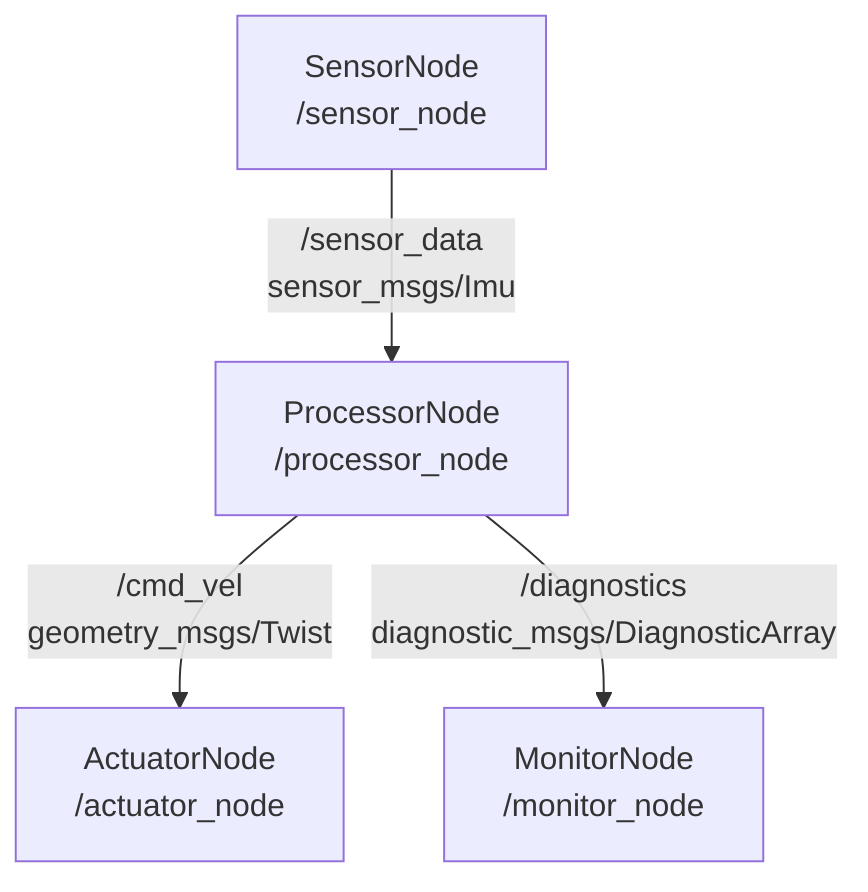

# 🏗️ Week 3: ROS 2 Architecture & Core Concepts

:::tip Related Chapter
The sensors from [Week 2](/module-1-ros2/week-02-embodied-intelligence) publish their data onto ROS 2 topics. This week you will understand exactly how that publishing mechanism works under the hood.
:::

## 🎯 Learning Objectives

By the end of this chapter you will be able to:

- Explain why ROS 2 was developed to replace ROS 1 and what problems it solves
- Describe the ROS 2 computation graph: nodes, topics, services, actions, and parameters
- Install ROS 2 Humble Hawksbill on Ubuntu 22.04 step-by-step
- Write, build, and run a minimal Python ROS 2 node using `rclpy`
- Use five essential CLI tools: `ros2 node list`, `ros2 topic echo`, `ros2 topic hz`, `ros2 run`, `ros2 topic pub`

---

## 📖 Introduction

Before any robot can do anything useful, its software components must talk to each other. A sensor node needs to send readings to a perception node; a perception node needs to command an actuator node; a safety monitor needs to shut everything down if something goes wrong. Coordinating these messages across potentially dozens of processes, running on multiple computers, over unreliable networks, in real-time — this is the problem that middleware solves.

**ROS 2** (Robot Operating System 2) is the industry-standard middleware for robotics. It is not an operating system in the traditional sense — it runs on top of Linux, macOS, or Windows. It is a collection of libraries, tools, and conventions that give you a common language for robot software. Publish a sensor reading from any node in any language; subscribe to it from any other node in any language. Use the same API whether you are running on a single laptop or a fleet of robots communicating over a 5G network.

By the end of this chapter, you will have ROS 2 Humble installed, a working Python node running, and the CLI tools to inspect any ROS 2 system. These skills are the foundation for every subsequent chapter in this course.

---

## 🧠 Core Concepts

### Why ROS 2 Over ROS 1?

ROS 1 (released 2007) was revolutionary for its time but was built on assumptions that do not hold for modern robotics:

| Limitation | ROS 1 | ROS 2 |
|-----------|-------|-------|
| Communication | Custom TCP-based roscore (single point of failure) | DDS (Data Distribution Service) — decentralised, no single point of failure |
| Real-time support | None — not suitable for hard real-time control | DDS QoS policies enable deterministic latency |
| Security | No encryption or authentication | SROS2 provides DDS-Security with mutual TLS |
| Multi-robot | Single ROS master = single robot | Domain isolation allows multiple independent robots on same network |
| Python version | Python 2 (EOL 2020) | Python 3 throughout |

The core architectural change is the replacement of the centralized `roscore` master with **DDS** (Data Distribution Service), an industry-standard publish-subscribe middleware used in aircraft, military systems, and medical devices. DDS is decentralised: any node can discover any other node directly, without a broker.

### The ROS 2 Computation Graph

A ROS 2 system is a **computation graph**: a network of processes (nodes) exchanging typed messages over named channels.



*Caption: A four-node ROS 2 computation graph. Arrows represent topic subscriptions. The ProcessorNode subscribes to sensor data and publishes both velocity commands and diagnostic information.*

The five primitive communication patterns in the computation graph:

- **Topics**: Asynchronous publish-subscribe. Publisher sends; any number of subscribers receive. Fire-and-forget.
- **Services**: Synchronous request-response. One client sends a request; one server returns a response. Blocking.
- **Actions**: Asynchronous long-running tasks with feedback. Client sends a goal; server sends periodic feedback; server sends a final result. Non-blocking with progress reporting.
- **Parameters**: Key-value configuration store per node. Get/set at runtime without restarting nodes.
- **tf2**: A distributed coordinate frame tree. Every sensor, link, and reference frame has a transform. Navigation, perception, and control all depend on tf2 being correct.

### DDS: The Communication Backbone

DDS (OMG Data Distribution Service) is the transport layer underneath every ROS 2 message. Key concepts:

- **Quality of Service (QoS)**: Each topic publisher and subscriber declares a QoS profile specifying reliability, durability, and deadline. For sensor data you typically use `BEST_EFFORT` (low latency, no retransmission). For commands you use `RELIABLE` (guaranteed delivery). Mismatched QoS prevents communication — a common debugging issue.
- **Domain ID**: An integer (0–232) that isolates independent ROS 2 systems on the same network. Two robots on the same LAN use different domain IDs to avoid interference.
- **RMW implementations**: The ROS middleware interface (RMW) abstracts over concrete DDS vendors. Common choices: FastDDS (default), CycloneDDS, Connext.

### ROS 2 Distributions

| Distribution | Status | EOL | Ubuntu |
|-------------|--------|-----|--------|
| Humble Hawksbill | **LTS — Recommended** | May 2027 | 22.04 |
| Iron Irwini | Standard | Nov 2024 | 22.04 / 23.10 |
| Jazzy Jalisco | LTS | May 2029 | 24.04 |

**Use Humble** for this course. It is the LTS release most widely used in industry and academia as of 2025.

### Installing ROS 2 Humble on Ubuntu 22.04

:::warning
The installation commands below require `sudo`. Never run arbitrary `sudo` commands from untrusted sources. Read each command before running it.
:::

**Step 1 — Locale setup:**

```bash
sudo apt update && sudo apt install -y locales
sudo locale-gen en_US en_US.UTF-8
sudo update-locale LC_ALL=en_US.UTF-8 LANG=en_US.UTF-8
export LANG=en_US.UTF-8
```

**Step 2 — Add the ROS 2 apt repository:**

```bash
sudo apt install -y software-properties-common curl
sudo curl -sSL https://raw.githubusercontent.com/ros/rosdistro/master/ros.key \
  -o /usr/share/keyrings/ros-archive-keyring.gpg
echo "deb [arch=$(dpkg --print-architecture) signed-by=/usr/share/keyrings/ros-archive-keyring.gpg] \
  http://packages.ros.org/ros2/ubuntu $(. /etc/os-release && echo $UBUNTU_CODENAME) main" \
  | sudo tee /etc/apt/sources.list.d/ros2.list > /dev/null
```

**Step 3 — Install ROS 2 Humble Desktop:**

```bash
sudo apt update
sudo apt upgrade -y
sudo apt install -y ros-humble-desktop
```

:::info
The `desktop` variant includes RViz2, Gazebo integration tools, and demonstration packages. It is approximately 1.5 GB.
:::

**Step 4 — Source the setup file (add to `.bashrc` for persistence):**

```bash
echo "source /opt/ros/humble/setup.bash" >> ~/.bashrc
source ~/.bashrc
```

**Step 5 — Verify installation:**

```bash
ros2 run demo_nodes_py talker
```

You should see `[INFO] Publishing: 'Hello World: N'` messages. Press Ctrl+C to stop.

### The `rclpy` Client Library

`rclpy` is the Python client library for ROS 2. It provides:

- `rclpy.node.Node` — the base class for all ROS 2 nodes
- `node.create_publisher()` / `node.create_subscription()` — topic I/O
- `node.create_service()` / `node.create_client()` — service I/O
- `node.create_action_server()` / `rclpy.action.ActionClient` — action I/O
- `node.create_timer()` — periodic callbacks without external threads
- `node.declare_parameter()` / `node.get_parameter()` — runtime config

All ROS 2 Python nodes follow the same lifecycle: initialise `rclpy` → create a node → spin (enter the event loop) → destroy the node → shutdown `rclpy`.

### Essential CLI Tools

| Command | Purpose | Example |
|---------|---------|---------|
| `ros2 node list` | List all running nodes | `ros2 node list` |
| `ros2 topic echo /topic` | Print messages on a topic | `ros2 topic echo /chatter` |
| `ros2 topic hz /topic` | Measure message frequency | `ros2 topic hz /cmd_vel` |
| `ros2 run pkg node` | Run a node from a package | `ros2 run demo_nodes_py talker` |
| `ros2 topic pub /topic type data` | Publish a one-shot message | `ros2 topic pub /cmd_vel geometry_msgs/msg/Twist "{linear: {x: 0.5}}"` |

---

## 💻 Code Examples

### Example 1: MinimalNode — Hello from ROS 2

```python showLineNumbers
# A minimal ROS 2 Python node that logs "Hello from ROS 2" every 1 second
# Save as: minimal_node.py

import rclpy
from rclpy.node import Node


class MinimalNode(Node):
    """A node with a single timer callback that logs a greeting."""

    def __init__(self) -> None:
        super().__init__("minimal_node")
        # Create a timer that calls timer_callback every 1.0 seconds
        self.timer = self.create_timer(1.0, self.timer_callback)
        self.get_logger().info("MinimalNode started — logging every 1 second")

    def timer_callback(self) -> None:
        self.get_logger().info("Hello from ROS 2!")


def main(args: list[str] | None = None) -> None:
    rclpy.init(args=args)
    node = MinimalNode()
    try:
        rclpy.spin(node)
    except KeyboardInterrupt:
        pass
    finally:
        node.destroy_node()
        rclpy.shutdown()


if __name__ == "__main__":
    main()
```

### Example 2: Building and Running the Node

```bash showLineNumbers
# Build and run a ROS 2 Python node from a workspace

# 1. Create a workspace
mkdir -p ~/ros2_ws/src
cd ~/ros2_ws

# 2. Copy minimal_node.py into the workspace (standalone script, no package needed yet)
cp /path/to/minimal_node.py ~/ros2_ws/

# 3. Source ROS 2 (if not already in .bashrc)
source /opt/ros/humble/setup.bash

# 4. Run the node directly with Python
python3 minimal_node.py

# Expected output:
# [INFO] [minimal_node]: MinimalNode started — logging every 1 second
# [INFO] [minimal_node]: Hello from ROS 2!
# [INFO] [minimal_node]: Hello from ROS 2!
# ...
```

---

## 🛠️ Hands-On Exercise: Talker-Listener Verification

**Difficulty**: Beginner | **Time**: 15–20 minutes | **Prerequisites**: ROS 2 Humble installed

**Goal**: Verify your ROS 2 installation by running the built-in talker/listener demo and inspecting the topic with CLI tools.

**Step 1 — Open terminal 1, start the talker:**

```bash
source /opt/ros/humble/setup.bash
ros2 run demo_nodes_py talker
```

**Step 2 — Open terminal 2, start the listener:**

```bash
source /opt/ros/humble/setup.bash
ros2 run demo_nodes_py listener
```

**Step 3 — Open terminal 3, inspect the system:**

```bash
source /opt/ros/humble/setup.bash

# List running nodes
ros2 node list

# Show topic details
ros2 topic info /chatter

# Print messages
ros2 topic echo /chatter

# Measure frequency
ros2 topic hz /chatter
```

**Expected output in terminal 3:**

```
/talker
/listener
---
Type: std_msgs/msg/String
Publisher count: 1
Subscription count: 1
---
data: 'Hello World: 42'
---
average rate: 1.000 Hz
```

---

## 📋 Summary

- **ROS 2** replaces ROS 1's centralised roscore with DDS, gaining real-time support, security, and multi-robot capability
- **The computation graph** consists of nodes exchanging typed messages via topics (async), services (sync), actions (long-running), and parameters (config)
- **DDS QoS policies** (RELIABLE vs BEST_EFFORT, TRANSIENT_LOCAL) must match between publishers and subscribers or communication silently fails
- **ROS 2 Humble** is the recommended LTS release — install it on Ubuntu 22.04 with `apt`
- **`rclpy`** provides the Python API; every node inherits from `Node`, uses `create_timer/publisher/subscription`, and spins in the `rclpy.spin()` event loop

---

## 🧪 Quiz

**Question 1**: What fundamental architectural change did ROS 2 make compared to ROS 1?

- A) ROS 2 switched from Python to C++ as its primary language
- B) ROS 2 replaced the centralised `roscore` master with DDS, enabling decentralised peer-to-peer communication ✅
- C) ROS 2 added support for Windows by removing Linux-specific system calls
- D) ROS 2 replaced topics with HTTP REST endpoints for all communication

**Question 2**: A ROS 2 publisher uses `RELIABLE` QoS but the subscriber uses `BEST_EFFORT` QoS. What happens?

- A) Messages are delivered but with added latency for reliability checking
- B) The subscriber automatically upgrades to RELIABLE QoS
- C) No communication occurs — mismatched QoS policies prevent the connection ✅
- D) Messages are delivered only when the network is idle

**Question 3**: Which ROS 2 communication pattern is most appropriate for a long-running task like "navigate to room 3B" where you need periodic progress updates?

- A) Topic — publish the goal and subscribe to updates
- B) Service — send a request and block until navigation completes
- C) Action — send a goal, receive periodic feedback, receive a final result ✅
- D) Parameter — store the goal as a node parameter

**Question 4**: What does the `rclpy.spin(node)` call do in a ROS 2 Python node?

- A) It runs the node's timers once and then exits
- B) It enters the event loop, executing callbacks for timers, subscriptions, and services until the node is shut down ✅
- C) It publishes a spinning diagnostic message to `/diagnostics`
- D) It creates a new thread for each callback registered on the node

**Question 5**: You run `ros2 topic hz /camera/depth/image_rect_raw` and see `average rate: 0.000 Hz`. What does this indicate?

- A) The camera is publishing at maximum speed with no throttling
- B) The topic exists but no node is currently subscribing to it
- C) No node is currently publishing messages on this topic ✅
- D) The ROS 2 daemon has crashed and needs to be restarted

---

## 📚 Further Reading

- [ROS 2 Humble Documentation](https://docs.ros.org/en/humble/index.html) — Complete official documentation including tutorials, how-to guides, and API reference
- [DDS and ROS 2 — ROS 2 Design Docs](https://design.ros2.org/articles/ros_on_dds.html) — The original design document explaining why DDS was chosen and how it maps to ROS concepts
- [rclpy API Reference](https://docs.ros2.org/latest/api/rclpy/) — Full Python client library API including Node, Publisher, Subscription, Service, Action, and Timer classes
