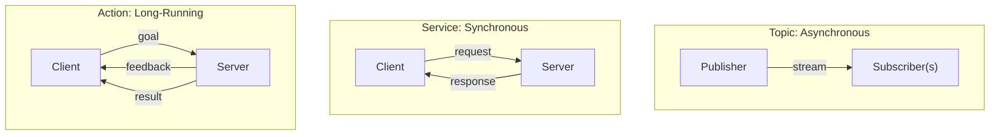

# 📡 Week 4: Nodes, Topics, Services & Actions

:::tip Related Chapter
This chapter builds directly on the computation graph introduced in [Week 3](/module-1-ros2/week-03-ros2-architecture). Make sure you have ROS 2 Humble installed before starting.
:::

## 🎯 Learning Objectives

By the end of this chapter you will be able to:

- Explain the role of ROS 2 lifecycle nodes and when to use managed nodes
- Write a publisher node sending `geometry_msgs/Twist` velocity commands at 10 Hz
- Write a subscriber node receiving and logging velocity messages
- Implement a service server and client for synchronous string manipulation
- Design a battery monitoring system using topics with threshold-based alerts

---

## 📖 Introduction

In Week 3 you learned that the ROS 2 computation graph consists of nodes exchanging messages. Now it is time to actually *build* those nodes. The communication patterns — topics, services, and actions — are not interchangeable. Choosing the wrong one leads to systems that either block when they should not, miss messages when they should not, or provide no feedback when feedback would be valuable.

By the end of this chapter you will have written five complete ROS 2 Python nodes: a velocity publisher, a velocity subscriber, a service server, a service client, and a battery monitor. These patterns appear in virtually every robotics project. Master them here and you will recognise them immediately in every codebase you encounter for the rest of your career.

---

## 🧠 Core Concepts

### Nodes: The Basic Unit of Computation

A **node** is a single process with a unique name in the ROS 2 computation graph. Best practice is one responsibility per node: a `LiDARDriver` node, a `MotionPlanner` node, a `JointController` node. This isolation means you can kill and restart any single node without affecting the others — critical for debugging on a live robot.

**Lifecycle nodes** add a formal state machine to a node: `Unconfigured → Inactive → Active → Finalized`. Managed nodes let you bring up sensors and actuators in a controlled order (configure first, then activate) and bring them down gracefully. Many hardware drivers in production use lifecycle nodes. You create one by inheriting from `rclpy.lifecycle.LifecycleNode` instead of `rclpy.node.Node`.

### Topics: Asynchronous Pub/Sub

A **topic** is a named channel with a fixed message type. Any number of nodes can publish to it; any number can subscribe. Publishers do not know who (if anyone) is listening. Subscribers do not know who is publishing. This decoupling is what makes topics composable.

**QoS policies** for topics:

| Policy | Options | Use case |
|--------|---------|----------|
| Reliability | `RELIABLE` / `BEST_EFFORT` | Commands: RELIABLE. Sensor streams: BEST_EFFORT |
| Durability | `VOLATILE` / `TRANSIENT_LOCAL` | Normal: VOLATILE. Latched config: TRANSIENT_LOCAL |
| Deadline | Duration | Alert if publisher misses its publication deadline |
| History | `KEEP_LAST(N)` / `KEEP_ALL` | `KEEP_LAST(1)` for state; `KEEP_ALL` for buffered log |

**Common message types:**

- `std_msgs/msg/String` — plain text
- `geometry_msgs/msg/Twist` — linear and angular velocity (the `cmd_vel` standard)
- `sensor_msgs/msg/Image` — camera frames
- `sensor_msgs/msg/Imu` — IMU readings
- `nav_msgs/msg/Odometry` — robot position + velocity estimate

### Services: Synchronous Request/Response

A **service** is a named endpoint with a request type and a response type. The client sends a request and *blocks* until the server sends a response. Services are appropriate for operations that are fast, well-defined, and need a return value — for example, asking the parameter server for a value, or commanding a gripper to open and waiting for confirmation.

**When NOT to use services**: if the operation takes more than ~100 ms, use an action instead. A blocking service call stalls the calling node's callback queue, which can cause it to miss incoming messages on other topics.

### Actions: Long-Running Tasks with Feedback

An **action** is the right pattern for anything that takes time: navigate to a waypoint, grasp an object, execute a trajectory. The client sends a **goal**; the server sends periodic **feedback**; eventually the server sends a final **result**.

The canonical example is `nav2_msgs/action/NavigateToPose`: the client says "go to (x=3.0, y=1.5)"; the server periodically reports "distance remaining: 2.1 m"; finally the server reports "SUCCEEDED" or "FAILED".

Actions are built on top of topics and services internally. You interact with them via `rclpy.action.ActionServer` and `rclpy.action.ActionClient`.

### Parameters: Runtime Configuration

Parameters are key-value pairs declared by a node and readable/writable at runtime without restarting:

```bash
ros2 param list /my_node          # see all parameters
ros2 param get /my_node frequency # get current value
ros2 param set /my_node frequency 5.0  # change at runtime
```

In Python: `self.declare_parameter("frequency", 10.0)` then `self.get_parameter("frequency").value`.

### Choosing the Right Pattern

| Criterion | Use Topic | Use Service | Use Action |
|-----------|-----------|-------------|------------|
| Operation duration | Ongoing stream | Instant (under 100 ms) | Long-running (over 100 ms) |
| Need return value? | No | Yes | Yes (result + feedback) |
| Multiple subscribers? | Yes | No | No |
| Progress reporting? | N/A | No | Yes |



*Caption: The three ROS 2 communication patterns side-by-side. Topics are one-to-many and fire-and-forget. Services are one-to-one and blocking. Actions are one-to-one with asynchronous feedback and a terminal result.*

---

## 💻 Code Examples

### Example 1: VelocityPublisher Node

```python showLineNumbers
# ROS 2 node that publishes alternating forward/turn velocity commands at 10 Hz
# Save as: velocity_publisher.py

import rclpy
from rclpy.node import Node
from geometry_msgs.msg import Twist


class VelocityPublisher(Node):
    """Publishes cmd_vel Twist messages at 10 Hz, alternating forward and turn."""

    def __init__(self) -> None:
        super().__init__("velocity_publisher")
        self.publisher = self.create_publisher(Twist, "cmd_vel", 10)
        self.timer = self.create_timer(0.1, self.timer_callback)  # 10 Hz
        self._cycle: int = 0
        self.get_logger().info("VelocityPublisher started")

    def timer_callback(self) -> None:
        msg = Twist()
        if self._cycle % 20 < 10:
            # First 10 cycles: move forward
            msg.linear.x = 0.5
            msg.angular.z = 0.0
        else:
            # Next 10 cycles: turn left
            msg.linear.x = 0.0
            msg.angular.z = 0.8
        self.publisher.publish(msg)
        self._cycle += 1


def main(args: list[str] | None = None) -> None:
    rclpy.init(args=args)
    node = VelocityPublisher()
    try:
        rclpy.spin(node)
    except KeyboardInterrupt:
        pass
    finally:
        node.destroy_node()
        rclpy.shutdown()


if __name__ == "__main__":
    main()
```

### Example 2: VelocitySubscriber Node

```python showLineNumbers
# ROS 2 node that subscribes to cmd_vel and logs linear.x and angular.z
# Save as: velocity_subscriber.py

import rclpy
from rclpy.node import Node
from geometry_msgs.msg import Twist


class VelocitySubscriber(Node):
    """Subscribes to cmd_vel and logs each velocity command received."""

    def __init__(self) -> None:
        super().__init__("velocity_subscriber")
        self.subscription = self.create_subscription(
            Twist, "cmd_vel", self.listener_callback, 10
        )
        self.get_logger().info("VelocitySubscriber listening on /cmd_vel")

    def listener_callback(self, msg: Twist) -> None:
        self.get_logger().info(
            f"Received cmd_vel — linear.x: {msg.linear.x:.2f} m/s, "
            f"angular.z: {msg.angular.z:.2f} rad/s"
        )


def main(args: list[str] | None = None) -> None:
    rclpy.init(args=args)
    node = VelocitySubscriber()
    try:
        rclpy.spin(node)
    except KeyboardInterrupt:
        pass
    finally:
        node.destroy_node()
        rclpy.shutdown()


if __name__ == "__main__":
    main()
```

### Bonus Example — Service Communication: ReverseStringServer

```python showLineNumbers
# ROS 2 service server that reverses a string on request
# Save as: reverse_string_server.py
# Custom service type not needed — we use std_srvs/srv/SetBool as template
# For a real string service, define a custom .srv file; this shows the pattern

import rclpy
from rclpy.node import Node
from example_interfaces.srv import AddTwoInts


class ReverseStringServer(Node):
    """
    Demonstrates a ROS 2 service server.
    Uses AddTwoInts (a + b) as a stand-in; returns a + b in the 'sum' field.
    In production, define a custom .srv with string request/response fields.
    """

    def __init__(self) -> None:
        super().__init__("reverse_string_server")
        self.srv = self.create_service(
            AddTwoInts, "add_two_ints", self.handle_request
        )
        self.get_logger().info("ReverseStringServer ready on /add_two_ints")

    def handle_request(
        self,
        request: AddTwoInts.Request,
        response: AddTwoInts.Response,
    ) -> AddTwoInts.Response:
        response.sum = request.a + request.b
        self.get_logger().info(
            f"Request: {request.a} + {request.b} = {response.sum}"
        )
        return response


def main(args: list[str] | None = None) -> None:
    rclpy.init(args=args)
    node = ReverseStringServer()
    try:
        rclpy.spin(node)
    except KeyboardInterrupt:
        pass
    finally:
        node.destroy_node()
        rclpy.shutdown()


if __name__ == "__main__":
    main()
```

---

## 🛠️ Hands-On Exercise: Battery Monitor

**Difficulty**: Intermediate | **Time**: 30–45 minutes | **Prerequisites**: ROS 2 Humble, Week 3 complete

Build a two-node battery monitoring system:

1. `BatteryPublisher` — publishes a random float 0–100 every 2 seconds on `/battery_level`
2. `BatteryMonitor` — subscribes and prints a warning when the value drops below 20

```python showLineNumbers
# battery_publisher.py — publishes random battery level every 2 seconds

import random
import rclpy
from rclpy.node import Node
from std_msgs.msg import Float32


class BatteryPublisher(Node):
    def __init__(self) -> None:
        super().__init__("battery_publisher")
        self.pub = self.create_publisher(Float32, "battery_level", 10)
        self.timer = self.create_timer(2.0, self.publish_level)
        self.get_logger().info("BatteryPublisher started")

    def publish_level(self) -> None:
        msg = Float32()
        msg.data = round(random.uniform(0.0, 100.0), 1)
        self.pub.publish(msg)
        self.get_logger().info(f"Battery level: {msg.data}%")


def main(args: list[str] | None = None) -> None:
    rclpy.init(args=args)
    node = BatteryPublisher()
    try:
        rclpy.spin(node)
    except KeyboardInterrupt:
        pass
    finally:
        node.destroy_node()
        rclpy.shutdown()


if __name__ == "__main__":
    main()
```

```python showLineNumbers
# battery_monitor.py — subscribes to /battery_level, warns when below 20%

import rclpy
from rclpy.node import Node
from std_msgs.msg import Float32


class BatteryMonitor(Node):
    LOW_BATTERY_THRESHOLD = 20.0

    def __init__(self) -> None:
        super().__init__("battery_monitor")
        self.sub = self.create_subscription(
            Float32, "battery_level", self.on_battery_level, 10
        )
        self.get_logger().info("BatteryMonitor listening on /battery_level")

    def on_battery_level(self, msg: Float32) -> None:
        level = msg.data
        if level < self.LOW_BATTERY_THRESHOLD:
            self.get_logger().warn(f"LOW BATTERY: {level:.1f}% — return to charging dock!")
        else:
            self.get_logger().info(f"Battery OK: {level:.1f}%")


def main(args: list[str] | None = None) -> None:
    rclpy.init(args=args)
    node = BatteryMonitor()
    try:
        rclpy.spin(node)
    except KeyboardInterrupt:
        pass
    finally:
        node.destroy_node()
        rclpy.shutdown()


if __name__ == "__main__":
    main()
```

**Expected output** (from BatteryMonitor terminal):

```
[INFO] [battery_monitor]: Battery OK: 72.3%
[INFO] [battery_monitor]: Battery OK: 45.1%
[WARN] [battery_monitor]: LOW BATTERY: 14.7% — return to charging dock!
[INFO] [battery_monitor]: Battery OK: 88.2%
```

---

## 📋 Summary

- **Nodes** are single-purpose processes; lifecycle nodes add a formal state machine for controlled startup and shutdown
- **Topics** are asynchronous publish-subscribe streams — choose them for continuous sensor data and actuator commands
- **Services** are synchronous request-response — choose them for fast, discrete operations that need a return value
- **Actions** handle long-running tasks with goal/feedback/result — the right choice for navigation, manipulation, and trajectory execution
- **Parameters** allow runtime configuration without restarting nodes; declare them in `__init__` and read them in callbacks

---

## 🧪 Quiz

**Question 1**: You are building a node that streams camera frames at 30 Hz to a perception node. Which ROS 2 communication pattern should you use?

- A) Service — the perception node requests each frame explicitly
- B) Action — each frame is a long-running goal
- C) Topic — stream the frames asynchronously ✅
- D) Parameter — store the latest frame as a node parameter

**Question 2**: A navigation node needs to drive the robot to a goal 5 metres away. The calling node needs progress updates every 500 ms and a final success/failure result. Which pattern is correct?

- A) Topic — publish the goal, subscribe to status
- B) Service — send the goal and block until arrival
- C) Action — send a goal, receive feedback, receive a final result ✅
- D) Parameter — set the goal position as a parameter

**Question 3**: A publisher uses `RELIABLE` QoS and a subscriber uses `BEST_EFFORT` QoS on the same topic. What happens?

- A) Messages are delivered with retransmission if lost
- B) The subscriber automatically upgrades its QoS policy
- C) No connection is established — QoS policies are incompatible ✅
- D) Messages are delivered in batches every 100 ms

**Question 4**: In the `VelocityPublisher` example, what does `self.create_timer(0.1, self.timer_callback)` do?

- A) Waits 0.1 seconds after startup then calls `timer_callback` once
- B) Calls `timer_callback` repeatedly every 0.1 seconds (10 Hz) ✅
- C) Sets the maximum rate at which messages may be received
- D) Creates a background thread that sleeps for 0.1 seconds between callbacks

**Question 5**: The `BatteryMonitor` node receives a `Float32` message with `data = 19.5`. Which log line will it print?

- A) `[INFO] Battery OK: 19.5%`
- B) `[ERROR] Battery critical: replace immediately`
- C) `[WARN] LOW BATTERY: 19.5% — return to charging dock!` ✅
- D) No output — the node only logs values above 20%

---

## 📚 Further Reading

- [ROS 2 Topics Tutorial](https://docs.ros.org/en/humble/Tutorials/Beginner-CLI-Tools/Understanding-ROS2-Topics/Understanding-ROS2-Topics.html) — Official ROS 2 tutorial covering topic introspection with CLI tools and rqt_graph
- [ROS 2 Actions Design Document](https://design.ros2.org/articles/actions.html) — Explains the goal/feedback/result protocol and how actions are built on topics and services
- [geometry_msgs/msg/Twist Reference](https://docs.ros2.org/latest/api/geometry_msgs/msg/Twist.html) — The canonical velocity command message used by Nav2, Gazebo, and all differential-drive robots
