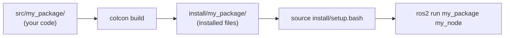

# 📦 Week 5: Building ROS 2 Packages with Python

:::tip Related Chapter
The nodes you wrote in [Week 4](/module-1-ros2/week-04-nodes-topics-services) were standalone scripts. This week you will package them properly so they can be installed, launched, and shared.
:::

## 🎯 Learning Objectives

By the end of this chapter you will be able to:

- Explain the ROS 2 workspace structure (`src/`, `build/`, `install/`, `log/`)
- Create a Python ROS 2 package from scratch using `ros2 pkg create`
- Write a correct `package.xml` (format 3) and `setup.py` with entry points
- Build a workspace with `colcon build` and run nodes with `ros2 run`
- Write a launch file using `LaunchDescription` with a `DeclareLaunchArgument` for runtime configuration

---

## 📖 Introduction

Up to this point, every node you have written was a standalone Python script. That approach works for prototyping but falls apart in production. How do other developers discover your nodes? How do you declare what packages your nodes depend on? How do you run multiple nodes with a single command and pass them parameters from a configuration file?

The answer is the **ROS 2 package** — a structured directory layout with metadata files that make nodes installable, discoverable, and composable. Every professional robotics project is organised into packages. The simulation stack is a package. The perception pipeline is a package. The navigation stack is a package. This week you will learn to build one from scratch.

---

## 🧠 Core Concepts

### The ROS 2 Workspace Structure

A ROS 2 **workspace** is a directory containing one or more packages. The `colcon build` command generates three directories alongside `src/`:

```
ros2_ws/
├── src/              ← You write code here
│   └── my_package/
├── build/            ← Intermediate build artifacts (generated)
├── install/          ← Installed files ready to source (generated)
└── log/              ← Build logs (generated)
```

After building, you run `source install/setup.bash` to add your packages to the ROS 2 environment. Only then will `ros2 run my_package my_node` find your node.



*Caption: The ROS 2 workspace lifecycle. You write code in `src/`, build with `colcon`, source the install space to update your environment, then run nodes with `ros2 run`.*

### Creating a Package with `ros2 pkg create`

```bash
cd ~/ros2_ws/src
ros2 pkg create --build-type ament_python robot_monitor \
  --dependencies rclpy sensor_msgs std_msgs
```

This creates the directory skeleton:

```
robot_monitor/
├── package.xml
├── setup.py
├── setup.cfg
├── resource/
│   └── robot_monitor
└── robot_monitor/
    └── __init__.py
```

### `package.xml` Deep Dive

The `package.xml` file is the manifest — it declares the package name, version, description, maintainer, licence, and dependencies.

```xml
<?xml version="1.0"?>
<?xml-model href="http://download.ros.org/schema/package_format3.xsd"?>
<package format="3">
  <name>robot_monitor</name>
  <version>0.1.0</version>
  <description>Monitor and log robot joint states</description>
  <maintainer email="you@example.com">Your Name</maintainer>
  <license>Apache-2.0</license>

  <!-- Build-time tools -->
  <buildtool_depend>ament_python</buildtool_depend>

  <!-- Runtime Python dependencies -->
  <depend>rclpy</depend>
  <depend>sensor_msgs</depend>
  <depend>std_msgs</depend>

  <!-- Test dependencies -->
  <test_depend>ament_copyright</test_depend>
  <test_depend>ament_flake8</test_depend>
  <test_depend>ament_pep257</test_depend>
  <test_depend>python3-pytest</test_depend>

  <export>
    <build_type>ament_python</build_type>
  </export>
</package>
```

Key dependency tags:
- `<depend>` — required at both build and runtime (most common)
- `<build_depend>` — only needed at build time (code generators, message packages)
- `<exec_depend>` / `<run_depend>` — only at runtime
- `<test_depend>` — only for running tests

### `setup.py` and Entry Points

The `setup.py` file registers your nodes as console scripts so `ros2 run` can find them:

```python
from setuptools import find_packages, setup

package_name = "robot_monitor"

setup(
    name=package_name,
    version="0.1.0",
    packages=find_packages(exclude=["test"]),
    data_files=[
        ("share/ament_index/resource_index/packages", [f"resource/{package_name}"]),
        (f"share/{package_name}", ["package.xml"]),
        (f"share/{package_name}/launch", ["launch/robot_monitor.launch.py"]),
        (f"share/{package_name}/config", ["config/params.yaml"]),
    ],
    install_requires=["setuptools"],
    zip_safe=True,
    maintainer="Your Name",
    maintainer_email="you@example.com",
    description="Monitor and log robot joint states",
    license="Apache-2.0",
    entry_points={
        "console_scripts": [
            "joint_publisher = robot_monitor.joint_publisher:main",
            "joint_subscriber = robot_monitor.joint_subscriber:main",
        ],
    },
)
```

The `console_scripts` entries follow the format `name = module.path:function`. After `colcon build`, `ros2 run robot_monitor joint_publisher` calls `robot_monitor/joint_publisher.py`'s `main()` function.

### The `colcon build` Command

```bash
# Build all packages in the workspace
colcon build

# Build only one package (faster during development)
colcon build --packages-select robot_monitor

# Symlink Python files instead of copying (edit without rebuilding)
colcon build --packages-select robot_monitor --symlink-install
```

:::info
`--symlink-install` is essential for Python development. Without it, every change to a `.py` file requires a full `colcon build`. With it, the installed files are symlinks to your source files — changes take effect immediately.
:::

### Launch Files (`.launch.py`)

A launch file is a Python script that returns a `LaunchDescription` — a list of actions to execute when the launch file is run. Launch files can start multiple nodes, pass parameters, and remap topic names.

### Parameter YAML Files

Store node parameters in a YAML file to keep them separate from code:

```yaml
# config/params.yaml
joint_publisher:
  ros__parameters:
    publish_frequency: 2.0
    joint_names:
      - shoulder_pan_joint
      - shoulder_lift_joint
      - elbow_joint
```

Load in the launch file with `parameters=[os.path.join(pkg_share, "config", "params.yaml")]`.

### Package Best Practices

- **One responsibility per package**: `robot_description`, `robot_bringup`, `robot_navigation` — not one giant `robot` package
- **Naming convention**: lowercase with underscores; no hyphens (Python module names cannot contain hyphens)
- **Always declare all dependencies** in `package.xml` — `rosdep install --from-paths src` uses this to install missing packages automatically
- **Use `--symlink-install`** during development; remove it for production builds

---

## 💻 Code Examples

### Example 1: Complete `package.xml` for `robot_monitor`

```xml
<?xml version="1.0"?>
<?xml-model href="http://download.ros.org/schema/package_format3.xsd"
 schematypens="http://www.w3.org/2001/XMLSchema"?>
<package format="3">
  <name>robot_monitor</name>
  <version>0.1.0</version>
  <description>Publishes and logs robot joint states for monitoring purposes</description>
  <maintainer email="student@example.com">Physical AI Student</maintainer>
  <license>Apache-2.0</license>

  <buildtool_depend>ament_python</buildtool_depend>

  <depend>rclpy</depend>
  <depend>sensor_msgs</depend>
  <depend>std_msgs</depend>

  <test_depend>ament_copyright</test_depend>
  <test_depend>ament_flake8</test_depend>
  <test_depend>ament_pep257</test_depend>
  <test_depend>python3-pytest</test_depend>

  <export>
    <build_type>ament_python</build_type>
  </export>
</package>
```

### Example 2: `setup.py` with Entry Points

```python showLineNumbers
# setup.py for the robot_monitor package
# Registers joint_publisher and joint_subscriber as ros2 run targets

import os
from glob import glob
from setuptools import find_packages, setup

package_name = "robot_monitor"

setup(
    name=package_name,
    version="0.1.0",
    packages=find_packages(exclude=["test"]),
    data_files=[
        (
            "share/ament_index/resource_index/packages",
            [f"resource/{package_name}"],
        ),
        (f"share/{package_name}", ["package.xml"]),
        (
            f"share/{package_name}/launch",
            glob("launch/*.launch.py"),
        ),
        (
            f"share/{package_name}/config",
            glob("config/*.yaml"),
        ),
    ],
    install_requires=["setuptools"],
    zip_safe=True,
    maintainer="Physical AI Student",
    maintainer_email="student@example.com",
    description="Publishes and logs robot joint states",
    license="Apache-2.0",
    entry_points={
        "console_scripts": [
            "joint_publisher = robot_monitor.joint_publisher:main",
            "joint_subscriber = robot_monitor.joint_subscriber:main",
        ],
    },
)
```

### Example 3: `robot_monitor.launch.py`

```python showLineNumbers
# launch/robot_monitor.launch.py
# Launches both joint_publisher and joint_subscriber with a configurable frequency

import os
from ament_index_python.packages import get_package_share_directory
from launch import LaunchDescription
from launch.actions import DeclareLaunchArgument
from launch.substitutions import LaunchConfiguration
from launch_ros.actions import Node


def generate_launch_description() -> LaunchDescription:
    pkg_share = get_package_share_directory("robot_monitor")

    # Declare a launch argument so users can override at launch time:
    # ros2 launch robot_monitor robot_monitor.launch.py publish_frequency:=2.0
    publish_frequency_arg = DeclareLaunchArgument(
        "publish_frequency",
        default_value="1.0",
        description="How often to publish joint states (Hz)",
    )

    joint_publisher_node = Node(
        package="robot_monitor",
        executable="joint_publisher",
        name="joint_publisher",
        parameters=[
            os.path.join(pkg_share, "config", "params.yaml"),
            {"publish_frequency": LaunchConfiguration("publish_frequency")},
        ],
        output="screen",
    )

    joint_subscriber_node = Node(
        package="robot_monitor",
        executable="joint_subscriber",
        name="joint_subscriber",
        output="screen",
    )

    return LaunchDescription([
        publish_frequency_arg,
        joint_publisher_node,
        joint_subscriber_node,
    ])
```

---

## 🛠️ Hands-On Exercise: Build the `robot_monitor` Package

**Difficulty**: Intermediate | **Time**: 45–60 minutes | **Prerequisites**: ROS 2 Humble, Week 4 complete

Build a complete `robot_monitor` package with two nodes and a launch file.

**Step 1 — Create the package:**

```bash
cd ~/ros2_ws/src
ros2 pkg create --build-type ament_python robot_monitor \
  --dependencies rclpy sensor_msgs std_msgs
mkdir -p robot_monitor/launch robot_monitor/config
```

**Step 2 — Write `joint_publisher.py`:**

```python showLineNumbers
# robot_monitor/joint_publisher.py
# Publishes random JointState messages for 6 joints at a configurable frequency

import random
import rclpy
from rclpy.node import Node
from sensor_msgs.msg import JointState


JOINT_NAMES = [
    "shoulder_pan",
    "shoulder_lift",
    "elbow",
    "wrist_1",
    "wrist_2",
    "wrist_3",
]


class JointPublisher(Node):
    def __init__(self) -> None:
        super().__init__("joint_publisher")
        self.declare_parameter("publish_frequency", 1.0)
        freq = self.get_parameter("publish_frequency").value
        self.pub = self.create_publisher(JointState, "joint_states", 10)
        self.timer = self.create_timer(1.0 / freq, self.publish_joints)
        self.get_logger().info(f"JointPublisher started at {freq} Hz")

    def publish_joints(self) -> None:
        msg = JointState()
        msg.header.stamp = self.get_clock().now().to_msg()
        msg.name = JOINT_NAMES
        msg.position = [round(random.uniform(-3.14, 3.14), 4) for _ in JOINT_NAMES]
        msg.velocity = [0.0] * len(JOINT_NAMES)
        msg.effort = [0.0] * len(JOINT_NAMES)
        self.pub.publish(msg)


def main(args: list[str] | None = None) -> None:
    rclpy.init(args=args)
    node = JointPublisher()
    try:
        rclpy.spin(node)
    except KeyboardInterrupt:
        pass
    finally:
        node.destroy_node()
        rclpy.shutdown()
```

**Step 3 — Write `joint_subscriber.py`:**

```python showLineNumbers
# robot_monitor/joint_subscriber.py
# Subscribes to joint_states and writes each message to joint_log.csv

import csv
import os
import rclpy
from rclpy.node import Node
from sensor_msgs.msg import JointState

LOG_FILE = os.path.expanduser("~/joint_log.csv")


class JointSubscriber(Node):
    def __init__(self) -> None:
        super().__init__("joint_subscriber")
        self.sub = self.create_subscription(
            JointState, "joint_states", self.on_joint_state, 10
        )
        # Write CSV header
        with open(LOG_FILE, "w", newline="") as f:
            writer = csv.writer(f)
            writer.writerow(["timestamp", "joint", "position"])
        self.get_logger().info(f"JointSubscriber logging to {LOG_FILE}")

    def on_joint_state(self, msg: JointState) -> None:
        stamp = msg.header.stamp.sec + msg.header.stamp.nanosec * 1e-9
        with open(LOG_FILE, "a", newline="") as f:
            writer = csv.writer(f)
            for name, pos in zip(msg.name, msg.position):
                writer.writerow([f"{stamp:.3f}", name, f"{pos:.4f}"])
        self.get_logger().info(f"Logged {len(msg.name)} joints at t={stamp:.2f}")


def main(args: list[str] | None = None) -> None:
    rclpy.init(args=args)
    node = JointSubscriber()
    try:
        rclpy.spin(node)
    except KeyboardInterrupt:
        pass
    finally:
        node.destroy_node()
        rclpy.shutdown()
```

**Step 4 — Build and run:**

```bash
cd ~/ros2_ws
colcon build --packages-select robot_monitor --symlink-install
source install/setup.bash
ros2 launch robot_monitor robot_monitor.launch.py publish_frequency:=2.0
```

**Expected output:**

```
[joint_publisher]: JointPublisher started at 2.0 Hz
[joint_subscriber]: JointSubscriber logging to ~/joint_log.csv
[joint_subscriber]: Logged 6 joints at t=1234567890.12
```

Open `~/joint_log.csv` — it will contain rows with timestamp, joint name, and position for each published message.

---

## 📋 Summary

- The ROS 2 **workspace** (`src/ → build/ → install/`) separates source code from build artifacts; always `source install/setup.bash` after building
- `package.xml` declares metadata and dependencies; `setup.py` registers nodes as console scripts via `entry_points`
- `colcon build --symlink-install` is the correct command for Python development — avoids rebuilding after every edit
- **Launch files** (`LaunchDescription` + `Node` + `DeclareLaunchArgument`) start multiple nodes with a single command and support runtime parameter overrides
- **YAML parameter files** keep configuration separate from code and are loaded via `parameters=[config_file]` in the launch file

---

## 🧪 Quiz

**Question 1**: After running `colcon build`, a student cannot run `ros2 run robot_monitor joint_publisher`. What step did they most likely forget?

- A) They forgot to write the `package.xml` file
- B) They forgot to run `source install/setup.bash` to update the ROS 2 environment ✅
- C) They forgot to install ROS 2 Humble
- D) They forgot to create the `log/` directory manually

**Question 2**: What is the purpose of the `entry_points` section in `setup.py`?

- A) It declares which Python packages are required at runtime
- B) It maps `ros2 run` command names to Python module functions ✅
- C) It specifies the ROS 2 message types the package uses
- D) It configures the colcon build system's compilation flags

**Question 3**: A developer edits `joint_publisher.py` after building with `--symlink-install`. Do they need to rebuild?

- A) Yes — Python files always require a rebuild after editing
- B) Yes — they need to run `colcon build --packages-select robot_monitor`
- C) No — the symlink points to the source file; changes take effect immediately ✅
- D) No — but they need to run `source install/setup.bash` again

**Question 4**: In `robot_monitor.launch.py`, what does `DeclareLaunchArgument("publish_frequency", default_value="1.0")` do?

- A) Sets the parameter permanently in the node — cannot be changed at launch time
- B) Declares a launch-time argument that users can override with `publish_frequency:=2.0` ✅
- C) Creates a ROS 2 parameter visible to all nodes in the system
- D) Declares a dependency on the `publish_frequency` package

**Question 5**: The `joint_subscriber.py` opens `~/joint_log.csv` in `"a"` (append) mode for every incoming message. Why is this correct?

- A) It is not correct — append mode prevents the file from being read by other processes
- B) It allows multiple subscriber instances to write to the same file without conflicts
- C) It ensures that existing log data is preserved across messages; each message adds rows without overwriting ✅
- D) Append mode is faster than write mode for large CSV files

---

## 📚 Further Reading

- [Creating a ROS 2 Package — Official Tutorial](https://docs.ros.org/en/humble/Tutorials/Beginner-Client-Libraries/Creating-Your-First-ROS2-Package.html) — Step-by-step guide for Python and C++ packages with colcon
- [ROS 2 Launch System Documentation](https://docs.ros.org/en/humble/Tutorials/Intermediate/Launch/Launch-Main.html) — Complete reference for launch files including conditions, event handlers, and composable nodes
- [colcon Documentation](https://colcon.readthedocs.io/en/released/) — Full documentation for the colcon build tool including all flags, test execution, and workspace management
