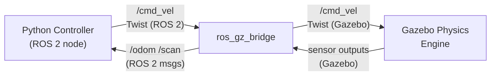

# 🌍 Week 6: Gazebo Simulation Environment

:::tip Related Chapter
The ROS 2 launch files you wrote in [Week 5](/module-1-ros2/week-05-ros2-packages) are exactly the pattern used to start a Gazebo simulation and bridge its topics to ROS 2.
:::

## 🎯 Learning Objectives

By the end of this chapter you will be able to:

- Explain why simulation is essential before deploying code to real hardware
- Compare Gazebo Classic and Gazebo Harmonic and choose the right one
- Install Gazebo Harmonic and launch your first simulated world
- Write a minimal SDF world with a ground plane, light, and obstacle
- Bridge Gazebo topics to ROS 2 using `ros_gz_bridge`

---

## 📖 Introduction

The first time a robot arm breaks a glass because the controller had an off-by-one error in its joint limit calculation, you appreciate simulation. Simulation lets you test dangerous behaviours safely, run experiments 100× faster than real time, generate synthetic training data at massive scale, and develop code before the hardware even arrives.

Gazebo is the most widely used robotics simulator in both academia and industry. It provides physics-accurate rigid body dynamics, multiple sensor models (LiDAR, cameras, IMUs, force/torque), and — critically — deep integration with ROS 2. Everything you build in Gazebo this week will connect directly to your ROS 2 nodes via the same topic interface you mastered in Weeks 3–5.

---

## 🧠 Core Concepts

### Why Simulation?

Four reasons simulation is indispensable in modern robotics development:

**Safe testing**: You can intentionally crash your robot, command illegal velocities, test edge-case sensor failures, and experiment with aggressive control parameters — all without destroying hardware worth thousands of dollars.

**Scalability**: Training a reinforcement learning policy requires millions of environment steps. On real hardware, 1 million steps at 10 Hz takes 28 hours. In GPU-accelerated simulation (Isaac Lab, covered in Week 8), it can take minutes.

**Synthetic data generation**: Object detection models need labelled training data. Gazebo can render photorealistic scenes with perfect ground-truth bounding boxes, depth maps, and semantic segmentation masks at zero human annotation cost.

**Parallel development**: The software team can develop and test perception and planning algorithms in simulation while the hardware team is still assembling the robot.

### Gazebo Classic vs Gazebo Harmonic

| Feature | Gazebo Classic (11) | Gazebo Harmonic |
|---------|---------------------|-----------------|
| Architecture | Monolithic | Modular (Ignition lineage) |
| Rendering | OGRE | OGRE-Next (better PBR materials) |
| Physics | ODE only | ODE, Bullet, DART (selectable) |
| GPU requirement | Low | Moderate (ray-traced sensors) |
| ROS integration | `gazebo_ros_pkgs` | `ros_gz` (cleaner bridge) |
| Python API | Limited | Full gz-transport Python bindings |
| Status | EOL 2025 | Active LTS |

**Use Gazebo Harmonic** for all new projects. Gazebo Classic is still widely referenced in tutorials but is end-of-life.

:::info
Gazebo Harmonic requires Ubuntu 22.04 (Jammy) or later and approximately 2 GB of disk space.
:::

### Physics Engines

Gazebo Harmonic supports three physics engines selectable per world:

- **ODE** (Open Dynamics Engine): default engine; fast, widely tested, suitable for most rigid-body scenarios
- **Bullet**: better contact modelling for soft constraints and articulated robots with complex joint dynamics
- **DART** (Dynamic Animation and Robotics Toolkit): most accurate for multi-body articulated systems; used for humanoid balance research

### The Three Building Blocks

Every Gazebo world is assembled from three primitives:

- **Worlds** (`.sdf` files): define gravity, ambient light, physics engine, and contain all models
- **Models**: define robot and object geometry, mass properties, and visual/collision meshes; referenced by worlds
- **Plugins**: C++ or Python code that runs inside the Gazebo process to implement sensors, actuators, and custom behaviours

### Installing Gazebo Harmonic

```bash
# Add the Gazebo apt repository
sudo apt-get update
sudo apt-get install -y curl
sudo curl https://packages.osrfoundation.org/gazebo.gpg \
  --output /usr/share/keyrings/pkgs-osrf-archive-keyring.gpg
echo "deb [arch=$(dpkg --print-architecture) signed-by=/usr/share/keyrings/pkgs-osrf-archive-keyring.gpg] \
  http://packages.osrfoundation.org/gazebo/ubuntu-stable $(lsb_release -cs) main" \
  | sudo tee /etc/apt/sources.list.d/gazebo-stable.list > /dev/null

# Install Gazebo Harmonic
sudo apt-get update
sudo apt-get install -y gz-harmonic

# Install ROS 2 – Gazebo bridge
sudo apt-get install -y ros-humble-ros-gz

# Verify
gz sim --version
```

### The `ros_gz_bridge`

The `ros_gz_bridge` is a bidirectional bridge between Gazebo topic types and ROS 2 message types. Without it, ROS 2 nodes cannot see Gazebo sensor data and cannot send commands to Gazebo actuators.

Key type mappings:

| Gazebo type | ROS 2 type |
|-------------|-----------|
| `gz.msgs.Twist` | `geometry_msgs/msg/Twist` |
| `gz.msgs.Odometry` | `nav_msgs/msg/Odometry` |
| `gz.msgs.Image` | `sensor_msgs/msg/Image` |
| `gz.msgs.LaserScan` | `sensor_msgs/msg/LaserScan` |
| `gz.msgs.IMU` | `sensor_msgs/msg/Imu` |



*Caption: The ros_gz_bridge is a bidirectional protocol translator. ROS 2 Twist messages become Gazebo Twist messages; Gazebo sensor outputs become ROS 2 sensor messages. Your Python nodes only interact with ROS 2 types.*

### SDF Format Overview

SDF (Simulation Description Format) is the XML format used by Gazebo for world and model descriptions. Key tags:

- `<world>`: root element; sets gravity and physics engine
- `<model>`: a rigid body assembly with links and joints
- `<link>`: a single rigid body with `<visual>`, `<collision>`, and `<inertial>` elements
- `<joint>`: connects two links with a type (revolute, prismatic, fixed)
- `<plugin>`: attaches behaviour code (sensor drivers, actuator controllers)

---

## 💻 Code Examples

### Example 1: Minimal SDF World

```xml showLineNumbers
<?xml version="1.0" ?>
<!-- Minimal Gazebo Harmonic world: ground plane, directional light, one box obstacle -->
<sdf version="1.10">
  <world name="minimal_world">

    <!-- Physics: use ODE at 1 kHz -->
    <physics name="default_physics" type="ode">
      <max_step_size>0.001</max_step_size>
      <real_time_factor>1.0</real_time_factor>
    </physics>

    <!-- Ambient light and sky -->
    <light name="sun" type="directional">
      <cast_shadows>true</cast_shadows>
      <pose>0 0 10 0 0 0</pose>
      <direction>-0.5 0.1 -0.9</direction>
      <diffuse>0.8 0.8 0.8 1</diffuse>
      <specular>0.2 0.2 0.2 1</specular>
    </light>

    <!-- Ground plane -->
    <model name="ground_plane">
      <static>true</static>
      <link name="link">
        <collision name="collision">
          <geometry><plane><normal>0 0 1</normal></plane></geometry>
        </collision>
        <visual name="visual">
          <geometry><plane><normal>0 0 1</normal><size>100 100</size></plane></geometry>
          <material><ambient>0.8 0.8 0.8 1</ambient></material>
        </visual>
      </link>
    </model>

    <!-- Obstacle: a 0.5m cube at position (2, 0, 0.25) -->
    <model name="obstacle_box">
      <pose>2 0 0.25 0 0 0</pose>
      <link name="link">
        <inertial><mass>10.0</mass></inertial>
        <collision name="collision">
          <geometry><box><size>0.5 0.5 0.5</size></box></geometry>
        </collision>
        <visual name="visual">
          <geometry><box><size>0.5 0.5 0.5</size></box></geometry>
          <material><ambient>0.2 0.5 0.9 1</ambient></material>
        </visual>
      </link>
    </model>

  </world>
</sdf>
```

### Example 2: `sim.launch.py` — Start Gazebo with ROS 2 Bridge

```python showLineNumbers
# launch/sim.launch.py
# Starts Gazebo Harmonic with a world file and bridges /cmd_vel and /odom topics

import os
from ament_index_python.packages import get_package_share_directory
from launch import LaunchDescription
from launch.actions import DeclareLaunchArgument, ExecuteProcess
from launch.substitutions import LaunchConfiguration
from launch_ros.actions import Node


def generate_launch_description() -> LaunchDescription:

    world_file = os.path.join(
        get_package_share_directory("my_simulation"),
        "worlds",
        "minimal_world.sdf",
    )

    # Start Gazebo Harmonic with the world file
    gazebo = ExecuteProcess(
        cmd=["gz", "sim", world_file, "-r"],
        output="screen",
    )

    # Bridge /cmd_vel (ROS 2 Twist → Gazebo Twist)
    # Bridge /odom   (Gazebo Odometry → ROS 2 Odometry)
    bridge = Node(
        package="ros_gz_bridge",
        executable="parameter_bridge",
        arguments=[
            "/cmd_vel@geometry_msgs/msg/Twist@gz.msgs.Twist",
            "/odom@nav_msgs/msg/Odometry@gz.msgs.Odometry",
        ],
        output="screen",
    )

    return LaunchDescription([gazebo, bridge])
```

---

## 🛠️ Hands-On Exercise: Drive a TurtleBot3 in Simulation

**Difficulty**: Intermediate | **Time**: 30–45 minutes | **Prerequisites**: ROS 2 Humble, Gazebo Harmonic installed

**Step 1 — Install TurtleBot3:**

```bash
sudo apt install -y ros-humble-turtlebot3-gazebo ros-humble-turtlebot3-teleop
export TURTLEBOT3_MODEL=burger
```

**Step 2 — Launch the simulation:**

```bash
source /opt/ros/humble/setup.bash
ros2 launch turtlebot3_gazebo turtlebot3_world.launch.py
```

**Step 3 — Drive the robot (new terminal):**

```bash
source /opt/ros/humble/setup.bash
ros2 topic pub /cmd_vel geometry_msgs/msg/Twist \
  "{linear: {x: 0.2, y: 0.0, z: 0.0}, angular: {x: 0.0, y: 0.0, z: 0.5}}" \
  --rate 10
```

**Step 4 — Record the odometry:**

```bash
ros2 bag record /odom -o turtlebot3_odom_bag
```

**Step 5 — Stop recording (Ctrl+C) and inspect:**

```bash
ros2 bag info turtlebot3_odom_bag/
```

**Expected output:**

```
Files:             turtlebot3_odom_bag_0.db3
Bag size:          523.4 KiB
Storage id:        sqlite3
Duration:          30.45s
Start:             Feb 19 2026 12:00:00.000
End:               Feb 19 2026 12:00:30.450
Messages:          607
Topic information: Topic: /odom | Type: nav_msgs/msg/Odometry | Count: 607 | Serialization Format: cdr
```

---

## 📋 Summary

- **Simulation** enables safe testing, parallel development, synthetic data generation, and accelerated RL training before touching real hardware
- **Gazebo Harmonic** is the current LTS simulator — use it for all new projects; Gazebo Classic is end-of-life in 2025
- **SDF** (Simulation Description Format) defines worlds, models, and plugins; key tags: `<world>`, `<model>`, `<link>`, `<joint>`, `<plugin>`
- **`ros_gz_bridge`** translates between Gazebo message types and ROS 2 message types, enabling seamless integration with your existing ROS 2 nodes
- **Physics engines** (ODE, Bullet, DART) are selectable per world; ODE is the default and works for most rigid-body scenarios

---

## 🧪 Quiz

**Question 1**: What is the primary reason simulation is used before deploying code to a real robot?

- A) Simulation runs faster than real hardware in all cases
- B) It enables safe testing of dangerous conditions and edge cases without hardware risk ✅
- C) Gazebo produces more accurate sensor data than real hardware
- D) Real robots cannot run ROS 2 nodes

**Question 2**: Which Gazebo physics engine is recommended for the most accurate simulation of humanoid multi-body articulated dynamics?

- A) ODE — it is the default and works for all scenarios
- B) Bullet — it is fastest for rigid body contacts
- C) DART — most accurate for multi-body articulated systems ✅
- D) PhysX — the GPU-accelerated engine in Gazebo Harmonic

**Question 3**: A ROS 2 node publishes to `/cmd_vel` using `geometry_msgs/msg/Twist`. How does this command reach the simulated robot in Gazebo?

- A) Gazebo subscribes directly to ROS 2 topics without any bridge
- B) The `ros_gz_bridge` translates the ROS 2 Twist message to a Gazebo Twist message ✅
- C) The SDF world file automatically imports all active ROS 2 topics
- D) The `rclpy` library includes a built-in Gazebo connector

**Question 4**: In a Gazebo SDF file, what is the difference between `<visual>` and `<collision>` in a link?

- A) They are identical — both define the same geometry used for all computations
- B) `<visual>` defines the rendered geometry; `<collision>` defines the geometry used for physics contact detection ✅
- C) `<visual>` is used only in Gazebo Classic; `<collision>` replaced it in Gazebo Harmonic
- D) `<collision>` is optional and only needed for sensor-equipped models

**Question 5**: After launching a TurtleBot3 simulation, you want to verify the odometry topic is publishing. Which command is correct?

- A) `ros2 topic pub /odom nav_msgs/msg/Odometry`
- B) `ros2 service call /odom`
- C) `ros2 topic hz /odom` ✅
- D) `gz topic -e /odom`

---

## 📚 Further Reading

- [Gazebo Harmonic Documentation](https://gazebosim.org/docs/harmonic) — Official documentation including SDF reference, plugin authoring guide, and ROS 2 integration tutorials
- [ros_gz Repository and Examples](https://github.com/gazebosim/ros_gz) — Source code and example launch files for bridging Gazebo Harmonic topics to ROS 2
- [TurtleBot3 Simulation Guide](https://emanual.robotis.com/docs/en/platform/turtlebot3/simulation/) — Step-by-step simulation guide for TurtleBot3 Burger and Waffle with Gazebo
