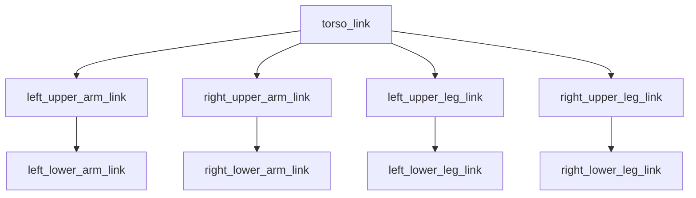

# 🦾 Week 7: URDF/SDF Robot Description & Physics Simulation

:::tip Related Chapter
This week you will describe robots formally — the same robots you launched in [Week 6's Gazebo simulation](/module-2-simulation/week-06-gazebo-setup). The URDF you write here will be loaded by Gazebo and visualised in RViz2.
:::

## 🎯 Learning Objectives

By the end of this chapter you will be able to:

- Explain the URDF link-joint model and write valid XML for a multi-link robot
- Choose the correct joint type (fixed, revolute, prismatic, continuous) for each robot DOF
- Calculate inertia tensors for common geometries (box, cylinder, sphere)
- Use Xacro macros to build reusable, parameterised robot descriptions
- Build a simplified humanoid URDF (9 links, 8 joints) and visualize its TF tree

---

## 📖 Introduction

Before a robot can be simulated, planned for, or perceived by a sensor fusion system, every software component needs to agree on a single question: *where is each part of the robot?* The answer lives in the **URDF** — Unified Robot Description Format — an XML file that defines every rigid body (link), every joint, every inertial property, and every sensor attachment point of a robot.

URDF is the lingua franca of ROS 2 robotics. MoveIt2 reads it to plan collision-free trajectories. RViz2 reads it to render the robot. Nav2 reads it to model the robot's footprint. The `robot_state_publisher` node reads it and publishes transforms on the `/tf` topic at the correct frequency — so that every coordinate frame in the entire system stays consistent.

---

## 🧠 Core Concepts

### URDF: The Robot Description Language

URDF describes a robot as a **kinematic tree** of links connected by joints. Each link is a rigid body; each joint defines the relationship between two links. The tree has a single root link (typically `base_link`).

```
base_link
├── shoulder_joint (revolute)
│   └── upper_arm_link
│       └── elbow_joint (revolute)
│           └── forearm_link
```

### URDF Link Elements

Each `<link>` has three optional sub-elements:

- `<visual>`: geometry and material used for rendering (RViz2, Gazebo rendering)
- `<collision>`: simplified geometry used for contact detection (usually the same as visual for small robots, simplified meshes for complex robots)
- `<inertial>`: mass, centre of mass, and inertia tensor — required for physics simulation

### URDF Joint Types

| Type | Motion | Example |
|------|--------|---------|
| `fixed` | No motion — rigid connection | Camera mount to torso |
| `revolute` | Rotation around one axis, with limits | Elbow, knee |
| `prismatic` | Translation along one axis, with limits | Linear actuator |
| `continuous` | Rotation without limits | Wheel hub |

### Calculating Inertia Tensors

The inertia tensor is the 3×3 matrix describing how mass is distributed around each axis. For uniform-density primitive shapes:

| Shape | Ixx | Iyy | Izz |
|-------|-----|-----|-----|
| Box (l, w, h) | m(w²+h²)/12 | m(l²+h²)/12 | m(l²+w²)/12 |
| Cylinder (r, h) | m(3r²+h²)/12 | m(3r²+h²)/12 | mr²/2 |
| Sphere (r) | 2mr²/5 | 2mr²/5 | 2mr²/5 |

In URDF, off-diagonal terms (ixy, ixz, iyz) are zero for uniform primitives aligned with their principal axes.

Example for a cylinder with mass=1.0 kg, radius=0.05 m, height=0.2 m:

```
Ixx = Iyy = 1.0 * (3*(0.05)^2 + (0.2)^2) / 12 = 0.004375
Izz = 1.0 * (0.05)^2 / 2 = 0.00125
```

### Xacro: DRY Robot Description

URDF becomes verbose and repetitive for robots with many symmetrical limbs. **Xacro** (XML Macros) solves this with:

- `<xacro:property>` — named constants (link lengths, masses)
- `<xacro:macro>` — parameterised templates (define a leg once, instantiate left and right)
- `<xacro:include>` — split description across multiple files

Process a Xacro file into URDF with: `xacro robot.urdf.xacro > robot.urdf`

### Converting URDF to SDF

Gazebo Harmonic requires SDF. Convert your URDF with:

```bash
gz sdf -p robot.urdf > robot.sdf
```

This command handles coordinate frame conventions and adds Gazebo-specific physics properties. You can also load URDF directly in Gazebo via the `robot_description` topic with `ros_gz_sim`'s `create` service.

### Visualizing in RViz2

The standard RViz2 visualization pipeline uses two nodes:

1. `robot_state_publisher` — reads the URDF from the `robot_description` parameter and publishes all transforms on `/tf`
2. `joint_state_publisher_gui` — publishes `JointState` messages with slider-controllable joint angles

```bash
ros2 launch urdf_tutorial display.launch.py model:=robot.urdf
```

### Adding Sensor Plugins

Attach sensors to URDF links by adding a `<gazebo>` extension block referencing the link name:

```xml
<!-- Camera plugin attached to camera_link -->
<gazebo reference="camera_link">
  <sensor name="camera" type="camera">
    <update_rate>30</update_rate>
    <camera>
      <horizontal_fov>1.3962634</horizontal_fov>
      <image><width>640</width><height>480</height></image>
    </camera>
    <plugin name="camera_driver" filename="libgz-sim-sensors-system.so"/>
  </sensor>
</gazebo>
```

---

## 💻 Code Examples

### Example 1: Complete 2-DOF Robot Arm URDF

```xml showLineNumbers
<?xml version="1.0"?>
<!-- 2-DOF planar robot arm: base → shoulder → upper_arm → elbow → forearm
     Suitable for loading in RViz2 and simulating in Gazebo -->
<robot name="two_dof_arm">

  <!-- Base link: fixed to the world -->
  <link name="base_link">
    <visual>
      <geometry><box size="0.1 0.1 0.05"/></geometry>
      <material><color rgba="0.5 0.5 0.5 1.0"/></material>
    </visual>
    <collision>
      <geometry><box size="0.1 0.1 0.05"/></geometry>
    </collision>
    <inertial>
      <mass value="2.0"/>
      <inertia ixx="0.0017" ixy="0" ixz="0" iyy="0.0017" iyz="0" izz="0.0033"/>
    </inertial>
  </link>

  <!-- Shoulder joint: revolute, rotates around Z axis -->
  <joint name="shoulder_joint" type="revolute">
    <parent link="base_link"/>
    <child link="upper_arm_link"/>
    <origin xyz="0 0 0.025" rpy="0 0 0"/>
    <axis xyz="0 0 1"/>
    <limit lower="-1.5708" upper="1.5708" effort="50" velocity="1.0"/>
    <dynamics damping="0.5" friction="0.1"/>
  </joint>

  <!-- Upper arm link: cylinder, 0.3 m long -->
  <link name="upper_arm_link">
    <visual>
      <origin xyz="0 0 0.15" rpy="0 0 0"/>
      <geometry><cylinder radius="0.025" length="0.3"/></geometry>
      <material><color rgba="0.2 0.6 0.9 1.0"/></material>
    </visual>
    <collision>
      <origin xyz="0 0 0.15" rpy="0 0 0"/>
      <geometry><cylinder radius="0.025" length="0.3"/></geometry>
    </collision>
    <inertial>
      <mass value="0.5"/>
      <!-- Cylinder: r=0.025, h=0.3, Ixx=Iyy=m(3r^2+h^2)/12, Izz=mr^2/2 -->
      <inertia ixx="0.003828" ixy="0" ixz="0" iyy="0.003828" iyz="0" izz="0.000156"/>
    </inertial>
  </link>

  <!-- Elbow joint: revolute, rotates around Z axis -->
  <joint name="elbow_joint" type="revolute">
    <parent link="upper_arm_link"/>
    <child link="forearm_link"/>
    <origin xyz="0 0 0.3" rpy="0 0 0"/>
    <axis xyz="0 0 1"/>
    <limit lower="-2.0944" upper="2.0944" effort="30" velocity="1.5"/>
    <dynamics damping="0.3" friction="0.05"/>
  </joint>

  <!-- Forearm link: cylinder, 0.25 m long -->
  <link name="forearm_link">
    <visual>
      <origin xyz="0 0 0.125" rpy="0 0 0"/>
      <geometry><cylinder radius="0.02" length="0.25"/></geometry>
      <material><color rgba="0.9 0.4 0.1 1.0"/></material>
    </visual>
    <collision>
      <origin xyz="0 0 0.125" rpy="0 0 0"/>
      <geometry><cylinder radius="0.02" length="0.25"/></geometry>
    </collision>
    <inertial>
      <mass value="0.3"/>
      <inertia ixx="0.001578" ixy="0" ixz="0" iyy="0.001578" iyz="0" izz="0.00006"/>
    </inertial>
  </link>

</robot>
```

### Example 2: Xacro Macro for Leg Generation

```xml showLineNumbers
<?xml version="1.0"?>
<!-- Xacro macro that generates a left or right leg from a single template -->
<robot name="humanoid_legs" xmlns:xacro="http://www.ros.org/wiki/xacro">

  <!-- Shared properties -->
  <xacro:property name="upper_leg_length" value="0.40"/>
  <xacro:property name="lower_leg_length" value="0.38"/>
  <xacro:property name="leg_radius" value="0.04"/>
  <xacro:property name="leg_mass" value="3.0"/>

  <!-- Leg macro: instantiate with side="left" or side="right" -->
  <xacro:macro name="leg" params="side reflect">

    <!-- Upper leg link -->
    <link name="${side}_upper_leg_link">
      <visual>
        <origin xyz="0 0 ${-upper_leg_length/2}" rpy="0 0 0"/>
        <geometry><cylinder radius="${leg_radius}" length="${upper_leg_length}"/></geometry>
        <material><color rgba="0.3 0.3 0.8 1.0"/></material>
      </visual>
      <collision>
        <origin xyz="0 0 ${-upper_leg_length/2}" rpy="0 0 0"/>
        <geometry><cylinder radius="${leg_radius}" length="${upper_leg_length}"/></geometry>
      </collision>
      <inertial>
        <mass value="${leg_mass}"/>
        <inertia ixx="0.04" ixy="0" ixz="0" iyy="0.04" iyz="0" izz="0.0024"/>
      </inertial>
    </link>

    <!-- Hip joint connecting torso to upper leg -->
    <joint name="${side}_hip_joint" type="revolute">
      <parent link="torso_link"/>
      <child link="${side}_upper_leg_link"/>
      <origin xyz="${reflect * 0.12} 0 -0.1" rpy="0 0 0"/>
      <axis xyz="1 0 0"/>
      <limit lower="-1.0472" upper="1.0472" effort="100" velocity="1.0"/>
    </joint>

    <!-- Lower leg link -->
    <link name="${side}_lower_leg_link">
      <visual>
        <origin xyz="0 0 ${-lower_leg_length/2}" rpy="0 0 0"/>
        <geometry><cylinder radius="${leg_radius * 0.8}" length="${lower_leg_length}"/></geometry>
        <material><color rgba="0.2 0.2 0.6 1.0"/></material>
      </visual>
      <collision>
        <origin xyz="0 0 ${-lower_leg_length/2}" rpy="0 0 0"/>
        <geometry><cylinder radius="${leg_radius * 0.8}" length="${lower_leg_length}"/></geometry>
      </collision>
      <inertial>
        <mass value="${leg_mass * 0.7}"/>
        <inertia ixx="0.028" ixy="0" ixz="0" iyy="0.028" iyz="0" izz="0.00134"/>
      </inertial>
    </link>

    <!-- Knee joint -->
    <joint name="${side}_knee_joint" type="revolute">
      <parent link="${side}_upper_leg_link"/>
      <child link="${side}_lower_leg_link"/>
      <origin xyz="0 0 ${-upper_leg_length}" rpy="0 0 0"/>
      <axis xyz="1 0 0"/>
      <limit lower="0" upper="2.0944" effort="80" velocity="1.2"/>
    </joint>

  </xacro:macro>

  <!-- Torso (parent link for both legs) -->
  <link name="torso_link">
    <visual>
      <geometry><box size="0.3 0.2 0.5"/></geometry>
      <material><color rgba="0.5 0.5 0.5 1.0"/></material>
    </visual>
    <inertial>
      <mass value="20.0"/>
      <inertia ixx="0.417" ixy="0" ixz="0" iyy="0.5" iyz="0" izz="0.208"/>
    </inertial>
  </link>

  <!-- Instantiate both legs -->
  <xacro:leg side="left"  reflect="1"/>
  <xacro:leg side="right" reflect="-1"/>

</robot>
```

---

## 🛠️ Hands-On Exercise: Build a Simplified Humanoid URDF

**Difficulty**: Advanced | **Time**: 60–90 minutes | **Prerequisites**: ROS 2 Humble, Week 6 complete

Build a humanoid URDF with 9 links and 8 joints, then visualize its TF tree.

**Target structure:**



*Caption: 9-link humanoid URDF structure. The torso is the root; arms and legs branch symmetrically. Each dashed connection represents a revolute joint.*

**Step 1** — Create the file `humanoid_simple.urdf` using the Xacro macro pattern from Example 2 extended with arm links.

**Step 2 — Install display tools:**

```bash
sudo apt install -y ros-humble-urdf-tutorial ros-humble-joint-state-publisher-gui
```

**Step 3 — Visualize in RViz2:**

```bash
ros2 launch urdf_tutorial display.launch.py model:=$(pwd)/humanoid_simple.urdf
```

**Step 4 — Generate TF tree:**

```bash
ros2 run tf2_tools view_frames
```

**Expected output**: A PDF file `frames.pdf` is created showing all 9 links connected with their parent-child relationships. Open it with: `xdg-open frames.pdf`

---

## 📋 Summary

- **URDF** describes a robot as a kinematic tree of links (rigid bodies) and joints (motion constraints); it is the authoritative source of truth for geometry and kinematics in ROS 2
- **Joint types** (fixed, revolute, prismatic, continuous) encode exactly what motion each joint permits; incorrect types cause wrong TF frames and planning failures
- **Inertia tensors** must be accurate for realistic physics simulation; use the box/cylinder/sphere formulas for uniform-density primitive geometries
- **Xacro** eliminates repetition in URDF by providing macros, properties, and includes — essential for robots with symmetric limbs
- **`robot_state_publisher`** reads the URDF and publishes `/tf` transforms at every `JointState` message, keeping the entire system's coordinate frame tree consistent

---

## 🧪 Quiz

**Question 1**: A robot arm has an elbow joint that rotates between -120° and +120° and has hard physical stops at those limits. Which URDF joint type is correct?

- A) `continuous` — no limits needed
- B) `fixed` — the elbow does not translate
- C) `revolute` — rotation with defined lower and upper limits ✅
- D) `prismatic` — for rotational joints with angular limits

**Question 2**: A URDF link has a cylinder geometry with mass=2.0 kg, radius=0.05 m, height=0.3 m. What is the correct `izz` (rotation about the cylinder's long axis) value?

- A) 2.0 * (3*(0.05)^2 + (0.3)^2) / 12 = 0.02
- B) 2.0 * (0.05)^2 / 2 = 0.0025 ✅
- C) 2.0 * (0.05)^2 * 2/5 = 0.002
- D) 2.0 * (0.3)^2 / 12 = 0.015

**Question 3**: What does the Xacro `<xacro:macro name="leg" params="side reflect">` declaration enable?

- A) It imports the leg definition from an external URDF file
- B) It creates a reusable leg template that can be instantiated multiple times with different parameter values ✅
- C) It generates a Gazebo plugin for simulating leg contacts
- D) It declares the leg as a lifecycle node in ROS 2

**Question 4**: The `robot_state_publisher` node crashes with "Could not find parameter robot_description". What is the most likely cause?

- A) The `joint_state_publisher_gui` is not running
- B) The URDF file has a syntax error that prevents parsing
- C) The `robot_description` parameter was not set — the node needs the URDF passed as a parameter ✅
- D) The ROS 2 domain ID does not match between nodes

**Question 5**: After running `ros2 run tf2_tools view_frames`, the TF tree PDF shows `forearm_link` not connected to `upper_arm_link`. What is the most likely cause?

- A) The `visual` element is missing from `forearm_link`
- B) The elbow joint's `<parent>` or `<child>` attribute references the wrong link name ✅
- C) The inertia tensor for `forearm_link` is incorrect
- D) RViz2 needs to be restarted after adding a new link

---

## 📚 Further Reading

- [URDF Tutorials — ROS 2 Documentation](https://docs.ros.org/en/humble/Tutorials/Intermediate/URDF/URDF-Main.html) — Step-by-step guide to writing URDF from a single link to a complete robot with sensors
- [Xacro Documentation](http://wiki.ros.org/xacro) — Complete reference for Xacro macros, properties, conditionals, and includes
- [Inertial Parameters for Robot Links](https://classic.gazebosim.org/tutorials?tut=inertia) — Gazebo tutorial on calculating correct inertia tensors for accurate physics simulation
