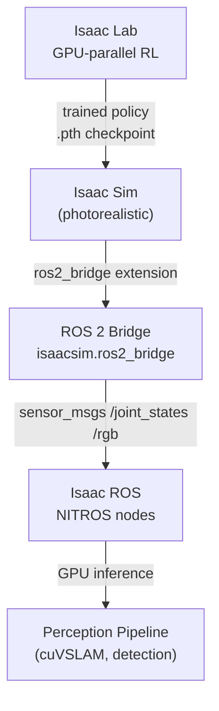

# 🚀 Week 8: NVIDIA Isaac Sim & Isaac SDK

:::info Hardware Requirement
This module requires an **NVIDIA RTX GPU with at least 8 GB of VRAM**. Isaac Sim uses GPU-accelerated ray tracing for photorealistic rendering and physics. If you do not have an RTX GPU, you can follow along with the conceptual sections and screenshots — the exercises are marked [Advanced] and can be deferred.
:::

:::tip Related Chapters
This module builds on [Week 6 (Gazebo)](/module-2-simulation/week-06-gazebo-setup) for simulation concepts and [Week 3 (ROS 2 topics)](/module-1-ros2/week-03-ros2-architecture) for the ROS 2 bridge integration.
:::

## 🎯 Learning Objectives

By the end of this chapter you will be able to:

- Describe the three tools in the NVIDIA Isaac platform and their distinct purposes
- Compare Isaac Sim and Gazebo across rendering quality, physics accuracy, and ROS 2 integration
- Explain USD (Universal Scene Description) and why NVIDIA adopted it for robotics
- Understand how Isaac ROS uses NITROS zero-copy transport to accelerate perception pipelines
- Connect Isaac Sim to ROS 2 via the `isaacsim.ros2_bridge` extension

---

## 📖 Introduction

Gazebo, which you learned in Weeks 6 and 7, is excellent for robotics development on standard hardware. But there is a class of problems where standard simulation is not enough: photorealistic perception training, GPU-parallel reinforcement learning at scale, and sim-to-real transfer with minimal domain gap. For these problems, NVIDIA built the Isaac platform.

The Isaac platform is not a replacement for Gazebo — it is a different layer of the stack. Gazebo excels at fast prototyping on consumer hardware. Isaac excels at photorealistic fidelity, large-scale RL training, and production deployment with GPU-accelerated inference. Companies like Amazon Robotics, Apptronik, and Figure AI use Isaac Sim for training their robot policies precisely because the visual and physical realism dramatically reduces the sim-to-real gap.

This week you will understand the architecture of the Isaac platform and learn how to connect it to the ROS 2 stack you have been building all semester. Week 9 will use Isaac Lab to train a perception and manipulation policy. Week 10 will export that policy to a real robot edge device.

---

## 🧠 Core Concepts

### The NVIDIA Isaac Platform

The Isaac platform has three distinct tools with three distinct purposes:

| Tool | Primary Purpose | When to Use |
|------|----------------|-------------|
| **Isaac Sim** | Photorealistic robot simulation | Generating synthetic training data; testing perception algorithms; validating policies in high-fidelity environments |
| **Isaac ROS** | GPU-accelerated ROS 2 nodes | Deploying perception pipelines (VSLAM, object detection) with GPU acceleration and zero-copy messaging |
| **Isaac Lab** | GPU-parallel reinforcement learning | Training robot control policies using thousands of parallel environments on a single GPU |

### Isaac Sim vs Gazebo

| Feature | Gazebo Harmonic | Isaac Sim |
|---------|-----------------|-----------|
| Rendering quality | OGRE-Next (good) | RTX ray tracing (photorealistic) |
| Physics accuracy | ODE/Bullet/DART | PhysX 5 + articulation solver |
| GPU requirement | Low (CPU physics optional) | Required (RTX GPU, 8GB+ VRAM) |
| ROS 2 integration | `ros_gz_bridge` | `isaacsim.ros2_bridge` extension |
| Primary use case | Fast prototyping, education | High-fidelity training, production |
| Synthetic data | Basic | Full replicator with ground-truth labels |

Both simulators are valuable — the choice depends on your hardware and training objective.

### USD: Universal Scene Description

USD (Universal Scene Description) is a 3D scene format originally developed by Pixar for feature-film VFX pipelines and adopted by NVIDIA for its Isaac platform. Key concepts:

- **Stage**: the root container for a USD scene, analogous to a Gazebo world
- **Prim** (primitive): any object in the scene — robots, obstacles, lights, cameras
- **Schema**: a typed definition that gives meaning to a prim (RobotPrim, PhysicsRigidBodyAPI, etc.)
- **Layer**: a USD file that can be composed on top of another — enabling modular scene construction

USD's composition model (referencing, instancing, layering) enables massive scale — a single stage can reference thousands of robot instances without loading duplicate geometry data.

### Isaac ROS: Hardware-Accelerated Nodes

Isaac ROS is a collection of GPU-accelerated ROS 2 packages for robotics perception:

- **NITROS** (NVIDIA Isaac Transport for ROS): zero-copy message passing between ROS 2 nodes using GPU memory — eliminates the CPU memory copy bottleneck that limits standard ROS 2 image pipelines to ~30 fps
- **cuVSLAM** (CUDA Visual SLAM): GPU-accelerated visual odometry and mapping, delivering camera-based localization at 60+ fps on Jetson hardware
- **cuDNN perception**: GPU-accelerated neural network inference for object detection and pose estimation within ROS 2 nodes

### Isaac Lab: GPU-Parallel RL

Isaac Lab is built on top of Isaac Sim and enables training reinforcement learning policies using thousands of parallel environments on a single GPU:

- A single A100 GPU can run 4,096 parallel robot environments simultaneously
- A policy that would take 7 days to train on real hardware trains in under 1 hour
- Built on PyTorch — policies are standard `torch.nn.Module` objects
- Environments are defined as Python classes inheriting from `DirectRLEnv` or `ManagerBasedRLEnv`

### System Requirements and Installation

Isaac Sim is distributed as a Docker container to manage the complex CUDA, PhysX, and Omniverse dependencies:

```bash
# Step 1: Install NVIDIA Container Toolkit
curl -fsSL https://nvidia.github.io/libnvidia-container/gpgkey | sudo gpg --dearmor \
  -o /usr/share/keyrings/nvidia-container-toolkit-keyring.gpg
sudo apt-get install -y nvidia-container-toolkit

# Step 2: Pull Isaac Sim container (requires NVIDIA Developer account)
docker pull nvcr.io/nvidia/isaac-sim:4.2.0

# Step 3: Launch with GPU and display access
docker run --gpus all -e DISPLAY=$DISPLAY \
  -v /tmp/.X11-unix:/tmp/.X11-unix \
  -v ~/isaac_ws:/root/isaac_ws \
  nvcr.io/nvidia/isaac-sim:4.2.0
```

### Connecting Isaac Sim to ROS 2

Inside Isaac Sim, enable the `isaacsim.ros2_bridge` extension:

1. Open Isaac Sim → Window → Extensions
2. Search for "ROS 2 Bridge" → enable `isaacsim.ros2_bridge`
3. The bridge publishes robot joint states, camera images, and LiDAR scans as standard ROS 2 messages

Topic namespacing: by default, Isaac Sim uses `/namespace/topic_name`. You can configure the namespace per robot asset in the USD stage properties.



*Caption: The Isaac platform architecture. Isaac Lab trains policies in GPU-parallel environments. Isaac Sim validates trained policies in photorealistic conditions. The ROS 2 bridge connects Isaac Sim to Isaac ROS perception nodes.*

---

## 💻 Code Examples

### Example 1: Isaac Sim Python API — Spawn and Step

```python showLineNumbers
# Spawn a Franka robot in Isaac Sim and step the simulation 100 frames
# Run this script from inside the Isaac Sim scripting console

from omni.isaac.core import World
from omni.isaac.core.robots import Robot
import numpy as np

# Create the simulation world
world = World(stage_units_in_meters=1.0)
world.scene.add_default_ground_plane()

# Add the Franka Emika Panda robot from the Isaac Sim asset library
franka = world.scene.add(
    Robot(
        prim_path="/World/Franka",
        name="franka",
        usd_path="/Isaac/Robots/Franka/franka.usd",
    )
)

# Initialize the world (loads physics and assets)
world.reset()

# Step the simulation 100 times at 60 Hz
print("Starting simulation...")
for step in range(100):
    world.step(render=True)
    if step % 10 == 0:
        # Read joint positions
        joint_pos = franka.get_joint_positions()
        print(f"Step {step:3d} | Joint 0: {joint_pos[0]:.4f} rad")

print("Simulation complete.")
world.close()
```

### Example 2: ROS 2 Node Subscribing to Isaac Sim RGB Camera

```python showLineNumbers
# ROS 2 node that subscribes to the RGB camera topic published by Isaac Sim's ros2_bridge
# Isaac Sim bridge publishes standard sensor_msgs/msg/Image messages

import rclpy
from rclpy.node import Node
from sensor_msgs.msg import Image


class IsaacCameraSubscriber(Node):
    """Subscribes to Isaac Sim's RGB camera output and logs frame dimensions."""

    def __init__(self) -> None:
        super().__init__("isaac_camera_subscriber")
        self.sub = self.create_subscription(
            Image,
            "/rgb",  # Default topic from isaacsim.ros2_bridge
            self.on_image,
            10,
        )
        self.frame_count = 0
        self.get_logger().info("IsaacCameraSubscriber ready on /rgb")

    def on_image(self, msg: Image) -> None:
        self.frame_count += 1
        self.get_logger().info(
            f"Frame {self.frame_count}: {msg.height} x {msg.width} px, "
            f"encoding={msg.encoding}, "
            f"stamp={msg.header.stamp.sec}.{msg.header.stamp.nanosec:09d}"
        )


def main(args: list[str] | None = None) -> None:
    rclpy.init(args=args)
    node = IsaacCameraSubscriber()
    try:
        rclpy.spin(node)
    except KeyboardInterrupt:
        pass
    finally:
        node.destroy_node()
        rclpy.shutdown()


if __name__ == "__main__":
    main()
```

---

## 🛠️ Hands-On Exercise: Launch Isaac Sim and Verify ROS 2 Topics

**Difficulty**: Advanced | **Time**: 30–60 minutes | **Prerequisites**: RTX GPU, Docker, NVIDIA Container Toolkit

**Step 1 — Launch Isaac Sim:**

```bash
docker run --gpus all --rm -it \
  -e DISPLAY=$DISPLAY \
  -v /tmp/.X11-unix:/tmp/.X11-unix \
  nvcr.io/nvidia/isaac-sim:4.2.0 \
  /isaac-sim/runapp.sh
```

**Step 2 — Inside Isaac Sim GUI:**
1. File → Open → navigate to `/Isaac/Robots/Franka/franka.usd`
2. Window → Extensions → search "ROS 2 Bridge" → enable `isaacsim.ros2_bridge`
3. Press Play (triangle button) to start the simulation

**Step 3 — In a new terminal (on host), check ROS 2 topics:**

```bash
source /opt/ros/humble/setup.bash
ros2 topic list
```

**Expected output:**

```
/joint_states
/franka/cmd_joint_position
/rgb
/depth
/clock
```

---

## 📋 Summary

- The **NVIDIA Isaac platform** has three tools: Isaac Sim (photorealistic simulation), Isaac ROS (GPU-accelerated nodes), and Isaac Lab (GPU-parallel RL training)
- **Isaac Sim uses USD** (Universal Scene Description) — a composable, layered scene format that scales to thousands of robot instances without duplicate geometry
- **Isaac ROS NITROS** eliminates the CPU memory copy bottleneck in ROS 2 image pipelines using GPU zero-copy transport
- **Isaac Lab** enables training on 4,096+ parallel environments simultaneously on one GPU, reducing policy training time from days to hours
- **`isaacsim.ros2_bridge`** publishes standard ROS 2 messages (`sensor_msgs`, `geometry_msgs`) from Isaac Sim, making it compatible with existing ROS 2 nodes

---

## 🧪 Quiz

**Question 1**: What is the primary advantage of Isaac Sim over Gazebo Harmonic for training robot perception policies?

- A) Isaac Sim runs on CPUs without requiring a GPU
- B) Isaac Sim provides photorealistic RTX rendering with minimal domain gap for sim-to-real transfer ✅
- C) Isaac Sim is free and open-source under the Apache 2.0 licence
- D) Isaac Sim uses the same SDF format as Gazebo for scene descriptions

**Question 2**: What does NITROS (NVIDIA Isaac Transport for ROS) do?

- A) It converts ROS 2 message types to Gazebo message types
- B) It provides zero-copy GPU-to-GPU message passing between Isaac ROS nodes, eliminating CPU memory copy overhead ✅
- C) It encrypts ROS 2 messages for secure robot communication
- D) It translates USD scene descriptions to URDF format

**Question 3**: A student wants to train a 7-DOF arm to reach a target using RL. Training requires 50 million environment steps. Which tool in the Isaac platform is most appropriate?

- A) Isaac Sim — photorealistic simulation for policy training
- B) Isaac ROS — GPU-accelerated perception for faster data collection
- C) Isaac Lab — GPU-parallel RL environment enabling thousands of simultaneous rollouts ✅
- D) Gazebo Harmonic with ODE physics for accurate rigid body dynamics

**Question 4**: In USD terminology, what is a "prim"?

- A) A Python module for Isaac Sim scripting
- B) The primary physics engine used by Isaac Sim
- C) Any object in a USD scene — robot, obstacle, light, camera, or abstract grouping ✅
- D) The root container of an Isaac Sim stage

**Question 5**: After enabling `isaacsim.ros2_bridge` in Isaac Sim and pressing Play, you check `ros2 topic list` and see no topics. What is the most likely cause?

- A) Isaac Sim requires a restart after enabling extensions
- B) The ROS 2 domain ID in the Docker container does not match the host system's domain ID ✅
- C) The Franka robot asset does not include any ROS 2 publishable sensors
- D) Isaac Sim only publishes topics when the simulation is paused

---

## 📚 Further Reading

- [NVIDIA Isaac Sim Documentation](https://docs.isaacsim.omniverse.nvidia.com/) — Official documentation covering installation, USD workflows, sensor simulation, and ROS 2 integration
- [Isaac Lab Documentation](https://isaac-sim.github.io/IsaacLab/) — Complete guide to defining environments, training agents with rsl_rl/rl_games, and exporting policies
- [Isaac ROS Documentation](https://nvidia-isaac-ros.github.io/index.html) — Isaac ROS packages including NITROS, cuVSLAM, and hardware-accelerated perception nodes
