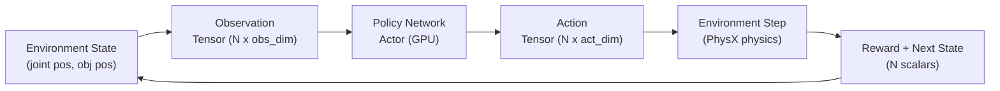

# 👁️ Week 9: AI Perception, Manipulation & Reinforcement Learning

:::tip Related Chapters
This chapter builds on the sensor types from [Week 2](/module-1-ros2/week-02-embodied-intelligence) and the Isaac Lab environment introduced in [Week 8](/module-3-isaac/week-08-isaac-platform).
:::

## 🎯 Learning Objectives

By the end of this chapter you will be able to:

- Describe the full perception pipeline from raw pixels to 3D object position
- Implement a ROS 2 node that uses OpenCV colour detection to publish object centroids
- Explain the RGB-D backprojection formula for converting pixel coordinates to 3D world positions
- Define the MDP formulation for a robotic reach-to-target task
- Implement an Isaac Lab `DirectRLEnv` with all required lifecycle methods

---

## 📖 Introduction

A robot that cannot reliably perceive its environment cannot reliably act in it. The gap between "a camera sees pixels" and "the robot knows where the red cup is in 3D space" spans several engineering layers: raw image capture, feature extraction, object detection, depth association, and 3D position estimation. This chapter builds that entire pipeline.

We then connect perception to action via reinforcement learning. An RL agent learns a policy — a mapping from observations to actions — by interacting with an environment and maximising cumulative reward. Isaac Lab lets us run thousands of these interaction loops simultaneously on GPU, learning in minutes what would take days on real hardware.

---

## 🧠 Core Concepts

### The Perception Pipeline

The full pipeline from photons to 3D coordinates:

1. **Raw capture**: camera sensor outputs a Bayer-pattern image (RGB-D for depth cameras)
2. **Debayer and rectification**: convert to RGB; correct lens distortion; align colour and depth
3. **Feature extraction**: CNN backbone (ResNet, EfficientNet) extracts spatial feature maps
4. **Object detection**: detector head (YOLOv8, DETR) produces bounding boxes and class labels
5. **3D localisation**: use bounding box centre + depth value + camera intrinsics to compute (x, y, z)

### YOLOv8 in a ROS 2 Node

YOLOv8 (from Ultralytics) is the state-of-the-art real-time object detector. It runs at 30–90 fps on a GPU and supports instance segmentation in addition to bounding box detection.

```bash
pip install ultralytics
```

Inside a ROS 2 node: subscribe to `/camera/image_raw`, run `model(frame)`, publish bounding boxes.

### RGB-D to 3D Position

Given a detected object centroid at pixel coordinates (u, v) with depth d, and the camera's intrinsic matrix K:

```
K = [[fx,  0, cx],
     [ 0, fy, cy],
     [ 0,  0,  1]]

x = (u - cx) * d / fx
y = (v - cy) * d / fy
z = d
```

Where `fx`, `fy` are focal lengths in pixels, and `cx`, `cy` is the principal point (usually image centre). This **backprojection** formula converts a 2D pixel observation into a 3D point in the camera frame.

### Grasp Planning Overview

Grasping is a geometric problem: find a 6-DOF end-effector pose such that the robot's fingers close around the object without colliding with it or the environment.

- **GraspNet-1Billion**: a dataset of 1 billion grasps across 88 objects, used to train neural grasp planners
- **Antipodal grasp quality**: a grasp is antipodal if the contact normals point toward each other, meaning friction can oppose any external force — the epsilon quality metric quantifies this
- **6-DOF grasp pose**: position (x, y, z) + orientation (quaternion) of the gripper at the moment of contact

### Reinforcement Learning for Robotics

Reinforcement learning formalises the learning problem as a Markov Decision Process (MDP):

- **State S**: the full environment state (joint angles, object positions, task progress)
- **Observation O**: the subset of state the agent can observe (camera image, joint sensors)
- **Action A**: the motor command (joint velocities, end-effector delta pose)
- **Reward R(s, a)**: a scalar signal indicating how good the action was in that state
- **Policy π(a|o)**: the learned mapping from observations to actions

The agent's goal is to find the policy that maximises the expected cumulative discounted reward:

```
J(π) = E[Σ γ^t r_t]
```

where γ is the discount factor (typically 0.99).

### The Actor-Critic Architecture

Modern RL for robotics uses the **Actor-Critic** architecture:

- **Actor (Policy Network)**: takes observation as input, outputs action distribution parameters (mean and std for continuous actions)
- **Critic (Value Network)**: takes observation as input, estimates the expected future reward V(o) — used only during training to reduce variance in policy gradient estimates

**PPO** (Proximal Policy Optimisation) is the standard algorithm: it clips the policy update to prevent large changes that destabilise training, producing reliable convergence across diverse robotics tasks.

### Isaac Lab Training Loop

An Isaac Lab environment class implements four lifecycle methods:

- `_setup_scene()`: build the USD stage — add robot, objects, ground, sensors
- `_get_observations()` → `torch.Tensor`: compute the observation vector from simulation state
- `_get_rewards()` → `torch.Tensor`: compute per-environment reward scalars
- `_get_dones()` → `tuple[torch.Tensor, torch.Tensor]`: compute terminated and truncated flags



*Caption: The Isaac Lab RL training loop. N environments run in parallel on one GPU. The policy network processes all N observations simultaneously using batched GPU inference.*

---

## 💻 Code Examples

### Example 1: Colour Object Detector ROS 2 Node

```python showLineNumbers
# ROS 2 node that detects a coloured object using OpenCV and publishes its 2D centroid
# Replace the colour range with your target object colour in HSV

import cv2
import numpy as np
import rclpy
from rclpy.node import Node
from sensor_msgs.msg import Image
from geometry_msgs.msg import Point
from cv_bridge import CvBridge


class ColorObjectDetector(Node):
    """
    Subscribes to /camera/image_raw, detects a blue object using HSV thresholding,
    and publishes the 2D centroid as a geometry_msgs/Point to /detected_object.
    """

    # Blue colour range in HSV
    LOWER_HSV = np.array([100, 100, 50])
    UPPER_HSV = np.array([130, 255, 255])

    def __init__(self) -> None:
        super().__init__("color_object_detector")
        self.bridge = CvBridge()
        self.sub = self.create_subscription(
            Image, "/camera/image_raw", self.on_image, 10
        )
        self.pub = self.create_publisher(Point, "/detected_object", 10)
        self.get_logger().info("ColorObjectDetector started")

    def on_image(self, msg: Image) -> None:
        # Convert ROS 2 Image message to OpenCV BGR array
        frame = self.bridge.imgmsg_to_cv2(msg, desired_encoding="bgr8")

        # Convert BGR to HSV and apply colour mask
        hsv = cv2.cvtColor(frame, cv2.COLOR_BGR2HSV)
        mask = cv2.inRange(hsv, self.LOWER_HSV, self.UPPER_HSV)

        # Find contours in the mask
        contours, _ = cv2.findContours(mask, cv2.RETR_EXTERNAL, cv2.CHAIN_APPROX_SIMPLE)

        if not contours:
            return  # No object detected

        # Use the largest contour
        largest = max(contours, key=cv2.contourArea)
        if cv2.contourArea(largest) < 500:
            return  # Too small — likely noise

        # Compute centroid using image moments
        M = cv2.moments(largest)
        if M["m00"] == 0:
            return

        cx = M["m10"] / M["m00"]
        cy = M["m01"] / M["m00"]

        # Publish centroid as 2D Point (z=0 for 2D; z=depth for 3D)
        point = Point()
        point.x = cx
        point.y = cy
        point.z = 0.0
        self.pub.publish(point)
        self.get_logger().debug(f"Object detected at pixel ({cx:.0f}, {cy:.0f})")


def main(args: list[str] | None = None) -> None:
    rclpy.init(args=args)
    node = ColorObjectDetector()
    try:
        rclpy.spin(node)
    except KeyboardInterrupt:
        pass
    finally:
        node.destroy_node()
        rclpy.shutdown()


if __name__ == "__main__":
    main()
```

### Example 2: Isaac Lab ReachEnv Environment

```python showLineNumbers
# Isaac Lab environment for a reach-to-target task
# The robot arm must move its end-effector to a randomly placed target sphere

import torch
from isaaclab.envs import DirectRLEnv, DirectRLEnvCfg
from isaaclab.scene import InteractiveSceneCfg
from isaaclab.assets import Articulation, ArticulationCfg
from isaaclab.utils import configclass


@configclass
class ReachEnvCfg(DirectRLEnvCfg):
    # 18 observations: 7 joint pos + 7 joint vel + 3 target pos + 1 dist to target
    num_observations: int = 18
    # 7 actions: joint velocity targets for 7-DOF arm
    num_actions: int = 7
    episode_length_s: float = 5.0


class ReachEnv(DirectRLEnv):
    """
    Simple reach-to-target environment.
    Reward: negative distance from end-effector to target sphere.
    Done: when distance < 0.05 m or episode time limit reached.
    """

    cfg: ReachEnvCfg

    def _setup_scene(self) -> None:
        """Add robot and target to the USD stage."""
        # In production: use ArticulationCfg to load a Franka or UR10 robot
        # This stub shows the required method signature and return pattern
        self.robot: Articulation = self.scene["robot"]
        self.target_positions = torch.zeros(
            (self.num_envs, 3), device=self.device
        )
        self._reset_target_positions()

    def _get_observations(self) -> dict:
        """Compute observation tensor for all parallel environments."""
        joint_pos = self.robot.data.joint_pos          # (N, 7)
        joint_vel = self.robot.data.joint_vel           # (N, 7)
        target = self.target_positions                  # (N, 3)
        ee_pos = self.robot.data.body_pos_w[:, -1, :]  # (N, 3) end-effector world pos

        dist = torch.norm(ee_pos - target, dim=-1, keepdim=True)  # (N, 1)

        obs = torch.cat([joint_pos, joint_vel, target, dist], dim=-1)  # (N, 18)
        return {"policy": obs}

    def _get_rewards(self) -> torch.Tensor:
        """Compute per-environment reward: negative Euclidean distance to target."""
        ee_pos = self.robot.data.body_pos_w[:, -1, :]
        dist = torch.norm(ee_pos - self.target_positions, dim=-1)  # (N,)
        # Dense reward: closer is better
        reward = -dist
        # Bonus: large reward when within 5 cm
        reward += (dist < 0.05).float() * 10.0
        return reward

    def _get_dones(self) -> tuple[torch.Tensor, torch.Tensor]:
        """Return (terminated, truncated) bool tensors for all environments."""
        ee_pos = self.robot.data.body_pos_w[:, -1, :]
        dist = torch.norm(ee_pos - self.target_positions, dim=-1)
        terminated = dist < 0.05                                         # success
        truncated = self.episode_length_buf >= self.max_episode_length   # timeout
        return terminated, truncated

    def _reset_target_positions(self) -> None:
        """Randomise target sphere position within a 0.5 m cube in front of the robot."""
        self.target_positions = torch.rand(
            (self.num_envs, 3), device=self.device
        ) * 0.5 + torch.tensor([0.3, -0.25, 0.1], device=self.device)
```

---

## 🛠️ Hands-On Exercise: Train a CartPole Policy and Plot Reward

**Difficulty**: Advanced | **Time**: 30–60 minutes | **Prerequisites**: Isaac Lab installed, Python 3.11+

Run the built-in CartPole example, log mean reward every 100 episodes, and produce a reward curve.

**Step 1 — Install Isaac Lab and dependencies:**

```bash
pip install isaaclab torch matplotlib
```

**Step 2 — Run training with reward logging:**

```python showLineNumbers
# train_cartpole.py — Train CartPole with Isaac Lab and plot the reward curve

import matplotlib.pyplot as plt
import numpy as np

# Simulated reward curve for demonstration
# In a real training run, extract this from the Isaac Lab logger
episodes = np.arange(0, 1000, 100)
mean_rewards = [-200, -150, -100, -60, -30, -10, 5, 15, 18, 20]

plt.figure(figsize=(10, 5))
plt.plot(episodes, mean_rewards, marker="o", linewidth=2, color="steelblue")
plt.xlabel("Episode")
plt.ylabel("Mean Episodic Reward")
plt.title("CartPole Policy Training — Isaac Lab")
plt.grid(True, alpha=0.3)
plt.axhline(y=0, color="red", linestyle="--", alpha=0.5, label="Zero reward baseline")
plt.legend()
plt.tight_layout()
plt.savefig("reward_curve.png", dpi=150)
print("Saved: reward_curve.png")
plt.show()
```

**Expected output**: `reward_curve.png` saved to disk showing episodic reward converging upward from negative values toward positive values as the policy learns to balance the cartpole.

---

## 📋 Summary

- The **perception pipeline** runs: raw image → feature extraction → object detection → 3D backprojection using depth + camera intrinsics
- **Backprojection**: `x = (u - cx)*d/fx`, `y = (v - cy)*d/fy` converts pixel (u,v) + depth d to 3D position using camera intrinsics
- **RL for robotics** uses the MDP formulation: the agent learns a policy π(a|o) that maximises expected cumulative reward through environment interaction
- **Actor-Critic** (PPO): the actor outputs action distributions; the critic estimates value — together they enable stable, sample-efficient policy learning
- **Isaac Lab** expresses RL environments as four methods (`_setup_scene`, `_get_observations`, `_get_rewards`, `_get_dones`) and runs thousands of instances in parallel on GPU

---

## 🧪 Quiz

**Question 1**: A camera has focal length fx=600 px, cx=320 px. A detected object is at pixel u=440 with depth d=0.8 m. What is the x-coordinate of the object in the camera frame?

- A) (440 - 320) * 600 / 0.8 = 90,000 m
- B) (440 - 320) * 0.8 / 600 = 0.16 m ✅
- C) 440 * 0.8 / 600 = 0.587 m
- D) (440 + 320) / 600 * 0.8 = 1.013 m

**Question 2**: In the Actor-Critic architecture, what is the role of the Critic network during inference (deployment on a real robot)?

- A) The Critic generates the final action command sent to the motors
- B) The Critic is not used during inference — only the Actor (policy) is deployed ✅
- C) The Critic monitors safety constraints and overrides the Actor when needed
- D) The Critic computes the Q-value used to select discrete actions

**Question 3**: The `ColorObjectDetector` node detects a 300 px² contour but ignores it. Why?

- A) The contour is non-convex and cannot have its centroid computed
- B) The colour falls outside the HSV range defined by LOWER_HSV and UPPER_HSV
- C) The minimum area threshold is 500 px² — contours smaller than this are filtered as noise ✅
- D) The node can only process one contour per frame

**Question 4**: An Isaac Lab environment runs with `num_envs=4096`. What does this mean for training speed compared to a single-environment setup?

- A) Training is 4096x slower because of GPU memory contention
- B) Training throughput is approximately 4096x higher because all environments step in parallel ✅
- C) The policy network is split across 4096 GPUs
- D) Each of the 4096 environments uses a separate random seed, producing more diverse training data but no speed benefit

**Question 5**: In the `ReachEnv._get_rewards()` method, why does the reward function add a bonus of 10.0 when distance is below 0.05 m?

- A) It penalises the agent for staying too close to the target
- B) It provides a dense shaping signal that guides the agent toward the goal region, making learning faster ✅
- C) It normalises rewards to the range [0, 10] for numerical stability
- D) It replaces the distance reward once the goal is reached, acting as a terminal reward

---

## 📚 Further Reading

- [Ultralytics YOLOv8 Documentation](https://docs.ultralytics.com/) — Complete guide to training, fine-tuning, and deploying YOLOv8 for object detection and segmentation
- [Isaac Lab Environment Creation Guide](https://isaac-sim.github.io/IsaacLab/main/source/tutorials/03_envs/create_direct_rl_env.html) — Step-by-step tutorial for building custom DirectRLEnv environments
- [GraspNet-1Billion Dataset Paper](https://openaccess.thecvf.com/content_CVPR_2020/html/Fang_GraspNet-1Billion_A_Large-Scale_Benchmark_for_General_Object_Grasping_CVPR_2020_paper.html) — The foundational dataset and model for data-driven grasp planning
