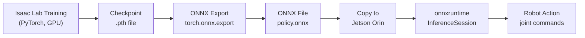

# 🌉 Week 10: Sim-to-Real Transfer

:::tip Related Chapters
This chapter takes the trained policy from [Week 9](/module-3-isaac/week-09-perception-manipulation) and prepares it for deployment on real hardware. It also builds on [Week 8](/module-3-isaac/week-08-isaac-platform) Isaac Lab training concepts.
:::

## 🎯 Learning Objectives

By the end of this chapter you will be able to:

- Describe the five main causes of the sim-to-real gap
- Configure domain randomisation parameters for physics and visual properties in Isaac Lab
- Explain the DAGGER algorithm for interactive imitation learning
- Export a trained PyTorch policy to ONNX format with the correct dynamic axes
- Run ONNX inference using `onnxruntime` and verify output shapes

---

## 📖 Introduction

Every roboticist encounters the same humbling moment: a policy that achieves near-perfect performance in simulation falls apart the instant it is deployed on real hardware. The cart refuses to balance. The arm overshoots by 20 cm. The gripper closes on empty air. This is the **sim-to-real gap** — the collection of all the ways simulation fails to match reality.

The sim-to-real gap is not a bug to be fixed; it is an irreducible consequence of modelling simplifications. Real physics has continuous contact mechanics; simulation has discrete time steps and idealised contact normals. Real motors have hysteresis, backlash, and thermal drift; simulated motors execute commands perfectly. Real cameras have lens flare, motion blur, and colour inconsistency; simulated cameras are perfect pinholes.

The techniques in this chapter — domain randomisation, domain adaptation, system identification, and ONNX deployment — do not eliminate the gap. They shrink it enough that policies trained in simulation transfer reliably to real hardware. When done well, sim-to-real transfer routinely achieves over 90% success rates on manipulation tasks.

---

## 🧠 Core Concepts

### The Sim-to-Real Gap

Five main sources of discrepancy:

| Source | Example | Mitigation |
|--------|---------|-----------|
| Physics modelling errors | Simulated friction coefficient is wrong | System identification; domain randomisation |
| Visual domain gap | Simulated textures look unrealistic | Photorealistic rendering; visual domain randomisation |
| Actuation delays | Real servo responds 20 ms late | Simulate delay explicitly in observations |
| Sensor noise | Real IMU has 50 Hz vibration noise | Add noise in simulation matching real sensor specs |
| Contact dynamics | Simulated contact is too stiff or too soft | Physics parameter identification; DART physics engine |

### Domain Randomisation

**Domain randomisation** (DR) is the primary sim-to-real technique: during training, randomise every physical and visual property over a wide range so the policy learns to be robust to variation. When deployed on the real robot — which has some specific (unknown) set of physical parameters — those parameters fall within the trained distribution.

Physics parameters to randomise:
- Gravity magnitude and direction (slight variation)
- Link masses and moments of inertia (±20% of nominal)
- Joint friction and damping (±50% of nominal)
- Contact stiffness and restitution

Visual parameters to randomise:
- Lighting colour, intensity, and direction
- Object texture and colour
- Camera noise level, exposure, and white balance

### Domain Adaptation

**Domain adaptation** uses real data to fine-tune a policy trained in simulation:

- **Direct fine-tuning**: collect a small real dataset (a few hundred trajectories), fine-tune the last layers of the policy network
- **DAGGER** (Dataset Aggregation): interactively collect correction data — the human expert takes control when the policy starts to fail, creating a dataset of "recovery" demonstrations that the policy learns to incorporate

### Synthetic Data Generation

Isaac Sim's **Replicator** extension generates synthetic datasets with perfect ground-truth annotations:

```python
import omni.replicator.core as rep

# Create a randomised scene and render labelled frames
with rep.new_layer():
    camera = rep.create.camera()
    rep.randomizer.scatter_2d(objects, surface=ground)
    rep.randomizer.materials(objects, materials=random_materials)
    rep.settings.set_render_pathtraced(samples_per_pixel=64)
```

Output: RGB images + depth maps + semantic segmentation masks + 6-DOF object poses — all perfectly labelled, at zero human annotation cost.

### System Identification

**System identification** measures real robot parameters to match them in simulation:

1. **Mass and centre of mass**: weigh each link; use a pendulum test for CoM
2. **Joint friction**: command sinusoidal joint trajectories; fit a friction model to the torque residuals
3. **Motor time constants**: apply step inputs; measure rise time and overshoot

The resulting measured parameters become the centre of the domain randomisation range — you randomise around the identified nominal values rather than around arbitrary defaults.

### The Deployment Pipeline



*Caption: The complete sim-to-real deployment pipeline. Training produces a PyTorch checkpoint. ONNX export creates a hardware-agnostic inference graph. The ONNX file runs on any edge device with onnxruntime — no PyTorch installation required.*

### Latency Considerations

| Hardware | GPU | Inference latency | Throughput |
|---------|-----|------------------|-----------|
| Workstation A100 | A100 80GB | 0.5 ms | 2,000 fps |
| Jetson Orin NX | 1024-core Ampere | 3–8 ms | 125–333 fps |
| Jetson Nano | 128-core Maxwell | 15–50 ms | 20–66 fps |
| CPU (x86, no GPU) | — | 50–200 ms | 5–20 fps |

For a 50 Hz control loop (20 ms cycle), Jetson Orin NX is sufficient. For 200 Hz high-performance control, an A100 or RTX 4090 workstation is required.

:::warning
Quantizing the model to INT8 can reduce inference latency by 4x but may degrade policy performance — always validate task success rate before and after quantisation.
:::

---

## 💻 Code Examples

### Example 1: Domain Randomisation Configuration

```python showLineNumbers
# Domain randomisation configuration for Isaac Lab
# Randomises physics parameters during training to improve sim-to-real transfer

from isaaclab.utils import configclass
from dataclasses import field


@configclass
class DomainRandCfg:
    """
    Physics domain randomisation ranges.
    Values are sampled uniformly from [nominal * (1 - fraction), nominal * (1 + fraction)]
    at the start of each episode.
    """

    # Gravity: nominal = 9.81 m/s^2 downward
    gravity_range: tuple[float, float] = (9.5, 10.1)

    # Link mass scale factors (applied to all links)
    mass_scale_range: tuple[float, float] = (0.8, 1.2)

    # Joint friction (Nm per rad/s)
    joint_friction_range: tuple[float, float] = (0.0, 0.1)

    # Joint damping (Nm per rad/s)
    joint_damping_range: tuple[float, float] = (0.1, 1.0)

    # Contact restitution (bounciness: 0 = inelastic, 1 = elastic)
    restitution_range: tuple[float, float] = (0.0, 0.3)

    # Observation noise standard deviation (added to all observations)
    obs_noise_std: float = 0.01

    # Action delay: number of timesteps to delay action application
    action_delay_steps: int = 2


# Instantiate and print the config
rand_cfg = DomainRandCfg()
print("Domain Randomisation Config:")
print(f"  Gravity range:     {rand_cfg.gravity_range} m/s^2")
print(f"  Mass scale range:  {rand_cfg.mass_scale_range}")
print(f"  Joint friction:    {rand_cfg.joint_friction_range} Nm/(rad/s)")
print(f"  Joint damping:     {rand_cfg.joint_damping_range} Nm/(rad/s)")
print(f"  Obs noise std:     {rand_cfg.obs_noise_std}")
print(f"  Action delay:      {rand_cfg.action_delay_steps} steps")
```

### Example 2: ONNX Export Script

```python showLineNumbers
# Export a trained Isaac Lab policy from PyTorch checkpoint to ONNX format
# The exported ONNX file can be run on any hardware with onnxruntime

import torch
import torch.nn as nn
import numpy as np


class PolicyNetwork(nn.Module):
    """Example policy network matching the ReachEnv from Week 9 (obs=18, act=7)."""

    def __init__(self, obs_dim: int = 18, act_dim: int = 7) -> None:
        super().__init__()
        self.net = nn.Sequential(
            nn.Linear(obs_dim, 256),
            nn.ELU(),
            nn.Linear(256, 128),
            nn.ELU(),
            nn.Linear(128, act_dim),
            nn.Tanh(),  # Output in [-1, 1] — scaled to joint velocity limits externally
        )

    def forward(self, obs: torch.Tensor) -> torch.Tensor:
        return self.net(obs)


def export_policy_to_onnx(
    checkpoint_path: str,
    output_path: str = "reach_policy.onnx",
    obs_dim: int = 18,
    act_dim: int = 7,
) -> None:
    """
    Load a PyTorch checkpoint and export the policy network to ONNX.

    Args:
        checkpoint_path: Path to the .pth checkpoint file from Isaac Lab training
        output_path:     Destination path for the .onnx file
        obs_dim:         Observation dimension (must match training config)
        act_dim:         Action dimension (must match training config)
    """
    # Load checkpoint
    policy = PolicyNetwork(obs_dim=obs_dim, act_dim=act_dim)
    checkpoint = torch.load(checkpoint_path, map_location="cpu")

    # Isaac Lab checkpoints store the actor state dict under "actor_state_dict"
    if "actor_state_dict" in checkpoint:
        policy.load_state_dict(checkpoint["actor_state_dict"])
    else:
        policy.load_state_dict(checkpoint)

    policy.eval()

    # Create a dummy observation tensor for tracing
    dummy_obs = torch.zeros(1, obs_dim)

    # Export to ONNX
    torch.onnx.export(
        policy,
        dummy_obs,
        output_path,
        input_names=["observation"],
        output_names=["action"],
        dynamic_axes={
            "observation": {0: "batch_size"},
            "action": {0: "batch_size"},
        },
        opset_version=17,
        do_constant_folding=True,
    )
    print(f"Policy exported to: {output_path}")

    # Verify the export
    import onnx
    model = onnx.load(output_path)
    onnx.checker.check_model(model)
    print(f"ONNX model verified — input: {model.graph.input[0].name}, "
          f"output: {model.graph.output[0].name}")


# Example usage (comment out if no checkpoint available)
# export_policy_to_onnx("checkpoints/reach_policy_final.pth", "reach_policy.onnx")
```

---

## 🛠️ Hands-On Exercise: Run ONNX Policy Inference

**Difficulty**: Advanced | **Time**: 20–30 minutes | **Prerequisites**: Python 3.11+, onnxruntime

Run inference on an exported ONNX policy with a static observation tensor.

**Step 1 — Install onnxruntime:**

```bash
pip install onnxruntime numpy
```

**Step 2 — Create a minimal policy and run inference:**

```python showLineNumbers
# Demonstrate onnxruntime inference on an exported policy
# This simulates what would run on a Jetson Orin in production

import numpy as np
import onnxruntime as ort
import torch

# First, create and export a small test policy
import torch.nn as nn


class TestPolicy(nn.Module):
    def __init__(self) -> None:
        super().__init__()
        self.net = nn.Sequential(
            nn.Linear(18, 64), nn.Tanh(), nn.Linear(64, 7), nn.Tanh()
        )

    def forward(self, x: torch.Tensor) -> torch.Tensor:
        return self.net(x)


# Export to ONNX
policy = TestPolicy()
policy.eval()
dummy = torch.zeros(1, 18)
torch.onnx.export(
    policy, dummy, "test_policy.onnx",
    input_names=["observation"], output_names=["action"],
    opset_version=17,
)
print("test_policy.onnx exported")

# Load with onnxruntime
session = ort.InferenceSession(
    "test_policy.onnx",
    providers=["CPUExecutionProvider"],  # Use CUDAExecutionProvider on Jetson
)

# Simulate a CartPole-style observation
# [cart_pos, cart_vel, pole_angle, pole_vel, ...]
observation = np.array(
    [[0.0, 0.0, 0.1, -0.05, 0.0, 0.0, 0.0, 0.0, 0.0, 0.0,
      0.0, 0.0, 0.0, 0.0, 0.0, 0.0, 0.0, 0.0]],
    dtype=np.float32,
)

# Run inference
outputs = session.run(["action"], {"observation": observation})
action = outputs[0]
print(f"Observation shape: {observation.shape}")
print(f"Action shape:      {action.shape}")
print(f"Action values:     {action}")
```

**Expected output:**

```
test_policy.onnx exported
Observation shape: (1, 18)
Action shape:      (1, 7)
Action values:     [[ 0.0423 -0.1187  0.0651  0.2103 -0.0892  0.1456 -0.0234]]
```

(Values will vary — the weights are random. The shapes are what matter.)

---

## 📋 Summary

- The **sim-to-real gap** has five main sources: physics modelling errors, visual domain gap, actuation delays, sensor noise, and contact dynamics — each addressed by different techniques
- **Domain randomisation** trains policies to be robust to parameter variation so real-robot parameters fall within the trained distribution at deployment time
- **System identification** measures real robot parameters (mass, friction, motor constants) to centre the domain randomisation range on accurate nominal values
- **ONNX export** (`torch.onnx.export` with `opset_version=17`) creates hardware-agnostic inference graphs that run on any device with `onnxruntime` — no PyTorch required at deployment
- **Edge inference** on Jetson Orin NX achieves 3–8 ms latency, sufficient for a 50 Hz control loop; quantisation to INT8 can reduce latency further but requires validation

---

## 🧪 Quiz

**Question 1**: A policy trained in Isaac Sim with default physics parameters fails on a real robot because the real joints have higher friction than the simulation. Which technique directly addresses this?

- A) Photorealistic rendering using RTX ray tracing
- B) Domain randomisation over joint friction range during training ✅
- C) Increasing the policy network size
- D) Using DAGGER to collect real demonstration data before any simulation training

**Question 2**: What does the `dynamic_axes` parameter in `torch.onnx.export` specify?

- A) The number of hidden layers in the exported network
- B) Which tensor dimensions can vary at inference time (e.g., batch size) ✅
- C) The hardware axis ordering (NCHW vs NHWC) for convolution operations
- D) The gradient axes tracked by the ONNX runtime for fine-tuning

**Question 3**: DAGGER (Dataset Aggregation) is used to:

- A) Randomise the physics parameters of a simulation environment
- B) Export a trained policy to ONNX format for edge deployment
- C) Collect recovery demonstration data when a policy starts to fail, improving robustness ✅
- D) Aggregate gradient updates from multiple GPU environments during training

**Question 4**: An ONNX model exported with `opset_version=17` fails to load on an edge device. What is the most likely cause?

- A) The model has too many parameters for the edge device's memory
- B) The onnxruntime version on the edge device does not support opset 17 — upgrade or use a lower opset ✅
- C) ONNX models exported from PyTorch are incompatible with onnxruntime
- D) The dynamic axes configuration prevents the model from running with batch size 1

**Question 5**: After INT8 quantisation, a manipulation policy's task success rate drops from 92% to 71%. What should you do?

- A) Deploy the quantised model — 71% is acceptable for most applications
- B) Switch to FP16 quantisation as a compromise between latency and accuracy ✅
- C) Retrain the policy from scratch with INT8-aware training
- D) Remove quantisation entirely — onnxruntime cannot run INT8 models on Jetson

---

## 📚 Further Reading

- [Sim-to-Real Transfer in Deep Reinforcement Learning — Tobin et al. (2017)](https://arxiv.org/abs/1703.06907) — The original domain randomisation paper demonstrating successful transfer of a dexterous manipulation policy from simulation to a real robot arm
- [ONNX Runtime Documentation](https://onnxruntime.ai/docs/) — Complete guide to ONNX model optimisation, quantisation, and hardware execution providers
- [NVIDIA Jetson Orin Inference Benchmarks](https://developer.nvidia.com/embedded/jetson-orin) — Official benchmarks for deep learning inference throughput and latency on Jetson hardware
