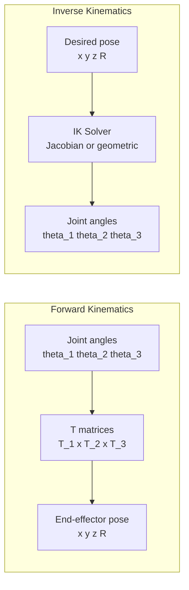

# 🦾 Week 11: Humanoid Kinematics & Bipedal Locomotion

:::tip Related Chapters
This chapter extends the URDF joint model from [Week 7](/module-2-simulation/week-07-urdf-sdf) to compute end-effector poses mathematically. The simulation environment from [Week 6](/module-2-simulation/week-06-gazebo-setup) hosts the MoveIt2 exercises.
:::

## 🎯 Learning Objectives

By the end of this chapter you will be able to:

- Compute forward kinematics (FK) for a 3-DOF planar arm using homogeneous transformation matrices
- Explain the difference between geometric IK, numerical IK, and Jacobian pseudoinverse methods
- Define the Zero-Moment Point (ZMP) criterion and explain its role in bipedal stability
- Use the MoveIt2 Python API to plan and execute a joint-space trajectory
- Describe how Model Predictive Control (MPC) maintains balance in a walking humanoid

---

## 📖 Introduction

Mathematics underpins every robot movement. When a humanoid's arm reaches for a doorknob, a kinematic chain of seven revolute joints must be coordinated so that the wrist arrives at exactly the right position and orientation. When the robot walks, a whole-body controller must ensure that the combined weight of 40 kg of metal never tips past the support polygon — or the robot falls.

This chapter introduces the mathematics of robot kinematics and locomotion. Unlike machine learning chapters, which rely on opaque neural networks to learn behaviour, kinematics gives you closed-form, interpretable equations. When debugging a robot that overshoots its target by 5 cm, kinematic analysis tells you exactly which joint angle or DH parameter is wrong. That interpretability is one reason classical kinematics remains the foundation of robot motion planning even in the era of deep learning.

---

## 🧠 Core Concepts

### Degrees of Freedom (DOF)

A rigid body in 3D space has 6 DOF: 3 translational (x, y, z) and 3 rotational (roll, pitch, yaw). Each revolute joint in a kinematic chain adds 1 DOF. A humanoid robot typically has:

- 6 DOF per leg (hip: 3, knee: 1, ankle: 2)
- 7 DOF per arm (shoulder: 3, elbow: 1, wrist: 3)
- 3 DOF neck, 1 DOF waist
- Total: approximately 29–44 DOF depending on hand configuration

**Redundancy** occurs when a robot has more DOF than needed for a task. A 7-DOF arm grasping an object (which needs 6 DOF) has 1 redundant DOF — it can reach the same goal with multiple elbow configurations. Redundancy enables obstacle avoidance by exploiting the null space of the Jacobian.

### Forward Kinematics (FK)

**Forward kinematics** answers: *given joint angles, where is the end-effector?*

The answer is computed by multiplying homogeneous transformation matrices along the kinematic chain. Each joint i contributes a 4×4 matrix T_i that encodes rotation and translation relative to the previous link. The end-effector pose is:

```
T_end = T_1 × T_2 × ... × T_n
```

**Denavit-Hartenberg (DH) parameters** systematically describe each link-joint combination:

| Parameter | Symbol | Description |
|-----------|--------|-------------|
| Link length | a | Distance along X from Z_i to Z_next |
| Link offset | d | Distance along Z from X_prev to X_i |
| Twist angle | alpha | Angle from Z_prev to Z_i around X |
| Joint angle | theta | Angle from X_prev to X_i around Z (variable!) |

Example DH table for a 3-DOF planar arm (all joints revolute, in the XY plane):

| Joint | a (m) | d (m) | alpha (rad) | theta (rad) |
|-------|-------|-------|-------------|-------------|
| 1 | 0.30 | 0 | 0 | theta_1 |
| 2 | 0.25 | 0 | 0 | theta_2 |
| 3 | 0.20 | 0 | 0 | theta_3 |

### Inverse Kinematics (IK)

**Inverse kinematics** answers: *given a desired end-effector pose, what joint angles produce it?*

This is a harder problem than FK — multiple solutions may exist, no solution may exist, or the solution may require passing through a singularity.

Three IK approaches:

- **Geometric IK**: derive closed-form equations using trigonometry for specific robot configurations. Fast and exact but requires custom derivation per robot.
- **Numerical IK (Newton-Raphson)**: iteratively refine joint angles to minimise the error between current and target end-effector pose. General purpose but may not converge.
- **Jacobian pseudoinverse**: compute the Moore-Penrose pseudoinverse of the Jacobian matrix J to get velocity-level IK: `dq = J^+ * dx`. Handles redundancy via null-space projection.

**Singularities** occur when the Jacobian loses rank — the robot loses the ability to move in certain directions. Common singularities: arm fully extended (wrist singularity), wrist aligned with shoulder (shoulder singularity).

### Bipedal Locomotion Challenges

Walking is a continuous fall that the robot catches at each step. The key challenge is maintaining **dynamic stability** — not just avoiding falling at each instant, but ensuring the robot's momentum will not cause a fall in future timesteps.

- **Static stability**: CoM (Centre of Mass) projects inside the support polygon — safe but slow; only achievable at very low speeds
- **Dynamic stability**: CoM is outside the support polygon but momentum ensures the robot will step into a new support polygon before falling — enables natural walking speed

### Zero-Moment Point (ZMP)

The **Zero-Moment Point** is the ground-plane point where the horizontal component of the resultant moment from gravity and inertia forces is zero. For stable walking:

```
ZMP must remain within the support polygon (convex hull of foot contact points)
```

If the ZMP exits the support polygon, the robot will rotate around the support polygon edge and fall. The ZMP criterion is the standard stability check for bipedal locomotion controllers.

Humanoid balance controllers compute the desired ZMP trajectory from the desired CoM trajectory and solve for joint torques that produce it — this is the foundation of pattern generation algorithms used in HRP, ASIMO, and modern humanoid robots.

### Gait Planning

A **gait** is a pattern of foot contacts over time:

- **Static gait**: at every instant, at least three feet are on the ground (CoM inside support polygon). Very slow but robust. Rarely used for humanoids.
- **Dynamic gait (walking cycle)**: double support (both feet) → single support left → double support → single support right → repeat. CoM traces a smooth arc over each support foot.

**Contact scheduling** defines when each foot leaves and lands. The timing must ensure the ZMP remains within the support polygon during single support — the most constrained phase.

### Model Predictive Control (MPC) for Balance

**MPC** plans a sequence of future control inputs over a prediction horizon H, executing only the first action, then replanning:

```
minimise  Σ_{k=0}^{H} ||ZMP_k - ZMP_desired||^2 + ||u_k||^2
subject to  system dynamics, joint limits, ZMP within support polygon
```

The **Linear Inverted Pendulum Model (LIPM)** simplifies the humanoid's dynamics to a point mass on a telescoping massless rod with constant CoM height. LIPM enables analytical ZMP-CoM relationships, making MPC tractable at 100–200 Hz.

### MoveIt2 Overview

MoveIt2 is the ROS 2 motion planning framework:

- **OMPL planners**: sampling-based planners (RRT, RRT*, PRM) for collision-free path planning in joint space
- **Planning scene**: a 3D occupancy map combining the robot model + environment point cloud + manually added collision objects
- **Collision objects**: primitive or mesh shapes added to the planning scene to block the planner from entering
- **MoveGroupInterface**: the Python API for commanding MoveIt2 (`move_to_pose`, `move_to_joint_values`, `execute_trajectory`)



*Caption: FK and IK are inverse problems. FK takes joint angles and computes Cartesian pose. IK takes a desired Cartesian pose and computes joint angles. IK is harder — multiple solutions may exist.*

---

## 💻 Code Examples

### Example 1: Forward Kinematics for a 3-DOF Planar Arm

```python showLineNumbers
# Computes forward kinematics for a 3-DOF planar robot arm using homogeneous matrices
# No ROS 2 required — pure Python with numpy

import numpy as np


def rotation_z(theta: float) -> np.ndarray:
    """4x4 homogeneous rotation matrix around the Z axis."""
    c, s = np.cos(theta), np.sin(theta)
    return np.array([
        [ c, -s, 0, 0],
        [ s,  c, 0, 0],
        [ 0,  0, 1, 0],
        [ 0,  0, 0, 1],
    ])


def translation(dx: float, dy: float, dz: float) -> np.ndarray:
    """4x4 homogeneous translation matrix."""
    return np.array([
        [1, 0, 0, dx],
        [0, 1, 0, dy],
        [0, 0, 1, dz],
        [0, 0, 0,  1],
    ])


def forward_kinematics(
    theta1: float,
    theta2: float,
    theta3: float,
    l1: float = 0.30,
    l2: float = 0.25,
    l3: float = 0.20,
) -> np.ndarray:
    """
    Returns the 4x4 end-effector transform in the world frame.

    Args:
        theta1, theta2, theta3: Joint angles in radians
        l1, l2, l3:             Link lengths in metres

    Returns:
        4x4 homogeneous transform matrix T_end
    """
    # Link 1: rotate by theta1, then translate along X by l1
    T1 = rotation_z(theta1) @ translation(l1, 0, 0)
    # Link 2: rotate by theta2, then translate along X by l2
    T2 = rotation_z(theta2) @ translation(l2, 0, 0)
    # Link 3: rotate by theta3, then translate along X by l3
    T3 = rotation_z(theta3) @ translation(l3, 0, 0)

    # Chain the transforms
    T_end = T1 @ T2 @ T3
    return T_end


# --- Demo ---
theta1 = np.radians(30)   # 30 degrees
theta2 = np.radians(45)   # 45 degrees
theta3 = np.radians(-15)  # -15 degrees

T = forward_kinematics(theta1, theta2, theta3)

# Extract end-effector position
x = T[0, 3]
y = T[1, 3]
print(f"Joint angles: theta1={np.degrees(theta1):.1f} deg, "
      f"theta2={np.degrees(theta2):.1f} deg, "
      f"theta3={np.degrees(theta3):.1f} deg")
print(f"End-effector: x={x:.4f} m, y={y:.4f} m")
print(f"Full transform:\n{np.round(T, 4)}")
```

**Expected output:**

```
Joint angles: theta1=30.0 deg, theta2=45.0 deg, theta3=-15.0 deg
End-effector: x=0.5327 m, y=0.3277 m
Full transform:
[[ 0.7071 -0.7071  0.      0.5327]
 [ 0.7071  0.7071  0.      0.3277]
 [ 0.      0.      1.      0.    ]
 [ 0.      0.      0.      1.    ]]
```

### Example 2: MoveIt2 Python API

```python showLineNumbers
# Plan and execute a motion to a target pose using MoveIt2 Python API
# Requires: ros-humble-moveit, a running robot (e.g., Panda in Gazebo)

from pymoveit2 import MoveIt2
import rclpy
from rclpy.node import Node
from geometry_msgs.msg import Pose
import numpy as np


class MoveIt2PlannerNode(Node):
    def __init__(self) -> None:
        super().__init__("moveit2_planner")

        # Initialise MoveIt2 interface for the Panda arm
        self.moveit2 = MoveIt2(
            node=self,
            joint_names=[
                "panda_joint1", "panda_joint2", "panda_joint3",
                "panda_joint4", "panda_joint5", "panda_joint6", "panda_joint7",
            ],
            base_link_name="panda_link0",
            end_effector_name="panda_hand",
            group_name="panda_arm",
        )

        # Target: move end-effector to (0.4, 0.0, 0.5) facing downward
        target = Pose()
        target.position.x = 0.4
        target.position.y = 0.0
        target.position.z = 0.5
        target.orientation.x = 1.0
        target.orientation.y = 0.0
        target.orientation.z = 0.0
        target.orientation.w = 0.0

        self.get_logger().info(
            f"Planning to: x={target.position.x}, y={target.position.y}, "
            f"z={target.position.z}"
        )

        # Plan and execute
        self.moveit2.move_to_pose(
            position=[target.position.x, target.position.y, target.position.z],
            quat_xyzw=[
                target.orientation.x, target.orientation.y,
                target.orientation.z, target.orientation.w,
            ],
            cartesian=False,
        )


def main(args: list[str] | None = None) -> None:
    rclpy.init(args=args)
    node = MoveIt2PlannerNode()
    rclpy.spin_once(node, timeout_sec=10.0)
    node.destroy_node()
    rclpy.shutdown()


if __name__ == "__main__":
    main()
```

---

## 🛠️ Hands-On Exercise: Plan 5 Poses in MoveIt2

**Difficulty**: Advanced | **Time**: 30–45 minutes | **Prerequisites**: ROS 2 Humble, MoveIt2

**Step 1 — Launch Panda robot with MoveIt2:**

```bash
sudo apt install -y ros-humble-moveit
ros2 launch moveit_resources_panda_moveit_config demo.launch.py
```

**Step 2 — In the RViz2 Motion Planning panel:**
1. Set Planning Group to `panda_arm`
2. Drag the orange interactive marker (end-effector) to a target pose
3. Click **Plan** to see the planned trajectory visualized
4. Click **Execute** to execute it
5. Observe the joint angles update in the Joints panel
6. Repeat for 5 different poses

**Expected output**: RViz2 shows a coloured trajectory from the current pose to each target pose. The robot model animates through the planned path on Execute.

---

## 📋 Summary

- **Forward kinematics** = multiply DH transformation matrices along the chain to get end-effector pose; deterministic and fast
- **Inverse kinematics** = find joint angles for a desired end-effector pose; can have multiple solutions, no solution, or require handling singularities
- The **ZMP criterion** requires the Zero-Moment Point to remain within the support polygon during all walking phases — violation means the robot falls
- **MPC** plans over a prediction horizon H and replans at every timestep; the LIPM model makes ZMP tracking tractable at real-time rates
- **MoveIt2** provides OMPL-based collision-free path planning via a planning scene (robot URDF + environment map) with a Python API (`MoveIt2.move_to_pose()`)

---

## 🧪 Quiz

**Question 1**: A 7-DOF arm is reaching for a target position that only requires 6 DOF to achieve. What does the extra (redundant) DOF allow the robot to do?

- A) Move faster by distributing torque across more joints
- B) Use null-space motion to change elbow configuration while keeping the end-effector at the target — useful for obstacle avoidance ✅
- C) Achieve more accurate positioning by over-constraining the target pose
- D) Reduce joint wear by distributing motion across all joints equally

**Question 2**: The DH parameter `theta` for a revolute joint is:

- A) A constant that describes the fixed angle of the joint's rotation axis
- B) The variable joint angle — this is the value commanded by the controller ✅
- C) The angle between consecutive joint rotation axes (twist)
- D) The offset distance along the previous joint's Z axis

**Question 3**: A walking humanoid's ZMP exits the support polygon during single support phase. What happens?

- A) The balance controller automatically widens the support polygon
- B) The robot switches to static gait to regain stability
- C) The robot begins to rotate about the support polygon edge and will fall unless it steps ✅
- D) The ZMP constraint is violated but the robot remains stable due to momentum

**Question 4**: In the `forward_kinematics` function, why is `T_end = T1 @ T2 @ T3` computed left-to-right?

- A) Matrix multiplication is commutative so order does not matter
- B) Each T_i transforms from joint i's frame to world frame; left-to-right composition chains from base to end-effector ✅
- C) Right-to-left multiplication would compute the inverse kinematics instead
- D) numpy's `@` operator performs element-wise multiplication for 2D arrays

**Question 5**: MoveIt2's OMPL planner fails to find a path to a target pose within 5 seconds. What are the two most likely causes?

- A) The target pose is outside the robot's joint limits, or a collision object in the planning scene blocks all paths ✅
- B) The robot's URDF has incorrect inertia tensors, or the ROS 2 domain ID is wrong
- C) The `move_to_pose()` timeout is too short, or the OMPL planner requires GPU acceleration
- D) The planning group name is incorrect, or MoveIt2 requires ROS 1 to function

---

## 📚 Further Reading

- [MoveIt2 Python API Documentation](https://moveit.picknik.ai/main/doc/examples/moveit_py/moveit_py_tutorial.html) — Tutorial for the `pymoveit2` package including pose goals, joint goals, and trajectory execution
- [Modern Robotics: Mechanics, Planning, and Control — Lynch and Park](http://hades.mech.northwestern.edu/index.php/Modern_Robotics) — Free textbook with complete coverage of DH parameters, FK, IK, and Jacobians with interactive code examples
- [Bipedal Walking Robots — Westervelt et al.](https://link.springer.com/book/10.1007/978-3-540-70910-8) — Advanced reference for ZMP-based gait planning and hybrid zero dynamics for bipedal locomotion
