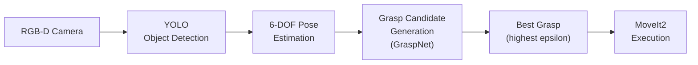

# 🤝 Week 12: Manipulation, Grasping & Human-Robot Interaction

:::tip Related Chapters
This chapter applies [Week 11's MoveIt2 skills](/module-4-vla/week-11-humanoid-kinematics) to real grasping tasks and uses the [Week 9 object detection pipeline](/module-3-isaac/week-09-perception-manipulation) to localise grasp targets.
:::

## 🎯 Learning Objectives

By the end of this chapter you will be able to:

- Define force closure and the grasp quality metrics epsilon and volume
- Explain the GraspNet-1Billion pipeline for learned grasp planning
- Describe HRI design principles including proxemics and motion legibility
- Implement a ROS 2 node that computes grasp targets from depth point clouds
- Send a grasp goal to MoveIt2 using a ROS 2 action client

---

## 📖 Introduction

The gap between *seeing* an object and *picking it up* is deceptively large. A human child spends years learning to grasp — calibrating grip force, predicting object weight from visual texture, recovering from slippage. For a robot, this same problem requires a complete pipeline: detect the object in 3D space, generate candidate grasp poses that satisfy stability constraints, select the best grasp, plan a collision-free trajectory to reach it, and execute it with compliant force control so the object is held firmly without being crushed.

This chapter builds that pipeline. We also cover Human-Robot Interaction (HRI) — because manipulation in human environments requires the robot to be safe, legible, and socially appropriate. A robot that grabs things too fast or invades personal space will not be tolerated in workplaces or homes, regardless of its technical capability.

---

## 🧠 Core Concepts

### The Grasp Planning Problem

A **grasp** is a 6-DOF end-effector pose (position + orientation) such that closing the fingers produces stable contact with the object. The planning problem has three parts:

1. **Geometric feasibility**: can the gripper reach the pose without colliding with the object or environment?
2. **Stability**: will the grasp resist external forces and torques without slipping?
3. **Quality**: among feasible stable grasps, which is best for the intended manipulation task?

**Force closure** is the standard stability criterion: a grasp achieves force closure if the contact forces and torques can resist *any* external wrench applied to the object. A two-finger pinch grasp on opposite sides of a cylindrical object achieves force closure; a single-finger touch does not.

**Grasp quality metrics**:
- **Epsilon quality**: the radius of the largest wrench sphere that fits inside the grasp wrench space — higher epsilon means the grasp resists more diverse external forces
- **Volume metric**: the volume of the grasp wrench space convex hull — a coarser but faster metric

### Learned Grasping

Classical grasp planning (analytic force-closure computation) requires an accurate 3D object model and is slow. Neural grasp planning learns to predict good grasps directly from depth images.

**GraspNet-1Billion** (Fang et al., CVPR 2020):
- Dataset: 97,280 depth images across 88 household objects with 1+ billion labelled 6-DOF grasps
- Architecture: PointNet++ backbone extracts geometric features from point clouds; grasp proposal head predicts (position, approach direction, rotation, width, score)
- Inference: given an RGB-D point cloud, outputs a ranked list of 6-DOF gripper poses

**Contact GraspNet** (Sundermeyer et al., ICRA 2021) predicts grasps directly from contact point distributions on the object surface, generalising better to novel objects.

### Dexterous Manipulation

Grasping is just the beginning — **dexterous manipulation** refers to in-hand re-orientation and repositioning of objects after grasping:

- **Finger gaiting**: successively retracting and re-placing individual fingers to rotate an object in the palm
- **In-hand manipulation**: sliding, rolling, or pivoting an object within the grasp without releasing it
- **Tactile sensing**: fingertip tactile sensors (capacitive or resistive arrays) detect shear forces that predict imminent slippage before it happens — enabling reactive grip adjustment at 100+ Hz

### HRI Design Principles

Human-Robot Interaction (HRI) design governs how robots behave in shared spaces with humans:

**Proxemics** (Hall's zones):
- Intimate zone: 0–45 cm — robots should not enter unless invited (medical assistance)
- Personal zone: 45–120 cm — handover, collaborative assembly
- Social zone: 1.2–3.7 m — general navigation and task execution
- Public zone: over 3.7 m — no interaction constraints

**Motion legibility**: a robot's motion should telegraph its intent. Humans predict robot destinations from early motion trajectories — a robot that takes a long arc to reach a close target is illegible and makes humans nervous. Design trajectories to be directly interpretable.

**Social cues**: robots that nod, point gaze toward task targets, and use appropriate approach angles (from the front, not from behind) are rated as more trustworthy by human subjects.

### Safety in HRI

**ISO/TS 15066** defines two safe operation modes for collaborative robots:

- **Speed and Separation Monitoring (SSM)**: the robot slows down proportionally to its distance from the human. If distance falls below a minimum threshold, the robot stops.
- **Power and Force Limiting (PFL)**: the robot limits its joint torques so that any collision with a human produces less than a threshold biomechanical force (typically 150 N for the hand/arm)

Both modes require certified safety-rated force sensing or vision-based distance estimation.

### Shared Autonomy

**Shared autonomy** describes the spectrum of human-robot control distribution:

| Level | Control Distribution | Example |
|-------|---------------------|---------|
| Full manual | 100% human | Teleoperation joystick |
| Assisted | Human direction, robot stabilisation | FPV drone with auto-leveling |
| Shared | Human goal, robot execution | "Pick up that cup" — human points, robot plans |
| Supervised | Robot runs, human monitors | Warehouse robot with emergency stop |
| Full autonomy | 100% robot | Fully autonomous manipulation |

Modern deployments use shared autonomy to balance robot capability with human oversight, especially during early deployment phases.

### Gesture Recognition

**MediaPipe Hands** (Google) detects 21 3D hand landmarks in real time on CPU hardware. These landmarks can be classified into gestures using:

- **Rule-based classification**: check finger extension states (fingertip above knuckle = extended) and finger angles
- **Skeleton-based classification**: feed landmark coordinates to a small MLP or LSTM trained on gesture datasets

MediaPipe Hands runs at 30 fps on a MacBook CPU and integrates with ROS 2 via an image subscriber node that processes frames and publishes detected gestures.



*Caption: The full grasp-to-execution pipeline. RGB-D input flows through detection and pose estimation into GraspNet which generates ranked 6-DOF grasp candidates. MoveIt2 plans and executes the collision-free approach trajectory.*

---

## 💻 Code Examples

### Example 1: GraspPointDetector — PointCloud Centroid Node

```python showLineNumbers
# ROS 2 node that subscribes to a PointCloud2, filters within a bounding box,
# and publishes the centroid as a grasp target pose

import rclpy
from rclpy.node import Node
from sensor_msgs.msg import PointCloud2
from geometry_msgs.msg import PointStamped
import sensor_msgs_py.point_cloud2 as pc2
import numpy as np


class GraspPointDetector(Node):
    """
    Subscribes to /camera/depth/points (PointCloud2).
    Filters points within a 3D bounding box.
    Publishes the centroid as the grasp target to /grasp_target.
    """

    # Bounding box defining the region of interest on the table surface
    X_MIN, X_MAX = 0.2, 0.7   # metres from camera
    Y_MIN, Y_MAX = -0.3, 0.3
    Z_MIN, Z_MAX = 0.05, 0.4

    def __init__(self) -> None:
        super().__init__("grasp_point_detector")
        self.sub = self.create_subscription(
            PointCloud2,
            "/camera/depth/points",
            self.on_pointcloud,
            10,
        )
        self.pub = self.create_publisher(PointStamped, "/grasp_target", 10)
        self.get_logger().info("GraspPointDetector ready on /camera/depth/points")

    def on_pointcloud(self, msg: PointCloud2) -> None:
        # Extract (x, y, z) from the point cloud
        points = np.array([
            [p[0], p[1], p[2]]
            for p in pc2.read_points(msg, field_names=("x", "y", "z"), skip_nans=True)
        ])

        if len(points) == 0:
            return

        # Apply bounding box filter
        mask = (
            (points[:, 0] >= self.X_MIN) & (points[:, 0] <= self.X_MAX) &
            (points[:, 1] >= self.Y_MIN) & (points[:, 1] <= self.Y_MAX) &
            (points[:, 2] >= self.Z_MIN) & (points[:, 2] <= self.Z_MAX)
        )
        filtered = points[mask]

        if len(filtered) < 10:
            self.get_logger().warn("Too few points in bounding box — no grasp target")
            return

        # Centroid of filtered points = grasp target
        centroid = filtered.mean(axis=0)

        target = PointStamped()
        target.header = msg.header
        target.point.x = float(centroid[0])
        target.point.y = float(centroid[1])
        target.point.z = float(centroid[2])

        self.pub.publish(target)
        self.get_logger().info(
            f"Grasp target: x={centroid[0]:.3f} y={centroid[1]:.3f} z={centroid[2]:.3f}"
        )


def main(args: list[str] | None = None) -> None:
    rclpy.init(args=args)
    node = GraspPointDetector()
    try:
        rclpy.spin(node)
    except KeyboardInterrupt:
        pass
    finally:
        node.destroy_node()
        rclpy.shutdown()


if __name__ == "__main__":
    main()
```

### Example 2: GraspActionClient — Send Grasp to MoveIt2

```python showLineNumbers
# ROS 2 action client that subscribes to /grasp_target and sends MoveIt2 a grasp goal
# Uses pymoveit2 for a clean Python interface to MoveIt2 motion planning

import rclpy
from rclpy.node import Node
from geometry_msgs.msg import PointStamped
from pymoveit2 import MoveIt2


class GraspActionClient(Node):
    """
    Subscribes to /grasp_target (PointStamped).
    Plans and executes a grasp trajectory to the target position using MoveIt2.
    Approach from 10 cm above (z offset) then descend to grasp.
    """

    APPROACH_OFFSET_Z = 0.10  # approach from 10 cm above grasp target

    def __init__(self) -> None:
        super().__init__("grasp_action_client")

        self.moveit2 = MoveIt2(
            node=self,
            joint_names=[
                "panda_joint1", "panda_joint2", "panda_joint3",
                "panda_joint4", "panda_joint5", "panda_joint6", "panda_joint7",
            ],
            base_link_name="panda_link0",
            end_effector_name="panda_hand",
            group_name="panda_arm",
        )

        self.sub = self.create_subscription(
            PointStamped, "/grasp_target", self.on_grasp_target, 1
        )
        self._executing = False
        self.get_logger().info("GraspActionClient ready")

    def on_grasp_target(self, msg: PointStamped) -> None:
        if self._executing:
            return  # Ignore new targets while a grasp is in progress

        gx = msg.point.x
        gy = msg.point.y
        gz = msg.point.z

        self.get_logger().info(
            f"Grasping at ({gx:.3f}, {gy:.3f}, {gz:.3f})"
        )
        self._executing = True

        # Phase 1: Move to approach pose (above the target)
        self.moveit2.move_to_pose(
            position=[gx, gy, gz + self.APPROACH_OFFSET_Z],
            quat_xyzw=[1.0, 0.0, 0.0, 0.0],  # gripper pointing down
            cartesian=False,
        )

        # Phase 2: Descend to grasp height
        self.moveit2.move_to_pose(
            position=[gx, gy, gz],
            quat_xyzw=[1.0, 0.0, 0.0, 0.0],
            cartesian=True,  # straight-line Cartesian move
        )

        self.get_logger().info("Grasp execution complete")
        self._executing = False


def main(args: list[str] | None = None) -> None:
    rclpy.init(args=args)
    node = GraspActionClient()
    try:
        rclpy.spin(node)
    except KeyboardInterrupt:
        pass
    finally:
        node.destroy_node()
        rclpy.shutdown()


if __name__ == "__main__":
    main()
```

---

## 🛠️ Hands-On Exercise: Grasp a Cube in Gazebo

**Difficulty**: Advanced | **Time**: 60–90 minutes | **Prerequisites**: ROS 2 Humble, Gazebo, MoveIt2

**Step 1 — Launch simulation with depth camera:**

```bash
ros2 launch panda_gazebo panda_world.launch.py
```

**Step 2 — Add a box obstacle to the world and start GraspPointDetector:**

```bash
ros2 run grasp_demo grasp_point_detector
```

**Step 3 — Verify grasp target is published:**

```bash
ros2 topic echo /grasp_target
```

**Step 4 — Launch MoveIt2 and GraspActionClient:**

```bash
ros2 launch moveit_resources_panda_moveit_config demo.launch.py
ros2 run grasp_demo grasp_action_client
```

**Expected output**: Gazebo simulation shows the Panda arm descending to the cube's centroid position, closing the gripper, and lifting the cube off the table. The `/grasp_result` topic reports `SUCCESS`.

---

## 📋 Summary

- **Force closure** is the stability criterion for grasps: contact forces and torques can resist any external wrench; epsilon quality quantifies this resistance
- **GraspNet-1Billion** uses PointNet++ to predict ranked 6-DOF grasp poses from depth point clouds, generalising to novel objects without per-object model fitting
- **HRI design** requires respecting proxemics (Hall's zones), making motion legible, and complying with ISO/TS 15066 speed/force limits for safe human-robot collaboration
- **Shared autonomy** distributes control between human and robot — the right level depends on robot capability, task risk, and human operator availability
- The **GraspPointDetector → GraspActionClient** pipeline chains PointCloud2 filtering, centroid estimation, and MoveIt2 execution into a complete grasp-and-pick workflow

---

## 🧪 Quiz

**Question 1**: A robot attempts to grasp a cylindrical cup from the side with two parallel jaw fingers. The grasp achieves force closure. What does this guarantee?

- A) The cup will not slip for any magnitude of external force
- B) The contact normals point toward each other such that friction can resist any applied external wrench ✅
- C) The grasp will remain stable for any object shape and surface material
- D) The gripper fingers are applying exactly the minimum required force

**Question 2**: The `GraspPointDetector` node receives a point cloud but publishes no `/grasp_target`. What is the most likely cause?

- A) The node subscribes to the wrong topic name
- B) The filtered point cloud within the bounding box has fewer than 10 points ✅
- C) The point cloud frame_id does not match the robot's base_link
- D) The centroid computation overflows when there are too many points

**Question 3**: According to Hall's proxemics zones, a robot should enter which zone to perform a handover with a human?

- A) Public zone (over 3.7 m) — maintain maximum distance for safety
- B) Social zone (1.2–3.7 m) — appropriate for all robot tasks
- C) Personal zone (45 cm – 1.2 m) — appropriate for collaborative tasks like handover ✅
- D) Intimate zone (0–45 cm) — required for precise manipulation

**Question 4**: In the `GraspActionClient`, why is `cartesian=True` used for the descent phase but `cartesian=False` for the approach phase?

- A) OMPL cannot plan in Cartesian space — `cartesian=True` uses a different planner
- B) The descent must follow a straight vertical line to avoid knocking the object; the approach can take any joint-space path ✅
- C) `cartesian=True` is faster because it uses a closed-form IK solution
- D) MoveIt2 requires `cartesian=True` for all motions near the table surface

**Question 5**: An ISO/TS 15066 Power and Force Limiting (PFL) mode stops the robot when it detects contact with a human. Which sensor is most appropriate for this detection?

- A) LiDAR — provides 3D distance to the human from metres away
- B) IMU — detects sudden deceleration when the robot hits an obstacle
- C) Wrist-mounted force/torque sensor — directly measures contact force and torque ✅
- D) RGB camera — detects human presence using pose estimation

---

## 📚 Further Reading

- [GraspNet-1Billion: A Large-Scale Benchmark](https://openaccess.thecvf.com/content_CVPR_2020/html/Fang_GraspNet-1Billion_A_Large-Scale_Benchmark_for_General_Object_Grasping_CVPR_2020_paper.html) — The foundational dataset and neural grasp planner evaluated in this chapter
- [ISO/TS 15066 — Robots and Robotic Devices: Collaborative Robots](https://www.iso.org/standard/62996.html) — International standard defining speed/separation and power/force limiting requirements for collaborative robot safety
- [pymoveit2 Python Library](https://github.com/AndrejOrsula/pymoveit2) — Clean Python interface to MoveIt2 with examples for pose goals, joint goals, and Cartesian paths
