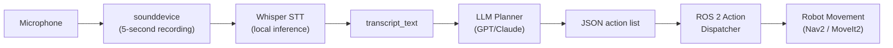

# 🗣️ Week 13: Conversational Robotics

:::tip Related Chapters
This chapter connects voice commands to the [Week 12 grasping actions](/module-4-vla/week-12-bipedal-locomotion) and [Week 4 ROS 2 action clients](/module-1-ros2/week-04-nodes-topics-services). The full pipeline is integrated in the [Capstone project](/capstone/autonomous-humanoid-project).
:::

:::warning API Costs
The code examples in this chapter call the OpenAI API, which charges per token. A typical test run costs under $0.01, but monitor your usage at platform.openai.com/usage. Always store your API key in an environment variable — never in source code.
:::

## 🎯 Learning Objectives

By the end of this chapter you will be able to:

- Describe the complete Voice-to-Action pipeline from microphone to robot movement
- Transcribe speech to text using OpenAI Whisper locally on CPU
- Build an LLM robot task planner that converts natural language to structured JSON action sequences
- Use OpenAI function calling to ground LLM outputs in concrete robot actions
- Enumerate the latency and safety limitations of LLM-based robot planners

---

## 📖 Introduction

Natural language is the most natural interface between humans and robots. Instead of programming a robot to "navigate to position (3.2, 1.7) then grasp object at (3.4, 1.6, 0.3)", you should be able to say "go to the kitchen and pick up the red cup" — and have the robot figure out the rest. This is the promise of conversational robotics.

The promise was largely theoretical until two developments converged: OpenAI's Whisper (2022) demonstrated near-human speech recognition accuracy running locally on a laptop CPU; and GPT-4 demonstrated that LLMs can decompose natural language commands into structured action sequences with surprisingly high reliability. Together they form a practical Voice-to-Action pipeline that you will build in this chapter.

By Week 13, you have built every component this pipeline needs. The voice node records audio and calls Whisper. The LLM planner converts the transcript to a JSON action list. The ROS 2 dispatcher sends each action to the appropriate node — Nav2 for navigation (Week 9), MoveIt2 for grasping (Week 12). This chapter connects those dots.

---

## 🧠 Core Concepts

### The Voice-to-Action Pipeline

The complete stack from sound wave to physical robot motion:



*Caption: The complete Voice-to-Action pipeline. Audio is captured by sounddevice, transcribed locally by Whisper, converted to structured JSON by an LLM, and dispatched to ROS 2 action servers for execution.*

### OpenAI Whisper

Whisper is an **encoder-decoder Transformer** trained on 680,000 hours of multilingual audio. Its design:

- **Encoder**: mel spectrogram → sequence of audio feature vectors
- **Decoder**: audio features + previous tokens → next token (autoregressive generation)
- Trained end-to-end with weak supervision on internet-scraped (audio, transcript) pairs

**Model sizes and tradeoffs**:

| Model | Parameters | VRAM | CPU speed | WER (English) |
|-------|-----------|------|----------|---------------|
| tiny | 39M | 1 GB | 32x real-time | ~10% |
| base | 74M | 1 GB | 16x real-time | ~7% |
| small | 244M | 2 GB | 6x real-time | ~4.5% |
| medium | 769M | 5 GB | 2x real-time | ~3% |
| large-v3 | 1550M | 10 GB | 0.5x real-time | ~2% |

**Local vs cloud**: local Whisper runs on CPU (base model: 16x real-time means 5s audio transcribes in ~0.3s) with zero API cost and no data leaving the device. Cloud Whisper API is faster for large audio files but costs $0.006/minute.

### LLMs as Robot Planners

LLMs decompose high-level goals into discrete sub-tasks:

```
Input:  "go to the kitchen and pick up the red cup"
Output: [
  {"action": "navigate_to", "location": "kitchen"},
  {"action": "detect_object", "object": "red cup"},
  {"action": "pick_up", "object": "red cup"}
]
```

This **task decomposition** works because LLMs encode world knowledge from training: they know kitchens contain cups, that you navigate before grasping, and that picking up requires first detecting.

The **grounding problem**: LLMs produce text tokens; robots operate on physical coordinates. Bridging this gap requires grounding each symbolic action ("navigate to kitchen") to a specific robot capability (Nav2 NavigateToPose with a pre-mapped kitchen waypoint).

### Prompt Engineering for Robotics

The system prompt is critical for reliable JSON output. It must:

1. **List available actions** with exact names and parameter schemas
2. **Specify output format** — always JSON, never prose
3. **Define scope** — the robot cannot do things not on the action list

```python
SYSTEM_PROMPT = """
You are a robot task planner. Convert natural language commands into a JSON list of actions.

Available actions:
{actions_manifest}

Rules:
- Output ONLY a JSON array. No prose, no markdown.
- Only use actions from the manifest above.
- If the command cannot be completed with available actions, return [{"action": "report_failure", "reason": "..."}]
"""
```

### Tool Calling / Function Calling

OpenAI's **function calling** API lets you define Python functions that the model can invoke, ensuring outputs match your schema:

```python
tools = [{
    "type": "function",
    "function": {
        "name": "navigate_to",
        "description": "Navigate the robot to a named location",
        "parameters": {
            "type": "object",
            "properties": {
                "location": {"type": "string", "description": "Location name from the map"},
            },
            "required": ["location"],
        },
    }
}]
```

With function calling, the model returns structured tool call objects instead of free text — making downstream parsing trivial and eliminating JSON formatting errors.

### Multi-modal Interaction

A voice-only interface is fragile in noisy environments. Robust conversational robotics combines:

- **Speech** (Whisper): "pick up that" (fast, natural, but ambiguous)
- **Gesture** (MediaPipe): pointing gesture selects the referent of "that"
- **Vision** (YOLOv8): confirms the selected object's identity and 3D position

The fusion of speech + gesture + vision resolves ambiguity that any single modality cannot, producing a more robust interface for real-world deployment.

### Limitations and Safety Guardrails

:::danger
Never allow an LLM to override safety-critical velocity limits, force limits, or emergency stops without explicit human confirmation. LLMs hallucinate and produce confident but wrong outputs.
:::

Key limitations:

- **Hallucination**: LLMs sometimes generate plausible but incorrect action sequences. Always validate outputs against the action manifest before dispatching.
- **Latency**: a single GPT-4 API call adds 500 ms – 2 s to the response loop. Plan for this in your control architecture — do not use LLM planning in tight control loops.
- **No persistent state**: LLMs have no memory across calls unless you maintain conversation history. The robot may forget it already navigated to the kitchen if the conversation window is not managed.
- **Hard-coded safety constraints**: navigation speed limits, force limits, and emergency stop conditions must be enforced in the ROS 2 nodes themselves — not in the LLM output.

---

## 💻 Code Examples

### Example 1: WhisperTranscriber

```python showLineNumbers
# Record 5 seconds of audio and transcribe with OpenAI Whisper running locally
# Install: pip install openai-whisper sounddevice numpy

import os
import numpy as np
import sounddevice as sd
import whisper

# Note: for the LLM planner in Example 2, set your API key:
# export OPENAI_API_KEY="sk-..."
# The Whisper model below runs LOCALLY — no API key needed

SAMPLE_RATE = 16_000  # Whisper expects 16 kHz mono audio
DURATION_SEC = 5


def record_audio(duration_sec: int = DURATION_SEC) -> np.ndarray:
    """Record mono audio from the default microphone."""
    print(f"Recording {duration_sec} seconds... (speak now)")
    audio = sd.rec(
        int(duration_sec * SAMPLE_RATE),
        samplerate=SAMPLE_RATE,
        channels=1,
        dtype="float32",
    )
    sd.wait()  # Block until recording is complete
    print("Recording complete.")
    return audio.flatten()


def transcribe(audio: np.ndarray, model_size: str = "base") -> str:
    """Load Whisper model and transcribe audio array to text."""
    print(f"Loading Whisper '{model_size}' model...")
    model = whisper.load_model(model_size)
    result = model.transcribe(audio, language="en", fp16=False)
    transcript = result["text"].strip()
    print(f"Transcript: {transcript}")
    return transcript


if __name__ == "__main__":
    audio = record_audio()
    text = transcribe(audio)
    print(f"\nFinal transcript: '{text}'")
```

### Example 2: RobotTaskPlanner

```python showLineNumbers
# LLM-based robot task planner: converts natural language transcript to JSON action list
# Install: pip install openai
# Requires: OPENAI_API_KEY environment variable

import json
import os
from openai import OpenAI

# Available robot actions manifest
ROBOT_ACTIONS = [
    {"name": "navigate_to",      "params": {"location": "string — named map waypoint"}},
    {"name": "detect_object",    "params": {"object": "string — object class name"}},
    {"name": "pick_up",          "params": {"object": "string — object class name"}},
    {"name": "place_at",         "params": {"location": "string — named map waypoint"}},
    {"name": "open_gripper",     "params": {}},
    {"name": "close_gripper",    "params": {}},
    {"name": "report_failure",   "params": {"reason": "string"}},
]

SYSTEM_PROMPT = (
    "You are a robot task planner. Convert the user's natural language command "
    "into a JSON array of actions from the following manifest:\n\n"
    f"{json.dumps(ROBOT_ACTIONS, indent=2)}\n\n"
    "Rules:\n"
    "- Output ONLY a valid JSON array. No prose, no markdown, no code fences.\n"
    "- Use only actions from the manifest above.\n"
    "- If the command cannot be executed with the available actions, "
    "return [{\"action\": \"report_failure\", \"reason\": \"...\"}].\n"
)


class RobotTaskPlanner:
    """Converts a natural language transcript to a structured ROS 2 action sequence."""

    def __init__(self, model: str = "gpt-4o-mini") -> None:
        self.client = OpenAI(api_key=os.environ["OPENAI_API_KEY"])
        self.model = model

    def plan(self, transcript: str) -> list[dict]:
        """
        Convert a voice command transcript to an ordered list of robot actions.

        Args:
            transcript: The output from WhisperTranscriber.transcribe()

        Returns:
            List of action dicts, each with 'action' key and parameter keys
        """
        response = self.client.chat.completions.create(
            model=self.model,
            messages=[
                {"role": "system", "content": SYSTEM_PROMPT},
                {"role": "user", "content": transcript},
            ],
            response_format={"type": "json_object"},
            temperature=0.0,  # Deterministic output for production
        )

        raw = response.choices[0].message.content
        data = json.loads(raw)

        # Handle both {"actions": [...]} and [...] top-level formats
        if isinstance(data, list):
            return data
        elif "actions" in data:
            return data["actions"]
        else:
            return list(data.values())[0] if data else []


if __name__ == "__main__":
    planner = RobotTaskPlanner()

    test_commands = [
        "go to the kitchen and pick up the red cup",
        "navigate to the charging station",
        "sort the blocks by color on the table",
    ]

    for command in test_commands:
        print(f"\nCommand: '{command}'")
        actions = planner.plan(command)
        print(f"Actions:\n{json.dumps(actions, indent=2)}")
```

---

## 🛠️ Hands-On Exercise: Voice-to-Action Demo

**Difficulty**: Advanced | **Time**: 30–45 minutes | **Prerequisites**: Python 3.11+, OpenAI API key, microphone

Chain WhisperTranscriber and RobotTaskPlanner into a complete voice planner demo.

```python showLineNumbers
# voice_planner_demo.py — Record voice, transcribe, plan, print JSON

import json
from whisper_transcriber import record_audio, transcribe
from robot_task_planner import RobotTaskPlanner

planner = RobotTaskPlanner()

test_commands_text = [
    "go to the kitchen and pick up the red cup",
    "navigate to the charging station",
    "sort the blocks by color on the table",
]

# Option A: Use pre-defined text commands (no microphone required)
for text_command in test_commands_text:
    print(f"\nText command: '{text_command}'")
    actions = planner.plan(text_command)
    print(f"Action plan:\n{json.dumps(actions, indent=2)}")

# Option B: Live microphone (uncomment to use)
# audio = record_audio(duration_sec=5)
# transcript = transcribe(audio)
# actions = planner.plan(transcript)
# print(f"Action plan:\n{json.dumps(actions, indent=2)}")
```

**Expected output:**

```
Text command: 'go to the kitchen and pick up the red cup'
Action plan:
[
  {"action": "navigate_to", "location": "kitchen"},
  {"action": "detect_object", "object": "red cup"},
  {"action": "pick_up", "object": "red cup"}
]

Text command: 'navigate to the charging station'
Action plan:
[
  {"action": "navigate_to", "location": "charging_station"}
]

Text command: 'sort the blocks by color on the table'
Action plan:
[
  {"action": "report_failure", "reason": "Sorting by colour requires visual classification not available in current action manifest"}
]
```

---

## 📋 Summary

- The **Voice-to-Action pipeline** runs: microphone → sounddevice → Whisper STT → transcript → LLM planner → JSON action list → ROS 2 dispatcher → robot movement
- **Whisper** runs locally on CPU (base model: 0.3s for 5s audio) with no API cost; larger models trade latency for accuracy
- **LLM task planning** decomposes natural language goals into ordered action sequences using the robot's capability manifest as grounding context
- **Function calling** constrains LLM outputs to exact schema definitions, eliminating JSON formatting errors at the cost of slightly higher latency
- **Safety**: LLM outputs must be validated before dispatch; hard velocity/force limits must live in ROS 2 nodes, never in LLM prompts; budget 500 ms–2 s API latency in your control loop design

---

## 🧪 Quiz

**Question 1**: Whisper uses which neural network architecture?

- A) CNN + CTC decoder, similar to DeepSpeech
- B) Encoder-Decoder Transformer trained on 680,000 hours of audio ✅
- C) Recurrent Neural Network (LSTM) with attention mechanism
- D) Diffusion model that generates spectrograms and then decodes them

**Question 2**: An LLM planner returns `[{"action": "fly_to", "location": "roof"}]` but "fly_to" is not in the robot's action manifest. What should the dispatcher do?

- A) Execute the action anyway — the robot may have hidden capabilities
- B) Pass the action to Nav2 as a long-distance navigation goal
- C) Reject the action, log the error, and optionally re-query the LLM with an error correction prompt ✅
- D) Silently ignore the action and execute the remaining valid actions

**Question 3**: The `RobotTaskPlanner` uses `temperature=0.0`. What is the effect?

- A) The model runs faster because it skips the sampling step
- B) Outputs are deterministic — the same input always produces the same action sequence ✅
- C) The model only uses tokens with 0% uncertainty in its probability distribution
- D) The model avoids using rare vocabulary tokens, keeping outputs simple

**Question 4**: A student measures 1800 ms end-to-end latency from speaking a command to the robot starting to move. They want to reduce this to under 500 ms. Which change has the most impact?

- A) Upgrade from Whisper `base` to Whisper `large-v3`
- B) Replace the GPT-4o API call with a locally hosted smaller LLM (e.g., Llama 3 8B) ✅
- C) Switch from ROS 2 Humble to ROS 2 Jazzy
- D) Increase the ROS 2 publisher queue size from 10 to 100

**Question 5**: Why must safety-critical limits (max velocity, max force) be enforced in ROS 2 nodes rather than in the LLM system prompt?

- A) ROS 2 nodes run at higher frequency than LLM calls
- B) LLMs hallucinate and can produce outputs that ignore instructions, making prompt-only safety unacceptably unreliable ✅
- C) The LLM system prompt is not executed at runtime — it is only used during training
- D) ROS 2 QoS policies automatically enforce velocity limits at the transport layer

---

## 📚 Further Reading

- [OpenAI Whisper Paper and Code](https://github.com/openai/whisper) — Original paper (Radford et al., 2022) and official repository with all model sizes and benchmark results
- [OpenAI Function Calling Guide](https://platform.openai.com/docs/guides/function-calling) — Complete reference for structuring tool definitions and parsing function call responses with structured outputs
- [Language Models as Zero-Shot Planners — Huang et al. (2022)](https://arxiv.org/abs/2201.07207) — Foundational paper demonstrating that LLMs can generate executable robot action plans from natural language without task-specific training
