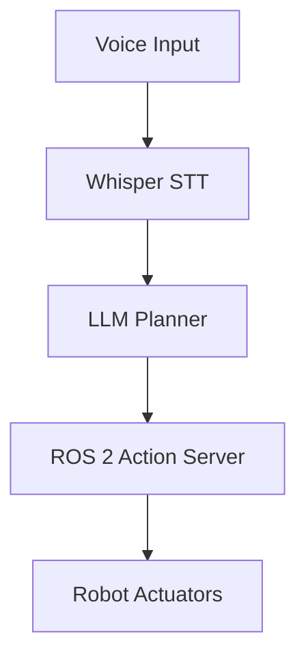

# Research: Docusaurus v3 Site Scaffold

**Feature**: 001-docusaurus-scaffold
**Date**: 2026-02-19
**Status**: Complete — all unknowns resolved

---

## R-01: Docusaurus v3 Initialization with TypeScript and pnpm

**Decision**: Use `pnpm create docusaurus@latest book -- --typescript` to scaffold inside `book/`.

**Rationale**: The `--typescript` flag generates the TypeScript template directly. Running the
command from repo root with `book` as the destination keeps all Docusaurus files inside `book/`
and none at the repo root (required by constitution).

**Exact command sequence**:
```bash
# From repo root — 'classic' preset name goes BEFORE --typescript flag
pnpm create docusaurus@latest book classic --typescript
# No interactive prompt needed — classic + typescript flags fully specify the scaffold
```

**Generated structure** (relevant files):
```
book/
├── docusaurus.config.ts   # Main config (TypeScript)
├── sidebars.ts            # Sidebar config (TypeScript)
├── tsconfig.json          # TypeScript config
├── package.json           # with "type": "module"
└── src/css/custom.css     # Global CSS entry point
```

**tsconfig.json for strict mode**:
```json
{
  "extends": "@docusaurus/tsconfig",
  "compilerOptions": {
    "baseUrl": ".",
    "strict": true,
    "noUnusedLocals": true,
    "noUnusedParameters": true,
    "noFallthroughCasesInSwitch": true,
    "forceConsistentCasingInFileNames": true,
    "skipLibCheck": true
  }
}
```

**Critical**: `skipLibCheck: true` is **required** — Docusaurus's own bundled type declarations
contain errors that break strict-mode compilation. Without it, `pnpm build` fails with type
errors in `node_modules`. This does not weaken type-checking of project source files.

**Alternatives considered**:
- JavaScript template: Rejected — constitution mandates TypeScript strict mode.
- Manual setup (no create command): Rejected — creates maintenance burden and risk of
  missing Docusaurus-internal webpack config.

---

## R-02: Disabling Blog and Removing Default Content

**Decision**: Disable blog plugin in preset config; delete `docs/tutorial-basics/` and
`docs/tutorial-extras/` directories generated by the scaffold.

**Exact `docusaurus.config.ts` preset config**:
```ts
presets: [
  [
    'classic',
    {
      docs: {
        sidebarPath: './sidebars.ts',
        routeBasePath: '/',  // Serve docs at site root (not /docs/)
      },
      blog: false,           // Disable blog entirely
      theme: {
        customCss: './src/css/custom.css',
      },
    } satisfies Preset.Options,
  ],
],
```

Setting `routeBasePath: '/'` makes the docs section serve at the site root — standard practice
for documentation-only sites so the landing page is the primary entry point.

**Default content to delete after scaffold**:
- `book/docs/tutorial-basics/` (entire directory)
- `book/docs/tutorial-extras/` (entire directory)
- `book/blog/` (entire directory, since blog is disabled)
- `book/docs/intro.md` (delete and replace with course Welcome page)

**`package.json` scripts** (standard Docusaurus set — do not remove `typecheck`):
```json
{
  "scripts": {
    "start":     "docusaurus start",
    "build":     "docusaurus build",
    "serve":     "docusaurus serve",
    "deploy":    "docusaurus deploy",
    "clear":     "docusaurus clear",
    "typecheck": "tsc"
  }
}
```
`typecheck` is used locally and in CI to catch TypeScript errors separately from the build.

---

## R-03: `docusaurus.config.ts` — Dark Mode, Branding, Navbar, Footer

**Decision**: Configure `colorMode.defaultMode: 'dark'` with `disableSwitch: false` (allow user
toggle). Custom navbar with SVG logo. Footer with three columns.

**Full branding config block**:
```ts
themeConfig: {
  colorMode: {
    defaultMode: 'dark',
    disableSwitch: false,
    respectPrefersColorScheme: true,
  },
  navbar: {
    title: 'Physical AI & Humanoid Robotics',
    logo: {
      alt: 'Physical AI Robot Logo',
      src: 'img/logo.svg',
      srcDark: 'img/logo.svg',
    },
    items: [
      {
        type: 'docSidebar',
        sidebarId: 'courseSidebar',
        position: 'left',
        label: 'Course',
      },
      {
        href: 'https://github.com/YOUR_ORG/YOUR_REPO',
        label: 'GitHub',
        position: 'right',
      },
    ],
  },
  footer: {
    style: 'dark',
    links: [
      {
        title: 'Course',
        items: [
          { label: 'Introduction', to: '/intro' },
          { label: 'Module 1: ROS 2', to: '/module-1-ros2/week-01-intro-physical-ai' },
        ],
      },
      {
        title: 'Resources',
        items: [
          { label: 'GitHub Repository', href: 'https://github.com/YOUR_ORG/YOUR_REPO' },
        ],
      },
    ],
    copyright: `Physical AI & Humanoid Robotics — Built with Docusaurus.`,
  },
} satisfies ThemeConfig,
```

**GitHub Pages URL config** (placeholders to be filled at implementation time):
```ts
url: 'https://YOUR_ORG.github.io',
baseUrl: '/YOUR_REPO/',
organizationName: 'YOUR_ORG',
projectName: 'YOUR_REPO',
trailingSlash: false,
```

---

## R-04: @fontsource Self-Hosted Fonts (Inter + JetBrains Mono)

**Decision**: Use `@fontsource/inter` and `@fontsource/jetbrains-mono` npm packages, imported
in `src/css/custom.css`, applying via Docusaurus `--ifm-font-family-*` CSS variables.

**Rationale**: Self-hosted via @fontsource avoids external CDN dependency, works with
Docusaurus's Webpack/Rspack bundler which resolves `node_modules` imports in CSS, and ships
`font-display: swap` by default (prevents FOIT).

**Install**:
```bash
pnpm add @fontsource/inter @fontsource/jetbrains-mono
```

**Import and variable override in `src/css/custom.css`**:
```css
/* Font imports — must be at top, processed by bundler */
@import '@fontsource/inter/400.css';
@import '@fontsource/inter/400-italic.css';
@import '@fontsource/inter/500.css';
@import '@fontsource/inter/600.css';
@import '@fontsource/jetbrains-mono/400.css';
@import '@fontsource/jetbrains-mono/500.css';

:root {
  --ifm-font-family-base: 'Inter', system-ui, -apple-system, sans-serif;
  --ifm-font-family-monospace: 'JetBrains Mono', 'SFMono-Regular', Consolas, monospace;
  --ifm-color-primary: #0066cc;
  --ifm-color-primary-dark: #005ab5;
  --ifm-color-primary-darker: #0055a8;
  --ifm-color-primary-darkest: #004590;
  --ifm-color-primary-light: #1a75d1;
  --ifm-color-primary-lighter: #267dd4;
  --ifm-color-primary-lightest: #4090dc;
  --ifm-code-font-size: 90%;
}

[data-theme='dark'] {
  --ifm-color-primary: #00d4ff;
  --ifm-color-primary-dark: #00bfe6;
  --ifm-color-primary-darker: #00b8dc;
  --ifm-color-primary-darkest: #0099b8;
  --ifm-color-primary-light: #1ad9ff;
  --ifm-color-primary-lighter: #33dcff;
  --ifm-color-primary-lightest: #66e6ff;
  --ifm-background-color: #0d1117;
  --ifm-background-surface-color: #161b22;
}
```

**Critical**: Do NOT import via `docusaurus.config.ts` stylesheets array — relative font-file
URLs break outside the bundler context.

**Alternatives considered**:
- Google Fonts CDN: Rejected — user explicitly requires @fontsource in plan prompt.
- Variable fonts (@fontsource-variable): Valid alternative but less predictable for
  JetBrains Mono; static weight approach is safer for SSR.

---

## R-05: @docusaurus/theme-mermaid Configuration

**Decision**: Install `@docusaurus/theme-mermaid` and add to `themes` array; set
`markdown.mermaid: true` in config. Diagrams use standard ` ```mermaid ` fenced blocks in MDX.

**Rationale**: The official Docusaurus Mermaid plugin is the recommended and actively maintained
integration. It renders Mermaid diagrams server-side during SSG and client-side for interactivity.

**Install** (`@docusaurus/theme-mermaid` is a **separate package** — NOT bundled with preset-classic.
Must be explicitly installed, version matching `@docusaurus/core`):
```bash
pnpm add @docusaurus/theme-mermaid
```

**`docusaurus.config.ts` changes**:
```ts
import type { Config } from '@docusaurus/types';
import '@docusaurus/theme-mermaid'; // REQUIRED side-effect import — augments ThemeConfig
                                    // types so 'mermaid' key is valid under strict TS

const config: Config = {
  // Add to themes array:
  themes: ['@docusaurus/theme-mermaid'],

  // Add markdown config (both flags MUST be present — missing either causes silent failure):
  markdown: {
    mermaid: true,
  },

  // Add to themeConfig:
  themeConfig: {
    mermaid: {
      theme: { light: 'neutral', dark: 'dark' },
    },
    // ...rest of themeConfig
  },
};
```

**Sample MDX usage**:
````mdx
## System Architecture


````

**TypeScript compatibility**: `@docusaurus/theme-mermaid` ships its own type declarations;
no additional `@types/*` package is needed.

**Alternatives considered**:
- `mdx-mermaid` npm package: Rejected — requires manual MDX component setup; the official
  plugin integrates transparently with fenced code blocks.
- Client-side-only mermaid.js import: Rejected — no SSR support, causes hydration errors.

---

## R-06: Syntax Highlighting Configuration

**Decision**: Use Docusaurus's built-in Prism syntax highlighter (included with classic preset).
Add languages beyond the default set via `themeConfig.prism.additionalLanguages`.

**Exact config**:
```ts
themeConfig: {
  prism: {
    theme: prismThemes.github,
    darkTheme: prismThemes.dracula,
    additionalLanguages: ['python', 'bash', 'yaml', 'cpp'],
  },
}
```

Note: `typescript` is included in the default Prism bundle; it does not need to be listed
in `additionalLanguages`. The `python`, `bash`, `yaml`, and `cpp` additions cover the
required language set from FR-011.

**Copy button**: Enabled by default in Docusaurus v3. No additional configuration needed.

**Line numbers**: Enabled per-block via the `showLineNumbers` meta-string:
````mdx
```python showLineNumbers
import rclpy
from rclpy.node import Node
```
````

**Import needed at top of `docusaurus.config.ts`**:
```ts
import { themes as prismThemes } from 'prism-react-renderer';
```

---

## R-07: GitHub Actions Deployment — peaceiris/actions-gh-pages@v3

**Decision**: Use a single GitHub Actions workflow triggered on `push` to `main`. Steps:
checkout → setup-node-20 → install-pnpm → pnpm-install → pnpm-build → peaceiris-deploy.
Working directory scoped to `book/` for install and build steps.

**Complete workflow YAML** (`deploy-book.yml`):
```yaml
name: Deploy Book to GitHub Pages

on:
  push:
    branches: [main]
  workflow_dispatch:

permissions:
  contents: write

jobs:
  deploy:
    name: Build and Deploy
    runs-on: ubuntu-latest
    steps:
      - name: Checkout repository
        uses: actions/checkout@v4
        with:
          fetch-depth: 0            # full history for git-based features

      # pnpm MUST come BEFORE setup-node so Node can configure pnpm cache
      - name: Setup pnpm
        uses: pnpm/action-setup@v4
        with:
          version: 9
          run_install: false

      - name: Setup Node.js 20
        uses: actions/setup-node@v4
        with:
          node-version: '20'
          cache: 'pnpm'
          cache-dependency-path: book/pnpm-lock.yaml  # repo-root-relative

      - name: Install dependencies
        working-directory: book
        run: pnpm install --frozen-lockfile

      - name: Build site
        working-directory: book
        run: pnpm run build

      - name: Deploy to GitHub Pages
        uses: peaceiris/actions-gh-pages@v3
        with:
          github_token: ${{ secrets.GITHUB_TOKEN }}
          publish_dir: ./book/build        # always relative to repo root
          publish_branch: gh-pages
          user_name: 'github-actions[bot]'
          user_email: 'github-actions[bot]@users.noreply.github.com'
          commit_message: ${{ github.event.head_commit.message }}
```

**Key design choices**:
- `permissions: contents: write` — required for peaceiris to push to `gh-pages` branch.
- `pnpm/action-setup@v4` (not v3) with `version: 9` — must precede `setup-node` so
  Node's pnpm cache configuration works correctly; wrong order silently disables caching.
- `cache-dependency-path: book/pnpm-lock.yaml` — repo-root-relative path to lock file.
- `--frozen-lockfile` — ensures reproducible installs; fails fast if `pnpm-lock.yaml` is stale.
- `workflow_dispatch` — allows manual re-trigger from GitHub UI without a push.
- `publish_dir: ./book/build` — always relative to repo root, regardless of `working-directory`.
- Bot identity on peaceiris step — cleaner commit attribution in `gh-pages` branch history.

**Required GitHub repository settings**:
1. Settings → Pages → Source: Deploy from a branch
2. Branch: `gh-pages` / `/(root)`
3. Actions permissions: Allow all actions

**Alternatives considered**:
- `JamesIves/github-pages-deploy-action`: Valid alternative but peaceiris/actions-gh-pages
  is the most commonly referenced in Docusaurus official docs.
- Docusaurus's own `docusaurus deploy` command: Works but requires SSH keys or Personal
  Access Token setup; `peaceiris` handles auth via `GITHUB_TOKEN` more cleanly in CI.

---

## R-08: CSS Modules and lucide-react in Docusaurus v3

**Decision**: CSS Modules work natively in Docusaurus v3 via Webpack's `css-loader`. TypeScript
recognizes CSS Module imports without a separate `.d.ts` declaration file when `@docusaurus/tsconfig`
is extended (it includes CSS Module typing support).

**Import pattern in `.tsx` files**:
```tsx
import styles from './HeroSection.module.css';

export function HeroSection(): JSX.Element {
  return <div className={styles.hero}>...</div>;
}
```

**TypeScript**: The extended `@docusaurus/tsconfig` includes a `declare module '*.css'` that
makes default CSS module imports resolve to `{ [className: string]: string }`. This avoids
needing a per-file `.module.css.d.ts` file.

**lucide-react**:
```bash
pnpm add lucide-react
```

Usage pattern (with strict TypeScript — no `any`, explicit import):
```tsx
import { Cpu, Zap, Globe } from 'lucide-react';

export function FeatureCard(): JSX.Element {
  return (
    <div className={styles.card}>
      <Cpu size={32} aria-hidden="true" />
    </div>
  );
}
```

**TypeScript icon prop type**:
```tsx
import type { LucideIcon } from 'lucide-react';

interface FeatureCardProps {
  icon: LucideIcon;   // use LucideIcon — NOT React.ComponentType or any
  title: string;
  description: string;
}
// Usage: const FeatureCard = ({ icon: Icon, ... }) => <Icon size={32} />
```

**SSR safety rule**: Use **static named imports only** — dynamic index access is not SSR-safe:
```tsx
// ✅ SAFE — static, resolved at build time
import { Cpu, Bot, Zap } from 'lucide-react';

// ❌ UNSAFE — dynamic, can fail during SSR
const Icon = (LucideIcons as Record<string, LucideIcon>)[iconName];
```

**SSR test**: Always run `pnpm build` (not just `pnpm start`) before considering the landing
page done. `pnpm start` skips SSR; `pnpm build` runs SSG and will surface any `window is not
defined` errors. If SSR errors occur after install, wrap affected icons with `BrowserOnly`.

**CSS Module class naming**: Write class names in **camelCase** in the `.module.css` file.
Avoid kebab-case (`hero-title`) — TypeScript's dot-completion works with `styles.heroTitle`
but not with `styles['hero-title']`, and the latter bypasses strict key checking.

**TypeScript declaration**: `@docusaurus/core` ships a global ambient declaration covering
all `*.module.css` imports project-wide — no per-file `.d.ts` files are needed. If the
error `TS2307: Cannot find module './Foo.module.css'` appears, the fix is ensuring
`"include": [".docusaurus"]` is in `tsconfig.json`, not creating a manual declaration file.

**Alternatives considered**:
- react-icons: More icons but larger bundle; lucide-react has better TypeScript coverage.
- SVG imports directly: No external dependency but verbose for multiple icons.

---

## R-09: Sidebar Configuration (sidebars.ts)

**Decision**: Define a single `courseSidebar` in `sidebars.ts` with category items matching
the 15-page structure. Use explicit `items` arrays (not auto-generated) to guarantee order.

**`sidebars.ts` structure**:
```ts
import type { SidebarsConfig } from '@docusaurus/plugin-content-docs';

const sidebars: SidebarsConfig = {
  courseSidebar: [
    'intro',
    {
      type: 'category',
      label: 'Module 1: The Robotic Nervous System (ROS 2)',
      items: [
        'module-1-ros2/week-01-intro-physical-ai',
        'module-1-ros2/week-02-embodied-intelligence',
        'module-1-ros2/week-03-ros2-architecture',
        'module-1-ros2/week-04-nodes-topics-services',
        'module-1-ros2/week-05-ros2-packages',
      ],
    },
    {
      type: 'category',
      label: 'Module 2: The Digital Twin (Gazebo & Unity)',
      items: [
        'module-2-simulation/week-06-gazebo-setup',
        'module-2-simulation/week-07-urdf-sdf',
      ],
    },
    {
      type: 'category',
      label: 'Module 3: The AI-Robot Brain (NVIDIA Isaac)',
      items: [
        'module-3-isaac/week-08-isaac-platform',
        'module-3-isaac/week-09-perception-manipulation',
        'module-3-isaac/week-10-sim-to-real',
      ],
    },
    {
      type: 'category',
      label: 'Module 4: Vision-Language-Action (VLA)',
      items: [
        'module-4-vla/week-11-humanoid-kinematics',
        'module-4-vla/week-12-bipedal-locomotion',
        'module-4-vla/week-13-conversational-robotics',
      ],
    },
    {
      type: 'category',
      label: 'Capstone Project',
      items: ['capstone/autonomous-humanoid-project'],
    },
  ],
};

export default sidebars;
```

Sidebar IDs use the relative path from `docs/` without extension, which is the Docusaurus
default ID derivation.

---

## R-10: Landing Page (`src/pages/index.tsx`) Architecture

**Decision**: Use a module-per-section approach. The `index.tsx` page composes 5 section
components (HeroSection, WhyPhysicalAI, CourseModules, LearningOutcomes, HardwareOverview)
each with their own `*.module.css` file. The page itself has a thin `index.module.css`.

**Component breakdown**:

| Component file | CSS Module | Responsibility |
|---|---|---|
| `src/pages/index.tsx` | `index.module.css` | Page composition, imports Layout |
| `src/components/landing/HeroSection.tsx` | `HeroSection.module.css` | Title, tagline, CTA button |
| `src/components/landing/WhyPhysicalAI.tsx` | `WhyPhysicalAI.module.css` | 3 feature cards |
| `src/components/landing/CourseModules.tsx` | `CourseModules.module.css` | 4 module cards |
| `src/components/landing/LearningOutcomes.tsx` | `LearningOutcomes.module.css` | 6 outcome bullets |
| `src/components/landing/HardwareOverview.tsx` | `HardwareOverview.module.css` | Hardware text + CTA |

This satisfies Constitution Principle II (single-responsibility files) and FR-010 (CSS Modules only).

**lucide-react icon assignments**:
- HeroSection: `Cpu` (robotics/compute theme)
- WhyPhysicalAI cards: `Brain`, `Rocket`, `Factory`
- CourseModules cards: `Network`, `Box`, `Sparkles`, `MessageSquare`

**Responsive breakpoints** (to satisfy SC-005 at ≥ 375 px):
- Cards use CSS Grid with `grid-template-columns: repeat(auto-fit, minmax(280px, 1fr))` —
  stacks naturally to 1 column on mobile without explicit breakpoints.

---

## Summary: All Unknowns Resolved

| Item | Status |
|---|---|
| Docusaurus v3 init command with pnpm + TypeScript | ✅ Resolved |
| tsconfig.json strict mode settings | ✅ Resolved |
| Blog disable + default content cleanup | ✅ Resolved |
| colorMode dark default configuration | ✅ Resolved |
| @fontsource packages and import method | ✅ Resolved |
| CSS variable overrides for colours and fonts | ✅ Resolved |
| @docusaurus/theme-mermaid install and config | ✅ Resolved |
| Prism languages + copy button + line numbers | ✅ Resolved |
| GitHub Actions workflow with pnpm + peaceiris | ✅ Resolved |
| CSS Modules TypeScript typing | ✅ Resolved |
| lucide-react SSR compatibility | ✅ Resolved |
| Sidebar explicit definition | ✅ Resolved |
| Landing page component architecture | ✅ Resolved |
