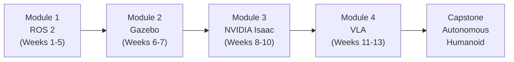

# Implementation Plan: Book Content — All 13 Weeks + Capstone

**Branch**: `002-book-content-chapters` | **Date**: 2026-02-19 | **Spec**: [spec.md](spec.md)
**Input**: Feature specification from `specs/002-book-content-chapters/spec.md`

---

## Summary

Write all 15 MDX chapter files for the Physical AI & Humanoid Robotics textbook by replacing placeholder content in `book/docs/`. All 15 files already exist with "Coming Soon" stubs — this plan replaces them with complete, production-quality educational content. Content is written in 6 sequential batches, with a `pnpm build` verification after each batch. The implementation order mirrors the pedagogical sequence (Weeks 1→13 → Capstone) so cross-references always point to already-written chapters.

---

## Technical Context

**Language/Version**: Python 3.11+ (all code examples), TypeScript 5.6 (Docusaurus only — do not modify)
**Primary Dependencies**: Docusaurus 3.9.2, `@docusaurus/theme-mermaid` (installed), MDX
**Storage**: File system only — MDX files in `book/docs/`
**Testing**: `pnpm build` (Docusaurus build validation after each batch)
**Target Platform**: Docusaurus static site, deployed to GitHub Pages
**Project Type**: Content-only — no source code changes
**Performance Goals**: `pnpm build` completes in < 3 minutes; all 15 pages load in < 2s
**Constraints**: `onBrokenLinks: 'throw'` — any broken internal link fails the build immediately
**Scale/Scope**: 15 MDX files × ~2000 prose words avg = ~30,000 words total; ~45 code examples; ~13 Mermaid diagrams; 65 quiz questions

---

## Constitution Check

*GATE: Must pass before Phase 0 research. Re-check after Phase 1 design.*

| Principle | Status | Notes |
|-----------|--------|-------|
| I. Spec-First | ✅ PASS | Spec `002-book-content-chapters` complete and validated |
| II. Clean Code | ✅ PASS | All code examples follow Python 3.11+ standards with type hints |
| III. Phase-Based Delivery | ✅ PASS | This is Phase 1 (book content). Phase 2 (RAG) not started |
| IV. Content Quality Standards | ✅ PASS | 8-section structure matches constitution requirements |
| V. TypeScript & Python Standards | ✅ PASS | Python code has type hints; no TS changes needed |
| VI. Secrets & Environment | ✅ PASS | Week 13 examples use env vars for OpenAI API keys |
| VII. Git Discipline | ✅ PASS | Branch `002-book-content-chapters` follows `###-short-name` convention |

**Constitution delta**: The constitution's Content Quality Standards (Principle IV) requires 8 sections, exactly matching spec requirements. The constitution lists "3–5 quiz questions" while the spec requires exactly 5 — using 5 satisfies both.

---

## Project Structure

### Documentation (this feature)

```text
specs/002-book-content-chapters/
├── plan.md              # This file
├── research.md          # Phase 0 — technical research findings
├── data-model.md        # Phase 1 — chapter content schema
├── quickstart.md        # Phase 1 — writing workflow guide
├── contracts/
│   └── chapter-content-contract.md  # Per-chapter delivery contracts
└── checklists/
    └── requirements.md  # Spec quality checklist
```

### Source Code (files to write/overwrite)

```text
book/docs/
├── intro.md                                           # Batch 1
├── module-1-ros2/
│   ├── week-01-intro-physical-ai.mdx                 # Batch 1
│   ├── week-02-embodied-intelligence.mdx             # Batch 1
│   ├── week-03-ros2-architecture.mdx                 # Batch 2
│   ├── week-04-nodes-topics-services.mdx             # Batch 2
│   └── week-05-ros2-packages.mdx                     # Batch 2
├── module-2-simulation/
│   ├── week-06-gazebo-setup.mdx                      # Batch 3
│   └── week-07-urdf-sdf.mdx                          # Batch 3
├── module-3-isaac/
│   ├── week-08-isaac-platform.mdx                    # Batch 4
│   ├── week-09-perception-manipulation.mdx           # Batch 4
│   └── week-10-sim-to-real.mdx                       # Batch 4
├── module-4-vla/
│   ├── week-11-humanoid-kinematics.mdx               # Batch 5
│   ├── week-12-bipedal-locomotion.mdx                # Batch 5
│   └── week-13-conversational-robotics.mdx           # Batch 5
└── capstone/
    └── autonomous-humanoid-project.mdx               # Batch 6
```

**Structure Decision**: Content-only — no new files or directories created. All 15 target files already exist. `sidebars.ts` already orders them correctly and MUST NOT be modified.

---

## Complexity Tracking

No complexity violations. This feature:
- Does not add new projects, services, or frameworks
- Does not add new database schemas or APIs
- Does not modify any configuration files
- Does not introduce dependencies

---

## Implementation Phases

### Phase 0: Research (Complete)

**Output**: `specs/002-book-content-chapters/research.md`

Key resolved decisions:

1. **Internal link URLs**: Use `/module-X-Y/week-NN-slug` (no `/docs/` prefix) — `routeBasePath: '/'`
2. **Frontmatter**: Keep existing `title` + `sidebar_label`; add `description` for SEO
3. **Mermaid**: Standard ` ```mermaid ` blocks — plugin already configured
4. **Code blocks**: ` ```python showLineNumbers ` confirmed working
5. **Admonitions**: `:::tip`, `:::note`, `:::warning`, `:::danger`, `:::info` all standard
6. **File strategy**: Full overwrite of each placeholder file
7. **Build verification**: `pnpm build` from `book/` after each batch
8. **Cross-reference admonition pattern**: `:::tip Related Chapter` with corrected URL

---

### Phase 1: Design (Complete)

**Outputs**:
- `specs/002-book-content-chapters/data-model.md` — Chapter content schema
- `specs/002-book-content-chapters/contracts/chapter-content-contract.md` — Per-chapter delivery contracts
- `specs/002-book-content-chapters/quickstart.md` — Writing workflow guide

**Content model decisions**:

1. **Chapter template structure** — canonical 8-section template with precise section names, heading emoji, and ordering. See `data-model.md` for full schema.
2. **Mermaid diagram types** — restrict to `flowchart LR`, `flowchart TD`, `graph TD`, `sequenceDiagram` for maximum compatibility with Mermaid v10.
3. **Code example completeness rule** — all ROS 2 nodes MUST include: full imports, class inheriting `Node`, `main()`, `rclpy.spin()`, `destroy_node()`, `rclpy.shutdown()`.
4. **Cross-reference consistency** — use `:::tip Related Chapter` admonition with exact URL from quickstart URL reference table.
5. **Week 13 API key handling** — OpenAI API calls use `os.environ["OPENAI_API_KEY"]`; include `:::warning` admonition about API costs.

---

### Phase 2: Implementation

**Execution order**: Batch 1 → Batch 2 → Batch 3 → Batch 4 → Batch 5 → Batch 6

**Gate between batches**: `pnpm build` MUST pass with zero errors before proceeding.

---

#### BATCH 1: Foundation — Intro + Weeks 1–2

**Files** (3 total):
1. `book/docs/intro.md`
2. `book/docs/module-1-ros2/week-01-intro-physical-ai.mdx`
3. `book/docs/module-1-ros2/week-02-embodied-intelligence.mdx`

**Task B1-1: Write `intro.md`**

Content requirements:
- Title: "Welcome to Physical AI & Humanoid Robotics"
- Frontmatter: `title`, `sidebar_label: "Course Introduction"`, `description`
- Sections: H1, What is Physical AI (2 paragraphs), Course Structure, Prerequisites, How to Use This Book, Getting Help
- Mermaid: `flowchart LR` showing 4 modules flowing into Capstone with week counts



- Prerequisites section: Ubuntu 22.04 / WSL2, Python 3.11+, Node.js 20, NVIDIA GPU (for Module 3+), 16GB RAM minimum
- NO quiz, NO further reading, NO learning objectives section
- Word target: 800–1200 words

**Task B1-2: Write `week-01-intro-physical-ai.mdx`**

Content spec:
- All 8 sections required
- Introduction paragraphs: define Physical AI vs traditional AI; explain embodied intelligence; discuss humanoid robots in human-centered environments
- Core Concepts subsections:
  - "What Is Physical AI?" — contrast with LLMs: no body, no sensorimotor loop
  - "Embodied Intelligence" — the body as part of cognition; Gibson's affordances concept
  - "The Sense → Plan → Act Loop" — Mermaid diagram here
  - "The Humanoid Robot Landscape" — Atlas, Figure 01, Tesla Optimus, Unitree G1 comparison
  - "Why Humanoids?" — human tools, spaces, interfaces built for humanoid form
- Mermaid: `flowchart LR` for Sense → Plan → Act with feedback arrow back to Sense
- Code Example 1: `SensePlanActRobot` class (pure Python, no ROS):
  ```python
  # Simulates the Sense-Plan-Act cognitive loop in pure Python
  class SensePlanActRobot:
      def sense(self) -> dict: ...
      def plan(self, sensor_data: dict) -> str: ...
      def act(self, action: str) -> None: ...
  ```
- Code Example 2: Run the loop 5 iterations with mock distance/temperature data, print actions
- Exercise [Beginner]: Python dict `humanoid_robots` with 3 entries (Boston Dynamics, Figure AI, Tesla); print formatted table using `tabulate` or manual f-string formatting
- Further Reading: ROS 2 official docs, NVIDIA Isaac robotics page, Boston Dynamics blog
- Word target: 2000–2500 words

**Task B1-3: Write `week-02-embodied-intelligence.mdx`**

Content spec:
- All 8 sections required
- Core Concepts subsections:
  - "What Makes Intelligence Embodied?" — Gibson's ecological psychology, sensorimotor coupling
  - "LiDAR" — time-of-flight principle, point clouds, role in SLAM (Simultaneous Localization and Mapping)
  - "Depth Cameras (RGB-D)" — Intel RealSense D435i, structured light vs time-of-flight
  - "IMU (Inertial Measurement Unit)" — accelerometer + gyroscope; quaternion output; role in balance
  - "Force/Torque Sensors" — detecting contact force and torque; safety in HRI
  - "Cameras (Monocular/Stereo)" — image pipeline: capture → debayer → rectify → publish
  - "Sensor Fusion" — complementary filter, EKF; why one sensor is never enough
- Mermaid: `flowchart TD` — LiDAR + Camera + IMU → Sensor Fusion Node → World Model → ROS 2 Topic
- Code Example 1: Python dataclasses (no ROS):
  ```python
  from dataclasses import dataclass
  import numpy as np

  @dataclass
  class LiDARReading:
      distances: np.ndarray  # 360 float values in meters
      timestamp: float

  @dataclass
  class IMUReading:
      quaternion: tuple[float, float, float, float]  # w, x, y, z
      angular_velocity: tuple[float, float, float]
      linear_acceleration: tuple[float, float, float]

  @dataclass
  class CameraFrame:
      image: np.ndarray  # (H, W, 3) uint8
      depth: np.ndarray  # (H, W) float32 in meters
      timestamp: float

  class SensorFusion:
      def update(self, lidar: LiDARReading, imu: IMUReading, camera: CameraFrame) -> dict: ...
  ```
- Code Example 2: Mock sensor data generator — `generate_lidar_scan(n_rays=360)` returning numpy array of distances with Gaussian noise
- Exercise [Intermediate]: Install `open3d`, generate random point cloud with 10,000 points, visualize with `o3d.visualization.draw_geometries()`
- Cross-reference: :::tip to Week 1 (Sense-Plan-Act, sensors as "Sense")
- Word target: 2000–2500 words

**Batch 1 gate**: Run `pnpm build` from `book/`. Must produce zero errors.

---

#### BATCH 2: ROS 2 Core — Weeks 3–5

**Files** (3 total):
4. `book/docs/module-1-ros2/week-03-ros2-architecture.mdx`
5. `book/docs/module-1-ros2/week-04-nodes-topics-services.mdx`
6. `book/docs/module-1-ros2/week-05-ros2-packages.mdx`

**Task B2-1: Write `week-03-ros2-architecture.mdx`**

Content spec:
- Core Concepts subsections:
  - "Why ROS 2?" — DDS middleware, security, real-time support, multi-robot; why ROS 1 is insufficient
  - "The ROS 2 Computation Graph" — nodes, topics, services, actions, parameters defined
  - "DDS: The Communication Backbone" — publish-subscribe middleware; QoS profiles; domain isolation
  - "ROS 2 Distributions" — Humble (LTS, recommended), Iron, Jazzy; EOL dates
  - "Installing ROS 2 Humble on Ubuntu 22.04" — FULL step-by-step installation commands in bash blocks
  - "The `rclpy` Client Library" — Python bindings overview
  - "Essential CLI Tools" — `ros2 node list`, `ros2 topic echo`, `ros2 topic hz`, `ros2 run`, `ros2 topic pub`
- Mermaid: `graph TD` — 3-node computation graph: SensorNode →|/sensor_data| ProcessorNode →|/cmd_vel| ActuatorNode
- Code Example 1: Complete `MinimalNode` class with timer logging "Hello from ROS 2" every 1 second (full imports, class, main, spin)
- Code Example 2: Bash — source setup + create workspace + `colcon build` + run node
- Installation section format: numbered steps with `:::warning` about sudo privileges and `:::info` about sourcing in `.bashrc`
- Exercise [Beginner]: Install ROS 2 Humble → run `ros2 run demo_nodes_py talker` in one terminal → run `ros2 run demo_nodes_py listener` in another → verify with `ros2 topic echo /chatter`
- Word target: 2500–3000 words

**Task B2-2: Write `week-04-nodes-topics-services.mdx`**

Content spec:
- Core Concepts subsections:
  - "Nodes: The Basic Unit of Computation" — lifecycle nodes, managed nodes
  - "Topics: Asynchronous Pub/Sub" — QoS policies (RELIABLE vs BEST_EFFORT, TRANSIENT_LOCAL); common message types
  - "Services: Synchronous Request/Response" — when to use vs topics; blocking nature
  - "Actions: Long-Running Tasks" — goal, feedback, result; `NavigateToPose` as canonical example
  - "Parameters: Runtime Configuration" — declare/get/set; ParameterServer
  - "Choosing the Right Pattern" — decision table: Topic vs Service vs Action
- Mermaid: `graph TD` with 3 sub-graphs showing Topic (async arrows), Service (bidirectional sync arrow), Action (goal/feedback/result arrows)
- Code Example 1: `VelocityPublisher` node (full) — publishes `Twist` at 10Hz with alternating forward/turn commands
- Code Example 2: `VelocitySubscriber` node (full) — subscribes to same topic, logs linear.x and angular.z
- Code Example 3 (clearly labeled "Bonus"): `ReverseStringServer` + `ReverseStringClient` service pair
- Exercise [Intermediate]: `BatteryPublisher` (random 0-100 float every 2s) + `BatteryMonitor` subscriber (prints warning when < 20)
- Word target: 2500–3000 words

**Task B2-3: Write `week-05-ros2-packages.mdx`**

Content spec:
- Core Concepts subsections:
  - "The ROS 2 Workspace" — `src/`, `build/`, `install/`, `log/` directory roles
  - "Creating a Package" — `ros2 pkg create --build-type ament_python <name> --dependencies rclpy`
  - "`package.xml` Deep Dive" — format 3, tags: exec_depend, build_depend, test_depend
  - "`setup.py` and Entry Points" — registering nodes as console scripts
  - "The `colcon build` Command" — `--packages-select`, `--symlink-install`
  - "Launch Files (`.launch.py`)" — `LaunchDescription`, `Node`, `DeclareLaunchArgument`, `LaunchConfiguration`
  - "Parameter YAML Files" — loading node params at launch with `parameters=[config_file]`
  - "Package Best Practices" — one responsibility per package; naming conventions
- Mermaid: `flowchart LR` — `src/<pkg>/` → [colcon build] → `install/<pkg>/` → [source setup.bash] → [ros2 run]
- Code Example 1: Complete `package.xml` for `robot_monitor` with all required tags
- Code Example 2: Complete `setup.py` with entry_points for `joint_publisher` and `joint_subscriber`
- Code Example 3: `robot_monitor.launch.py` starting both nodes with `publish_frequency` parameter
- Exercise [Intermediate]: Build full `robot_monitor` package:
  - `joint_publisher.py`: publishes `JointState` with random positions for 6 joints every N seconds
  - `joint_subscriber.py`: subscribes, formats data, writes to `joint_log.csv`
  - Launch file with `publish_frequency` parameter defaulting to 1.0
- Word target: 2500–3000 words

**Batch 2 gate**: Run `pnpm build`. Zero errors required.

---

#### BATCH 3: Simulation — Weeks 6–7

**Files** (2 total):
7. `book/docs/module-2-simulation/week-06-gazebo-setup.mdx`
8. `book/docs/module-2-simulation/week-07-urdf-sdf.mdx`

**Task B3-1: Write `week-06-gazebo-setup.mdx`**

Content spec:
- Core Concepts subsections:
  - "Why Simulation?" — safe testing, scalability, synthetic data generation, parallel training
  - "Gazebo Classic vs Gazebo Harmonic" — architectural differences; Ignition lineage; why Harmonic
  - "Physics Engines" — ODE (default), Bullet, DART; when to use each
  - "The Three Building Blocks" — Worlds (`.sdf`), Models (meshes + physics), Plugins (behaviors)
  - "Installing Gazebo Harmonic" — apt installation commands; dependency on Ubuntu 22.04
  - "The `ros_gz_bridge`" — bridging Gazebo topics to ROS 2; type mappings
  - "SDF Format" — key tags: `<world>`, `<model>`, `<link>`, `<joint>`, `<plugin>`
  - "Your First Simulation Launch" — launch file pattern for Gazebo + ROS 2
- Mermaid: `flowchart LR` — Python Controller →|/cmd_vel (ROS 2)| Bridge →|/cmd_vel (Gz)| Gazebo Physics Engine → Sensor Outputs → Bridge →|/odom, /scan (ROS 2)| Python Controller
- Code Example 1: Minimal SDF world with ground plane + directional light + 1 box obstacle (full XML)
- Code Example 2: Launch file `sim.launch.py` — start Gazebo Harmonic + spawn world + bridge `/cmd_vel` and `/odom` topics
- Exercise [Intermediate]: Install TurtleBot3 packages + launch Gazebo → drive with `ros2 topic pub /cmd_vel` → `ros2 bag record /odom`
- `:::info` for installation: "Gazebo Harmonic requires Ubuntu 22.04 or later"
- Word target: 2000–2500 words

**Task B3-2: Write `week-07-urdf-sdf.mdx`**

Content spec:
- Core Concepts subsections:
  - "URDF: The Robot Description Language" — XML structure, link-joint model
  - "URDF Link Elements" — `<visual>`, `<collision>`, `<inertial>` with geometry types
  - "URDF Joint Types" — fixed, revolute, prismatic, continuous; limits and dynamics
  - "Calculating Inertia Tensors" — table of formulas (box, cylinder, sphere) with URDF XML snippets
  - "Xacro: DRY Robot Description" — macros, properties, includes; why URDF alone doesn't scale
  - "Converting URDF to SDF" — `gz sdf -p robot.urdf > robot.sdf`; what changes
  - "Visualizing in RViz2" — `robot_state_publisher` + `joint_state_publisher_gui` launch pattern
  - "Adding Sensor Plugins" — camera plugin + LiDAR plugin in URDF for Gazebo simulation
- Mermaid: `graph TD` — base_link → shoulder_joint → upper_arm_link → elbow_joint → forearm_link (clean link-joint tree)
- Code Example 1: Complete 2-DOF URDF for robot arm — base_link + shoulder_joint + upper_arm + elbow_joint + forearm with proper inertia, visual (cylinder geometry), and collision
- Code Example 2: Xacro macro for leg generation: `<xacro:macro name="leg" params="side">` with hip_link, knee_joint, lower_leg_link
- Inertia formula table:

| Shape | Ixx | Iyy | Izz |
|-------|-----|-----|-----|
| Box (l,w,h) | m(w²+h²)/12 | m(l²+h²)/12 | m(l²+w²)/12 |
| Cylinder (r,h) | m(3r²+h²)/12 | m(3r²+h²)/12 | mr²/2 |
| Sphere (r) | 2mr²/5 | 2mr²/5 | 2mr²/5 |

- Exercise [Advanced]: Build simplified humanoid URDF (torso + 2 upper arms + 2 lower arms + 2 upper legs + 2 lower legs = 9 links, 8 joints); visualize in RViz2; generate TF tree with `ros2 run tf2_tools view_frames`
- Word target: 2500–3000 words

**Batch 3 gate**: Run `pnpm build`. Zero errors required.

---

#### BATCH 4: NVIDIA Isaac — Weeks 8–10

**Files** (3 total):
9. `book/docs/module-3-isaac/week-08-isaac-platform.mdx`
10. `book/docs/module-3-isaac/week-09-perception-manipulation.mdx`
11. `book/docs/module-3-isaac/week-10-sim-to-real.mdx`

**Task B4-1: Write `week-08-isaac-platform.mdx`**

Content spec:
- Open with `:::info Hardware Requirement` admonition: RTX GPU + 8GB+ VRAM required for this module
- Core Concepts subsections:
  - "The NVIDIA Isaac Platform" — three tools, three purposes: Isaac Sim (photorealistic sim), Isaac ROS (GPU-accelerated nodes), Isaac Lab (GPU RL training)
  - "Isaac Sim vs Gazebo" — comparison table: rendering quality, physics accuracy, GPU requirement, ROS integration, use case
  - "USD: Universal Scene Description" — Pixar-originated format; USD stages, prims, schemas
  - "Isaac ROS: Hardware-Accelerated Nodes" — NITROS (zero-copy transport), cuVSLAM, cuDNN perception
  - "Isaac Lab: GPU-Parallel RL" — thousands of parallel environments on one GPU; IsaacGym evolution
  - "System Requirements and Installation" — Docker-based setup; NVIDIA container toolkit
  - "Connecting Isaac Sim to ROS 2" — `isaacsim.ros2_bridge` extension; topic namespacing
- Mermaid: `graph TD` — Isaac Sim (photorealistic) ↔ ROS 2 Bridge ↔ Isaac ROS (NITROS) — Isaac Lab (GPU RL) → trained policy → Isaac Sim for validation
- Code Example 1: Isaac Sim Python API — spawn Franka robot, step 100 simulation frames:
  ```python
  # Spawn a Franka robot in Isaac Sim using the Python scripting API
  from omni.isaac.core import World
  from omni.isaac.core.robots import Robot
  ```
- Code Example 2: ROS 2 node subscribing to `/rgb` image topic from Isaac Sim bridge, logging resolution
- Exercise [Advanced]: Docker launch of Isaac Sim → load Franka asset → verify joint state topics
- Word target: 2000–2500 words

**Task B4-2: Write `week-09-perception-manipulation.mdx`**

Content spec:
- Core Concepts subsections:
  - "The Perception Pipeline" — raw pixels → feature extraction → object detection → 3D localization
  - "YOLOv8 in a ROS 2 Node" — `ultralytics` package; subscribing to `/camera/image_raw`; publishing bounding boxes
  - "RGB-D to 3D Position" — backprojection: `(u, v, depth) → (x, y, z)` using camera intrinsics
  - "Grasp Planning Overview" — GraspNet-1Billion; antipodal grasp quality; 6-DOF grasp poses
  - "Reinforcement Learning for Robotics" — MDP formulation; reward shaping; policy networks
  - "The Actor-Critic Architecture" — policy network (actor) + value network (critic); PPO algorithm
  - "Isaac Lab Training Loop" — environment vectorization; `_setup_scene()`, `_get_observations()`, `_get_rewards()`, `_get_dones()`
- Mermaid: `flowchart LR` — Environment State → [Observation] → Policy Network → [Action] → Environment Step → [Reward + Next State] → back to start
- Code Example 1: ROS 2 perception node using OpenCV (full node — imports, class, subscriber, `cv2.inRange`, publish `geometry_msgs/Point` centroid)
- Code Example 2: Minimal Isaac Lab `DirectRLEnv` subclass for "reach to target" task with all required methods
- Exercise [Advanced]: Run `cartpole_direct` example in Isaac Lab; log mean reward per 100 episodes; generate matplotlib reward curve
- Cross-reference: :::tip to Week 2 (sensors) and Week 8 (Isaac Lab intro)
- Word target: 2500–3000 words

**Task B4-3: Write `week-10-sim-to-real.mdx`**

Content spec:
- Core Concepts subsections:
  - "The Sim-to-Real Gap" — physics modeling errors, visual domain gap, actuation delays, sensor noise
  - "Domain Randomization" — randomize physics params (gravity, friction, mass, joint stiffness), visual params (lighting, textures, camera noise)
  - "Domain Adaptation" — real data fine-tuning; DAGGER algorithm overview
  - "Synthetic Data Generation" — Isaac Sim replicator; label generation; depth variation
  - "System Identification" — measure real robot: mass, CoM, motor friction; match in simulation
  - "The Deployment Pipeline" — training (Isaac Lab) → checkpoint → ONNX export → edge device (Jetson Orin) → `onnxruntime` inference
  - "Latency Considerations" — training GPU (A100) vs edge (Jetson): throughput vs latency tradeoffs; quantization
- Mermaid: `flowchart LR` — Isaac Lab Training → [PyTorch checkpoint] → ONNX Export → [.onnx file] → copy to Jetson Orin → onnxruntime inference → Robot Action
- Code Example 1: Domain randomization config dict for Isaac Lab with gravity, friction coefficient, joint damping ranges
- Code Example 2: ONNX export script — load checkpoint → wrap policy → `torch.onnx.export` with dynamic axes
- Exercise [Advanced]: Export Week 9 policy → create static observation tensor → run `onnxruntime` inference → print action shape and values
- `:::warning` admonition: "Quantizing the model to INT8 can reduce inference latency 4× but may degrade policy performance — always validate before deployment"
- Word target: 2000–2500 words

**Batch 4 gate**: Run `pnpm build`. Zero errors required.

---

#### BATCH 5: VLA & Humanoids — Weeks 11–13

**Files** (3 total):
12. `book/docs/module-4-vla/week-11-humanoid-kinematics.mdx`
13. `book/docs/module-4-vla/week-12-bipedal-locomotion.mdx`
14. `book/docs/module-4-vla/week-13-conversational-robotics.mdx`

**Task B5-1: Write `week-11-humanoid-kinematics.mdx`**

Content spec:
- Core Concepts subsections:
  - "Degrees of Freedom (DOF)" — per joint; total DOF for humanoid (29-44 DOF typical); redundancy
  - "Forward Kinematics (FK)" — DH parameters; transformation matrix multiplication; end-effector pose
  - "Inverse Kinematics (IK)" — geometric, numerical (Newton-Raphson), Jacobian pseudoinverse; singularities
  - "Bipedal Locomotion Challenges" — dynamic stability vs static stability; center of mass (CoM) management
  - "Zero-Moment Point (ZMP)" — definition; ZMP criterion for dynamic stability; measurement
  - "Gait Planning" — static gait (slow, stable) vs dynamic gait (walking cycle); contact scheduling
  - "Model Predictive Control (MPC) for Balance" — prediction horizon; constraints; LIPM (Linear Inverted Pendulum Model)
  - "MoveIt2 Overview" — OMPL planners; planning scene; collision objects; `MoveGroupInterface`
- DH Parameter table (3-DOF arm example): joint, a, d, α, θ columns
- Mermaid: FK and IK shown as two parallel `graph LR` flows side-by-side (use subgraph notation)
- Code Example 1: Pure Python FK using numpy for 3-DOF planar arm:
  ```python
  # Computes forward kinematics for a 3-DOF planar robot arm using homogeneous matrices
  import numpy as np

  def rotation_z(theta: float) -> np.ndarray:
      # 4×4 rotation matrix around Z-axis
      ...

  def translation(dx: float, dy: float, dz: float) -> np.ndarray:
      # 4×4 translation matrix
      ...

  def forward_kinematics(theta1: float, theta2: float, theta3: float,
                          l1: float, l2: float, l3: float) -> np.ndarray:
      # Returns 4×4 end-effector transform in world frame
      ...
  ```
- Code Example 2: MoveIt2 Python API — `MoveGroupCommander("panda_arm")` planning to a `Pose` goal then executing
- Exercise [Advanced]: RViz2 with Panda → drag end-effector to 5 poses → observe IK solutions via motion planning panel
- Word target: 2500–3000 words

**Task B5-2: Write `week-12-bipedal-locomotion.mdx`**

Content spec:
- Core Concepts subsections:
  - "The Grasp Planning Problem" — 6-DOF grasp pose; force closure condition; grasp quality metrics (epsilon, volume)
  - "Learned Grasping" — GraspNet-1Billion dataset; Contact GraspNet architecture; inference pipeline
  - "Dexterous Manipulation" — finger gaiting; in-hand manipulation; tactile sensing role
  - "HRI Design Principles" — Proxemics (Hall's zones); legibility of motion (telegraph intent); social cues
  - "Safety in HRI" — ISO/TS 15066 speed and separation monitoring; power and force limiting
  - "Shared Autonomy" — intervention spectrum: full manual → teleoperation → shared control → full autonomy
  - "Gesture Recognition" — MediaPipe Hands pipeline; skeleton-based gesture classification
- Mermaid: `flowchart LR` — RGB-D Camera → YOLO Object Detection → 6-DOF Pose Estimation → Grasp Candidate Generation → [Best Grasp] → MoveIt2 Execution
- Code Example 1: ROS 2 node subscribing to `/camera/depth/points` PointCloud2, filtering within bounding box, computing centroid (full node with `sensor_msgs.msg.PointCloud2`, `sensor_msgs_py.point_cloud2` helper)
- Code Example 2: ROS 2 action client sending `MoveGroupAction` goal to MoveIt2 with a grasp pose constructed from detected centroid
- Exercise [Advanced]: Gazebo scene with table + cube + robot arm + depth camera → detect cube → grasp via MoveIt2
- Cross-references: :::tip to Week 11 (MoveIt2), Week 9 (object detection), Week 6 (Gazebo)
- Word target: 2500–3000 words

**Task B5-3: Write `week-13-conversational-robotics.mdx`**

Content spec:
- Core Concepts subsections:
  - "The Voice-to-Action Pipeline" — full stack: microphone → Whisper → LLM → action schema → ROS 2 dispatcher
  - "OpenAI Whisper" — architecture (encoder-decoder Transformer); model sizes (tiny to large); local vs cloud tradeoffs
  - "LLMs as Robot Planners" — decomposing "clean the room" into discrete actions; grounding problem
  - "Prompt Engineering for Robotics" — system prompt with robot capability manifest; structured JSON output
  - "Tool Calling / Function Calling" — OpenAI function calling; mapping tools to ROS 2 action clients
  - "Multi-modal Interaction" — combining speech + gesture + vision for robustness
  - "Limitations and Safety Guardrails" — hallucination risks; latency bottlenecks; hard-coded safety constraints; human-in-the-loop override
- Mermaid: `flowchart LR` — Microphone → [sounddevice] → raw_audio → Whisper STT → transcript_text → LLM Planner → JSON_actions → ROS 2 Action Dispatcher → Robot Movement
- Code Example 1: Full Python Whisper STT script — load model, record 5 seconds via `sounddevice`, run transcription, print result
- Code Example 2: Python LLM robot planner — builds system prompt with available actions manifest, calls OpenAI API, parses JSON response:
  ```python
  # LLM-based robot task planner that converts natural language to structured ROS 2 action sequences
  import os
  import json
  from openai import OpenAI

  ROBOT_ACTIONS = [
      {"name": "navigate_to", "params": {"location": "string"}},
      {"name": "pick_up", "params": {"object": "string"}},
      {"name": "place_at", "params": {"location": "string"}},
      {"name": "open_gripper", "params": {}},
      {"name": "close_gripper", "params": {}},
  ]
  ```
- `:::warning` admonition: API costs and latency for LLM calls; `:::danger`: never let LLM override safety-critical constraints without human confirmation
- Exercise [Advanced]: Chain Examples 1+2; record voice command; transcribe; plan; print JSON; test 3 commands
- Week 13 uses `os.environ["OPENAI_API_KEY"]` — must be documented with .env reference
- Cross-references: :::tip to Week 12 (grasping), Week 4 (ROS 2 actions), Week 9 (object detection)
- Word target: 2500–3000 words

**Batch 5 gate**: Run `pnpm build`. Zero errors required.

---

#### BATCH 6: Capstone

**File** (1):
15. `book/docs/capstone/autonomous-humanoid-project.mdx`

**Task B6-1: Write `autonomous-humanoid-project.mdx`**

Content spec:
- Title: "Capstone: The Autonomous Humanoid"
- Learning Objectives: 5 measurable objectives covering voice → plan → navigate → detect → grasp
- Introduction: 3 paragraphs — what the student will build, what it demonstrates, how it integrates all 4 modules
- Core Concepts (Project Overview section):
  - System architecture description
  - Mermaid 1: Full system flowchart (all 5 milestones + MainOrchestrator)
  - Mermaid 2: Milestone dependency DAG
- Code Examples (Implementation Guide section) — organized by milestone:
  - Milestone 1: Voice Pipeline
    - Setup: `pip install openai-whisper sounddevice`
    - `voice_node.py` — ROS 2 node wrapping Whisper, publishes transcription to `/voice_command` topic
  - Milestone 2: LLM Planner
    - `llm_planner_node.py` — subscribes to `/voice_command`, calls OpenAI API, publishes action list to `/action_plan`
    - System prompt template for action planning
  - Milestone 3: ROS 2 Navigation
    - Nav2 setup with pre-built map
    - `navigator_node.py` — subscribes to `/action_plan`, dispatches `NavigateToPose` actions
  - Milestone 4: Object Detection
    - `detector_node.py` — YOLOv8 + depth camera → publishes to `/detected_object_pose`
  - Milestone 5: Grasping
    - `grasp_executor_node.py` — subscribes to `/detected_object_pose`, executes MoveIt2 grasp
  - Integration: `main_orchestrator.launch.py` launching all 5 nodes + Nav2 + MoveIt2
- Hands-On Exercise (Integration Guide):
  - Step-by-step instructions to wire all 5 milestones via `MainOrchestrator` ROS 2 node
  - State machine pattern: LISTENING → PLANNING → NAVIGATING → DETECTING → GRASPING → IDLE
- Summary: 6 bullets covering what was built
- Submission Checklist (REPLACES Quiz — exactly 10 items as specified in contract):
  1. Voice command is transcribed correctly by Whisper
  2. LLM produces valid JSON action plan for at least 3 different voice commands
  3. Robot navigates from start to goal without colliding with obstacles
  4. Object is detected and its 3D position is published to `/detected_object_pose`
  5. Robot arm reaches the detected object position
  6. Grasp is executed successfully (object is lifted off the surface)
  7. Full pipeline runs end-to-end from voice to grasp in a single `ros2 launch` command
  8. A ROS 2 bag recording of the complete run is saved
  9. A screen recording of the simulation shows all 5 stages completing
  10. `pnpm build` of the book passes with zero errors
- Debugging section: 5 common failure modes + diagnosis steps + fixes:
  1. Whisper not transcribing → microphone permissions / `sounddevice` backend
  2. LLM returning invalid JSON → update system prompt + add JSON schema validation
  3. Nav2 navigation timeout → check costmap, inflation radius, goal tolerance
  4. Object not detected → check camera topic names, YOLO confidence threshold
  5. Grasp failure → check MoveIt2 planning scene, collision objects, end-effector offset
- Further Reading: 3 links (Nav2 docs, YOLOv8 ROS 2 package, OpenAI function calling docs)
- Word target: 3000–4000 words

**Batch 6 gate**: Run `pnpm build`. Zero errors required.

---

## Definition of Done

Implementation is complete when ALL of the following are true:

| # | Criterion | Verification |
|---|-----------|-------------|
| 1 | All 15 MDX files contain real, complete content | `grep -r "Coming Soon" book/docs/` returns empty |
| 2 | Every chapter has all 8 mandatory sections | Manual review per chapter-content-contract.md |
| 3 | Every chapter has ≥1 working Mermaid diagram | `pnpm build` passes + visual check in `pnpm start` |
| 4 | Every chapter has ≥2 Python code examples with `showLineNumbers` | `grep -r "showLineNumbers" book/docs/` shows ≥2 per file |
| 5 | Every weekly chapter has exactly 5 quiz questions with ✅ | `grep -c "✅" book/docs/module-*/week-*.mdx` shows 5 per file |
| 6 | Capstone has exactly 10 submission checklist items | Count checklist items in capstone file |
| 7 | `pnpm build` passes with zero errors/warnings | Build output clean |
| 8 | All internal cross-reference links are valid | `pnpm build` with `onBrokenLinks: 'throw'` catches any broken links |

---

## Risk Register

| Risk | Likelihood | Impact | Mitigation |
|------|-----------|--------|-----------|
| Mermaid syntax error causes build failure | Medium | High | Test each diagram in dev server (`pnpm start`) before proceeding to next batch |
| Broken internal cross-reference link | Low | High | Use URL table in `quickstart.md`; build validates with `onBrokenLinks: 'throw'` |
| Code example syntax error | Medium | Medium | Write examples as valid Python; no pseudocode, no ellipsis placeholders |
| Word count below minimum | Low | Low | Check prose word count before marking batch complete |
| Week 13 OpenAI API key in code | Low | High | Always use `os.environ["OPENAI_API_KEY"]`; include `.env` reference |

---

## ADR Suggestion

📋 **Architectural decision detected**: Writing order (sequential by week) vs parallel by module — batching by curriculum order ensures cross-references always point to existing content but limits parallelism. Document this tradeoff? Run `/sp.adr sequential-chapter-writing-order`.
